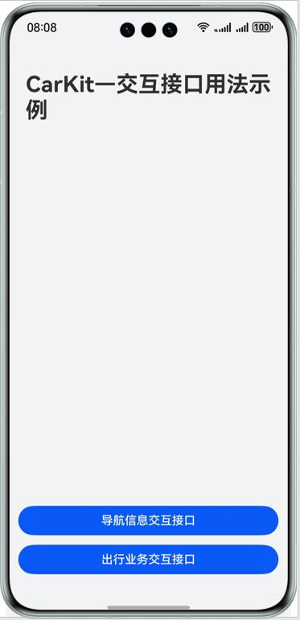
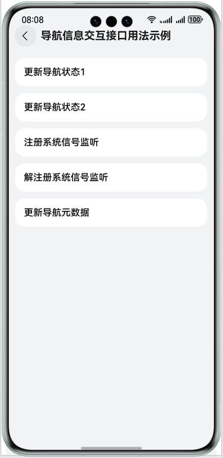
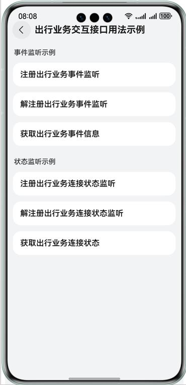

## Car Kit示例代码

## 介绍

本示例展示了导航信息服务和出行分布式引擎服务的接口用法

这些接口需要导入'@kit.CarKit'。

## 效果预览

|              **应用首页**               |                **导航信息交互页面**                |               **出行业务交互页面**                |
|:-----------------------------------:|:------------------------------------------:|:-----------------------------------------:|
|    |  |  |

使用说明：
1. 实例演示导航数据更新接口、导航信号监听接口及出行业务的使用,通过对应的按钮触发相关接口的调用，界面文本区域会显示相关状态

## 工程目录
```
├──entry/src/main/ets               // 代码区
│  ├──common
│  │  ├──CommonUtils.ets            // 工具类
│  │  └──Logger.ets                 // 日志类
│  ├──entryability
│  │  └──EntryAbility.ets           // 程序入口类
│  └──pages
│     ├──Index.ets                  // 程序入口类
│     ├──NavInfoServicePage.ets     // 导航信息交互接口用法类
│     └──TravelServicePage.ets      // 出行业务交互接口用法类
└──entry/src/main/resources         // 应用静态资源目录
```

## 具体实现

### 导航信息服务示例
* 获取导航管理者对象；
```
function getNavigationController(): NavigationController;
```
* 导航管理者对象，用于注册系统信号监听、解注册系统信号监听、更新导航状态（导航状态，包含导航类型，导航目的地，导航途径点，路线，地图主题等）、更新导航元数据（导航元数据，包含TBT信息，道路、电子眼等信息）
```
NavigationController
    // 注册系统信号监听
    registerSystemNavigationListener(listener: SystemNavigationListener): void;

    // 解注册系统信号监听
    unregisterSystemNavigationListener(): void;

    // 更新导航状态
    updateNavigationStatus(navigationStatus: NavigationStatus): void;

    // 更新导航元数据（导航元数据，包含TBT信息，道路、电子眼等信息）
    updateNavigationMetadata(navigationMetadata: NavigationMetadata): void;
```

业务使用时，需要先进行import导入  import { navigationInfoMgr } from '@kit.CarKit';

### 出行业务交互示例
* 获取出行业务感知对象；
```
function getSmartMobilityAwareness(): SmartMobilityAwareness;
```
* 出行业务感知对象,用于注册出行业务事件监听、解除注册出行业务事件监听、获取出行业务事件信息、出行业务连接状态监听、解除注册出行业务连接状态监听、获取出行业务连接状态信息
```
SmartMobilityAwareness
    // 出行业务事件监听
    on(type: 'smartMobilityEvent', smartMobilityTypes: SmartMobilityType[],
      callback: Callback<SmartMobilityEvent>): void;

    // 解注册出行业务监听
    off(type: 'smartMobilityEvent', smartMobilityTypes: SmartMobilityType[],
      callback?: Callback<SmartMobilityEvent>): void;
   
    // 获取出行业务事件信息
    getSmartMobilityEvent(type: SmartMobilityType, eventName: string): SmartMobilityEvent;
    
    // 出行业务连接状态监听
    on(type: 'smartMobilityStatus', smartMobilityTypes: SmartMobilityType[],
      callback: Callback<SmartMobilityInfo>): void;

    // 解注册出行业务连接状态监听
    off(type: 'smartMobilityStatus', smartMobilityTypes: SmartMobilityType[],
      callback?: Callback<SmartMobilityInfo>): void;

    // 获取出行业务连接状态信息
    getSmartMobilityStatus(type: SmartMobilityType): SmartMobilityInfo;
```

业务使用时，需要先进行import导入 import { smartMobilityCommon } from '@kit.CarKit';

## 相关权限
应用在使用Car Kit能力前，需要检查是否已经获取对应权限。如未获得授权，需要声明对应权限。
Car Kit所需权限有：  
ohos.permission.ACCESS_SERVICE_NAVIGATION_INFO：用于访问导航信息服务的API。  
ohos.permission.ACCESS_CAR_DISTRIBUTED_ENGINE：用于访问出行分布式引擎服务的API。

## 约束与限制

1. 本实例仅支持标准系统上运行，支持设备：当前仅支持华为手机。
2. HarmonyOS系统：HarmonyOS 5.0.0 Release及以上。
3. DevEco Studio版本：DevEco Studio 5.0.0 Release及以上。
4. HarmonyOS SDK版本：HarmonyOS 5.0.0 Release SDK及以上。

## 依赖

无
