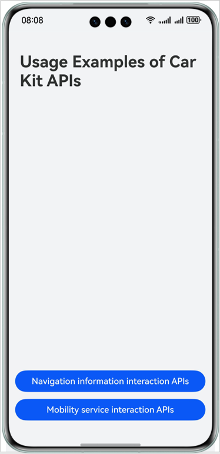
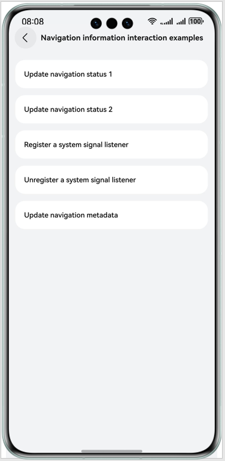
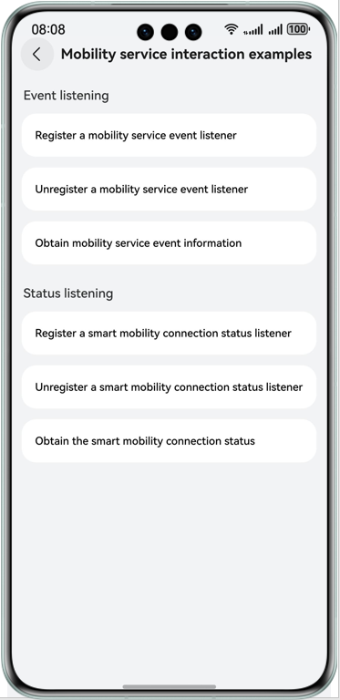

## Car Kit Demo Code

## Overview

This sample code illustrates how to use APIs of the navigation information service and mobility distributed engine service.

These APIs are packaged into **@kit.CarKit**.

## Preview

|         **App home screen**          | **Navigation information interaction screen** |   **Mobility service interaction screen**    |
|:------------------------------------:|:---------------------------------------------:|:--------------------------------------------:|
|  |  |  |

Instructions:
1. The sample illustrates how to use the navigation data update API, navigation signal listening API, and mobility service. You can tap the corresponding buttons to trigger the calling of related APIs. The related status is displayed in the text area on the UI.

## Project Directory
```
├──entry/src/main/ets               // Code area.
│  ├──common
│  │  ├──CommonUtils.ets            // Utility class.
│  │  └──Logger.ets                 // Log class.
│  ├──entryability
│  │  └──EntryAbility.ets           // Entry point class.
│  └──pages
│     ├──Index.ets                  // Entry point class.
│     ├──NavInfoServicePage.ets     // Navigation information interaction API usage class.
│     └──TravelServicePage.ets      // Mobility service interaction API usage class.
└──entry/src/main/resources         // App static resource directory.
```

## How to Implement

### Navigation Information Service Example
* Obtain a **NavigationController** object.
```
function getNavigationController(): NavigationController;
```
* Use the **NavigationController** object to perform the following operations: register a system signal listener, unregister a system signal listener, update navigation status (including the navigation type, destination, waypoints, route, and map theme), and update navigation metadata (including the TBT, road, and traffic camera information)
```
NavigationController
    // Register a system signal listener.
    registerSystemNavigationListener(listener: SystemNavigationListener): void;

    // Unregister a system signal listener.
    unregisterSystemNavigationListener(): void;

    // Update the navigation status.
    updateNavigationStatus(navigationStatus: NavigationStatus): void;

    // Update navigation metadata (including the TBT, road, and traffic camera information).
    updateNavigationMetadata(navigationMetadata: NavigationMetadata): void;
```

Before using the service, you need to perform the following operation: **import { navigationInfoMgr } from '@kit.CarKit';**

### Mobility Service Interaction Example
* Obtain a **SmartMobilityAwareness** object.
```
function getSmartMobilityAwareness(): SmartMobilityAwareness;
```
* Use the **SmartMobilityAwareness** object to perform the following operations: register a mobility service event listener, unregister a mobility service event listener, obtain mobility service event information, register a smart mobility connection status listener, unregister a smart mobility connection status listener, and obtain the smart mobility connection status
```
SmartMobilityAwareness
    // Register a mobility service event listener.
    on(type: 'smartMobilityEvent', smartMobilityTypes: SmartMobilityType[],
      callback: Callback<SmartMobilityEvent>): void;

    // Unregister a mobility service event listener.
    off(type: 'smartMobilityEvent', smartMobilityTypes: SmartMobilityType[],
      callback?: Callback<SmartMobilityEvent>): void;
   
    // Obtain mobility service event information.
    getSmartMobilityEvent(type: SmartMobilityType, eventName: string): SmartMobilityEvent;
    
    // Register a smart mobility connection status listener.
    on(type: 'smartMobilityStatus', smartMobilityTypes: SmartMobilityType[],
      callback: Callback<SmartMobilityInfo>): void;

    // Unregister a smart mobility connection status listener.
    off(type: 'smartMobilityStatus', smartMobilityTypes: SmartMobilityType[],
      callback?: Callback<SmartMobilityInfo>): void;

    // Obtain the smart mobility connection status.
    getSmartMobilityStatus(type: SmartMobilityType): SmartMobilityInfo;
```

Before using the service, you need to perform the following operation: **import smartMobilityCommon from '@hms.carService.smartMobilityCommon';** or **import { smartMobilityCommon } from '@kit.CarKit';**

## Required Permissions
Before using Car Kit capabilities, check whether your app has corresponding permissions. If not, you need to declare these permissions.
Specifically, Car Kit requires the following permissions: 
**ohos.permission.ACCESS_SERVICE_NAVIGATION_INFO**: enables your app to call APIs of the navigation information service. 
**ohos.permission.ACCESS_CAR_DISTRIBUTED_ENGINE**: enables your app to call APIs of the mobility distributed engine service.

## Constraints

1. The sample app is only supported on Huawei phones with standard systems.
2. The HarmonyOS version must be HarmonyOS 5.0.0 Release or later.
3. The DevEco Studio version must be DevEco Studio 5.0.0 Release or later.
4. The HarmonyOS SDK version must be HarmonyOS 5.0.0 Release SDK or later.

## Dependencies

None
