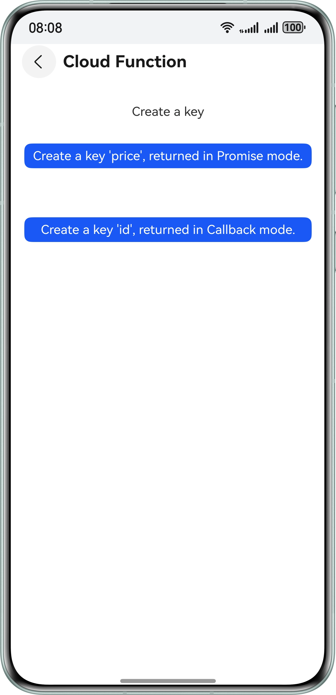
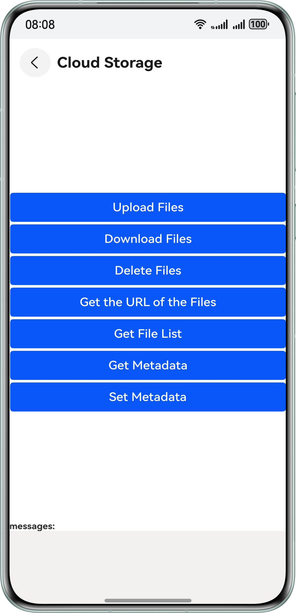
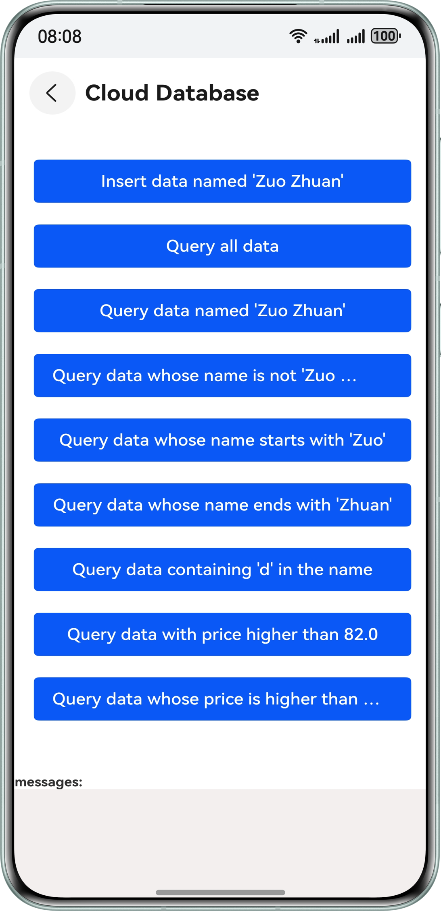
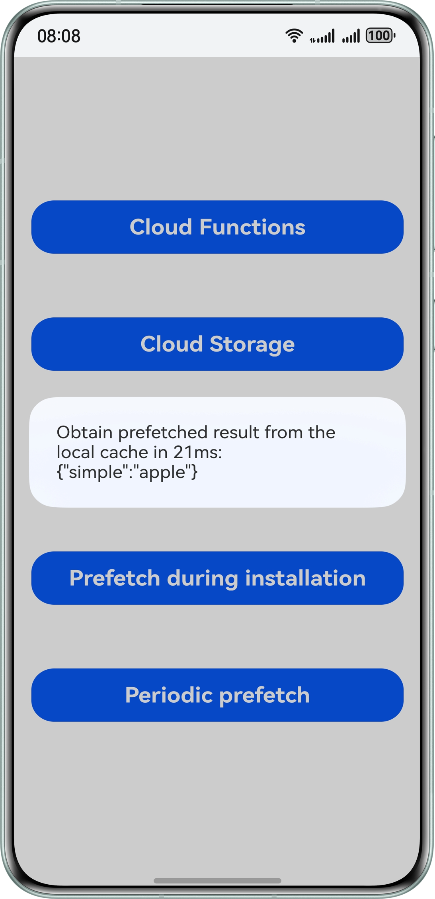
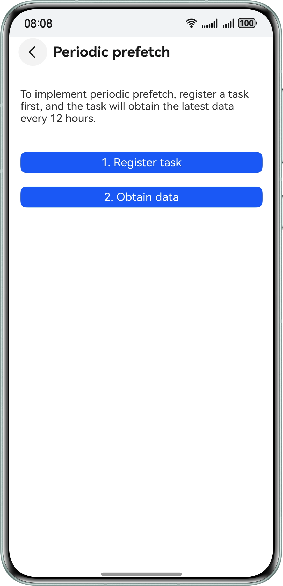
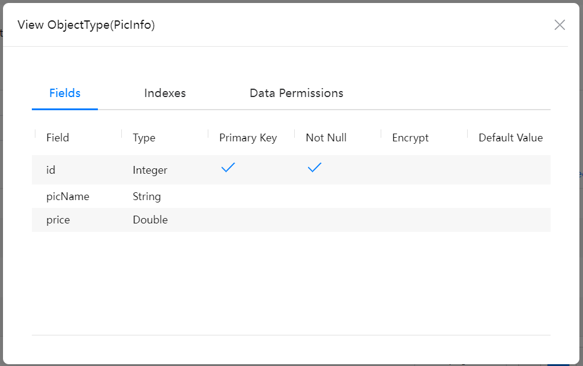

# Cloud Foundation Kit

## Overview

This sample shows how to use capabilities of Cloud Functions, Cloud Storage, Cloud Database, and Prefetch provided by Cloud Foundation Kit, including:

1. Calling a cloud function
2. Uploading, downloading, and deleting files through the Cloud Storage service
3. Performing create, read, update, and delete operations through the Cloud Database service
4. Using prefetch during installation and periodic prefetch

To use these capabilities, you need **@kit.CloudFoundationKit**.

## Preview

| **UI of Cloud Functions**                 | **UI of Cloud Storage**                  | **UI of Cloud Database**                 | UI of Prefetch during Installation                | UI of Periodic Prefetch                            |
| ----------------------------------------- | ---------------------------------------- | ---------------------------------------- | ------------------------------------------------- | -------------------------------------------------- |
|  |  |  |  |  |

## How to Configure and Use the Sample Project

### Configuring the Sample Project in DevEco Studio

1. [Create a project](https://developer.huawei.com/consumer/en/doc/app/agc-help-create-project-0000002242804048). Under the project, [create an app](https://developer.huawei.com/consumer/en/doc/app/agc-help-create-app-0000002247955506).

2. Open the sample app and set **bundleName** in the **app.json5** file to the app package name configured in [AppGallery Connect](https://developer.huawei.com/consumer/en/service/josp/agc/index.html).

3. Obtain the user credential through [AuthProvider](https://developer.huawei.com/consumer/en/doc/harmonyos-references/cloudfoundation-cloudcommon#section136610231214). You can use the access token API of Account Kit to customize an AuthProvider. 

4. Create a signature through [manual signing](https://developer.huawei.com/consumer/en/doc/harmonyos-guides/ide-signing#section297715173233). Note that automatic signing is not supported.

5. Enable Cloud Database, Cloud Functions, Cloud Storage, and Prefetch in [AppGallery Connect](https://developer.huawei.com/consumer/en/service/josp/agc/index.html).

6. In Cloud Functions, you need to create two functions named **sort** and **sort-id**. For details about the function content, please refer to **sort_\$latest** and **sort-id_$latest** in the **functionJSDemo** folder in the project directory.

7. Create a Cloud Database zone named **QuickStartDemo** in Cloud Database and create a storage object named **PicInfo**. For details about the object attributes, please refer to the following.

   Export the object as a JSON file, change the file name to **schema.json**, and use the file to replace the existing **schema.json** file in the **rawfile** folder in the **resources** directory of the project. For details about how to export a file, please refer to [Adding an Object Type](https://developer.huawei.com/consumer/en/doc/harmonyos-guides/cloudfoundation-database-add-object).

8. Create a cloud function in [AppGallery Connect](https://developer.huawei.com/consumer/en/service/josp/agc/index.html), configure the function code, and bind the function to the prefetch service.

### How to Use the Sample

1. Run the sample app and tap **Cloud Functions**, **Cloud Storage**, **Cloud Database**, **Prefetch during installation**, and **Periodic prefetch** to access the corresponding UI.
2. The UI of Cloud Functions displays the **price** string returned by the **sort** function and the **id** string returned by the **sort-id** function in promise and callback modes, respectively.
3. The UI of Cloud Storage displays the buttons for uploading, downloading, deleting, and listing files, obtaining file URLs, and obtaining and setting metadata. You can tap a button to perform a function. Related information is displayed in the message area.
4. The UI of Cloud Database displays the buttons for inserting data, querying data based on various conditions, performing arithmetic calculations on number-type attributes of the queried data, updating data, and deleting data. You can tap a button to perform a function. Related information is displayed in the message area.
5. After you tap the **Prefetch during installation** button on the home page, the prefetched data is displayed in a pop-up dialog box. 
6. The UI of Periodic Prefetch displays the buttons for registering a periodic prefetch task and obtaining  periodically retrieved data.

## Project directory

```
├──AppScope/resources/rawfile
│  └──schema.json                   // Cloud Database configuration file
├──entry/src/main/ets
│  ├──common
│  │  ├──Common.ets                 // Common util class
│  │  └──GlobalContext.ets          // Global application context class
│  ├──entryability               
│  │  └──EntryAbility.ets           // Entry point class
│  ├──model
│  │  └──PicInfo.ets                // Cloud Database object
│  └──pages
│     ├──CloudDatabasePage.ets      // UI of Cloud Database
│     ├──CloudResPrefetchPage.ets   // UI of Periodic Prefetch
│     ├──FunctionPage.ets           // UI of Cloud Functions
│     ├──Index.ets                  // Entry class file
│     └──StoragePage.ets            // UI of Cloud Storage
├──entry/src/main/resources         // Resource directory
└──functionJSDemo                   // JS demo for functions created on AGC
```

## How to Implement

Cloud Functions: Call the **cloudFunction.call** method with **sort** and **sort-id** to obtain the **price** and **id** fields of the string type. For details, please refer to **FunctionPage.ets**.

* Use **cloudFunction.call({name: 'sort'})** to return a **FunctionResult** object through a promise, parse the **FunctionResult** object, and use the key **sort** to obtain the desired value **price**.
* Use **cloudFunction.call({name: 'sort-id'})** to return a **FunctionResult** object through a callback, parse the **FunctionResult** object, and use the key **sort-id** to obtain the desired value **id**.

Cloud Storage: Call relevant methods to implement functions such as file upload and download. For details, please refer to **StoragePage.ets**.

* To upload a file, use **photoAccessHelper.PhotoViewPicker()** to select an image, copy the selected file to the **cache** directory, and use the **cloudStorage.bucket().uploadFile(context, {localPath: cacheFile, cloudPath: UI.uploadFileName, mode:request.agent.Mode.BACKGROUND})** API of Cloud Storage to upload the file. The log will be displayed at the bottom of the screen.

* To download a file, use the **cloudStorage.bucket().downloadFile(context,{localPath:`./${Date.now()}_`+UI.uploadFileName,cloudPath:UI.uploadFileName})** API. The log will be displayed at the bottom of the screen.

* To delete a file, use the **deleteFile** API of the bucket to pass the file name.

  let bucket: cloudStorage.StorageBucket = cloudStorage.bucket();

  bucket.deleteFile(UI.uploadFileName);

  The log will be displayed at the bottom of the screen.

* To obtain the file URL, use the **getDownloadURL** API of the bucket to pass the file name.

  let bucket: cloudStorage.StorageBucket =cloudStorage.bucket();

  bucket.getDownloadURL(UI.uploadFileName);

  The log will be displayed at the bottom of the screen.

* To obtain the file list, use the **bucket.list('')** method. The log will be displayed at the bottom of the screen.

* To obtain metadata, use the **bucket.getMetadata(UI.uploadFileName)** method to pass the file name. The log will be displayed at the bottom of the screen.

* To set metadata, use the **bucket.setMetadata(UI.uploadFileName, {customMetadata: { key1: "value1", key2: "value2" }})** method to pass the file name and set the metadata. The log will be displayed at the bottom of the screen.

Cloud Database: Call relevant APIs to create, read, update, and delete data. For details, please refer to **CloudDatabasePage.ets**.

* To insert data, use **PicInfo** to create an object to be added (**pic** as an example), and call **databaseZone.upsert(pic)** to insert data. The log is displayed at the bottom of the screen.

* To query all data, create a query condition **let condition = new cloudDatabase.DatabaseQuery(PicInfo)**, and then call **databaseZone.query(condition)** to query data. The log will be displayed at the bottom of the screen. To query data based on a condition, for example, to query data where the value of **picName** is **Zuo Zhuan**, set a condition **condition.equalTo('picName','Zuo Zhuan')** and execute **databaseZone.query(condition)** to obtain the data. Other conditions are not described here. For details, please refer to the sample code.

* After querying the data, you can perform arithmetic calculations on number-type attributes. First, create a query condition **let condition = new cloudDatabase.DatabaseQuery(PicInfo)**. Then call **databaseZone.calculateQuery(condition, 'price', cloudDatabase.QueryCalculate.AVERAGE)**. Here, **price** is an attribute in **PicInfo**, and **AVERAGE** indicates to calculate the average value. Other enumeration values like **SUM** for summation are also available. Refer to the code for more details.

* To delete data, you need to create an object to be deleted, set the object ID, and delete the object based on the ID.

  let pic = new PicInfo()

  pic.id = 11

  databaseZone.delete(pic)

For details about Cloud Database objects, please refer to **PicInfo.ets**.

Prefetch: Call relevant APIs to obtain pretched data. Refer to **Index.ets** for the code for prefetch during installation, or refer to **CloudResPrefetchPage.ets** for the code for periodic prefetch.

- Prefetch During Installation: Use **cloudResPrefetch.getPrefetchResult(cloudResPrefetch.PrefetchMode.INSTALL_PREFETCH)** to obtain data.
- Periodic Prefetch: Use **cloudResPrefetch.registerPrefetchTask(**) to register a periodic prefetch task, and then use **cloudResPrefetch.getPrefetchResult(cloudResPrefetch.PrefetchMode.PERIODIC_PREFETCH)** to obtain data.

**Reference**

1. [entry\src\main\ets\pages\FunctionPage.ets](./entry/src/main/ets/pages/FunctionPage.ets)
2. [entry\src\main\ets\pages\StoragePage.ets](./entry/src/main/ets/pages/StoragePage.ets)
3. [entry\src\main\ets\pages\CloudDatabasePage.ets](./entry/src/main/ets/pages/CloudDatabasePage.ets)
4. [entry\src\main\ets\pages\CloudResPrefetchPage.ets](./entry/src/main/ets/pages/CloudResPrefetchPage.ets)
5. [entry\src\main\ets\model\PicInfo.ets](entry/src/main/ets/model/PicInfo.ets)

## Required Permissions

The sample app needs to access the network when calling APIs. The network permission **ohos.permission.INTERNET** has been added to the **module.json5** file.

## Dependencies

The device must support Wi-Fi.

## Constraints

1. The sample app is only supported on Huawei phones.
2. The sample app supports API version 17 or later.
3. The HarmonyOS version must be HarmonyOS 5.0.5 Release or later.
4. The DevEco Studio version must be DevEco Studio 5.0.5 Release or later.
5. The HarmonyOS SDK version must be HarmonyOS 5.0.5 Release SDK or later.
