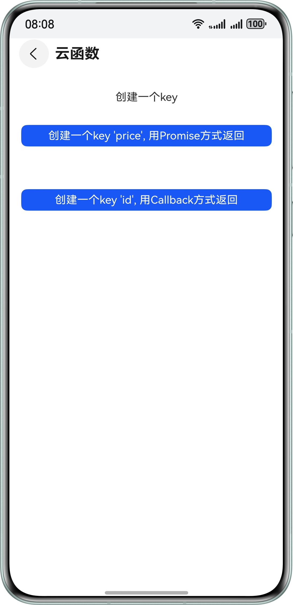

# Cloud Foundation Kit（云开发服务）

## 介绍

本示例展示了开发云函数、云存储、云数据库、预加载的过程，包括：

1.云函数的创建、部署及调用。

2.云存储的上传下载功能。

3.云数据库的创建和增删改查功能。

4.安装预加载和周期性预加载的用法。

需要使用@kit.CloudFoundationKit。

## 效果预览

| **云函数页面**                              | **云存储页面**                             | **云数据库页面**                            |                    安装预加载页面                     | 周期性预加载页面                                        |
|----------------------------------------|---------------------------------------|---------------------------------------|:----------------------------------------------:|-------------------------------------------------|
|  |  |  |  |  |

## Sample工程的配置与使用

### 在DevEco中配置Sample工程的步骤如下

1. [创建项目](https://developer.huawei.com/consumer/cn/doc/app/agc-help-create-project-0000002242804048)及[应用](https://developer.huawei.com/consumer/cn/doc/app/agc-help-create-app-0000002247955506)。
2. 打开Sample工程，使用[AppGallery Connect](https://developer.huawei.com/consumer/cn/service/josp/agc/index.html)配置的应用包名替换app.json5文件中的bundleName属性值。
3. 该Sample应用已集成认证服务SDK，请将您的“agconnect-services.json”文件复制到“AppScope/resources/rawfile”目录下。 具体参考[添加应用配置文件](https://developer.huawei.com/consumer/cn/doc/app/agc-help-auth-integration-sdk-0000002236337006#section845671619187)。 
4. 使用华为认证服务SDK登录华为账号后获取用户凭据，开通华为账号认证后，使用您的"client_id"替换module.json5中metadata字段里的"client_id"对应的"value"的值。具体参考[认证服务-华为账号](https://developer.huawei.com/consumer/cn/doc/AppGallery-connect-Guides/agc-auth-harmonyos-arkts12-login-hwaccount-0000001975787301)。 
5. 进行[手动签名](https://developer.huawei.com/consumer/cn/doc/harmonyos-guides/ide-signing#section297715173233)，注意：不支持自动签名。 
6. 在[AppGallery Connect](https://developer.huawei.com/consumer/cn/service/josp/agc/index.html)平台开通云函数、云存储、云数据库和预加载功能。 
7. 云函数需要创建两个名称分别为sort和sort-id的函数，函数的内容具体可以参考工程目录下functionJSDemo文件夹中的`sort_$latest`和`sort-id_$latest`。 
8. 云数据库中需要配置一个名称为QuickStartDemo的存储区，创建一个名称为PicInfo的存储对象，对象属性可参考 

   然后将对象导出为json文件，名称修改为schema.json，并替换工程resources目录下rawfile文件夹中的schema.json文件，导出文件操作可参考[新增对象类型](https://developer.huawei.com/consumer/cn/doc/harmonyos-guides/cloudfoundation-database-add-object)。 
9. 预加载中需要绑定云函数，参考[配置预加载](https://developer.huawei.com/consumer/cn/doc/harmonyos-guides/cloudfoundation-prefetch-config)。

### Sample工程使用说明

1. 运行该Sample应用，依次点击"云函数"、"云存储"、"云数据库"、"安装预加载"、"周期性预加载"按钮，会进入相应的功能展示页面。
2. 云函数页面展示了调用sort函数返回字符串price、调用sort-id函数返回字符串id，且分别以Promise方式和Callback方式返回。
3. 云存储页面展示了上传文件、下载文件、删除文件、获取文件地址、列出存储信息、获取和设置元数据的功能，点击相应按钮执行功能，下方的message区域会打印出相关信息。
4. 云数据库页面展示了插入数据、按照各种条件查询数据、对查询数据数字属性的算术计算、更新数据、删除数据的功能，点击相应按钮执行功能，下方的message区域会打印出相关信息。
5. 首页的安装预加载按钮点击后以弹窗形式展示安装预加载的数据。
6. 周期性预加载页面展示了注册周期性预加载任务，获取周期性预加载数据。

## 工程目录

```
├──AppScope/resources/rawfile
│  └──schema.json                   // 云数据库端侧配置文件
├──entry/src/main/ets
│  ├──common
│  │  ├──Common.ets                 // 通用工具类
│  │  └──GlobalContext.ets          // 全局应用上下文类
│  ├──entryability               
│  │  └──EntryAbility.ets           // 程序入口类
│  ├──model
│  │  └──PicInfo.ets                // 云数据库对象文件
│  └──pages
│     ├──CloudDatabasePage.ets      // 云数据库页面
│     ├──CloudResPrefetchPage.ets   // 周期性预加载页面
│     ├──FunctionPage.ets           // 云函数页面
│     ├──Index.ets                  // 入口类文件
│     └──StoragePage.ets            // 云存储页面
├──entry/src/main/resources         // 应用资源目录
└──functionJSDemo                   // AGC云函数JS Demo代码
```

## 具体实现

云函数：调用cloudFunction.call方法传入sort 和sort-id，获取一个string类型的price和id，参考FunctionPage.ets。

* 使用cloudFunction.call({ name: 'sort' }) 以Promise方式返回一个FunctionResult对象，解析FunctionResult，最终用key sort来获取想要的值‘price’。
* 使用cloudFunction.call({ name: 'sort-id' }) 以Callback方式返回一个FunctionResult对象，解析FunctionResult，最终用key sort-id来获取想要的值‘id’。

云存储：调用相关方法实现文件上传、下载等功能，参考StoragePage.ets。

* 上传文件API ， 使用photoAccessHelper.PhotoViewPicker()
  选择一张图片，将选中文件copy至cache目录下，使用云存储API上传文件，cloudStorage.bucket().uploadFile(context,
  {localPath: cacheFile, cloudPath: UI.uploadFileName, mode:request.agent.Mode.BACKGROUND})，日志会打印在屏幕下方。

* 下载文件API ， 使用cloudStorage.bucket().downloadFile(context,{localPath:`./${Date.now()}_`
  +UI.uploadFileName,cloudPath:UI.uploadFileName})接口下载文件，日志会打印在屏幕下方。

* 删除文件方法，使用bucket的deleteFile接口传入图片名称。

  let bucket: cloudStorage.StorageBucket = cloudStorage.bucket();

  bucket.deleteFile(UI.uploadFileName);

  日志会打印在屏幕下方。

* 获取文件的URL, 使用bucket的getDownloadURL接口传入图片名称。

  let bucket: cloudStorage.StorageBucket =cloudStorage.bucket();

  bucket.getDownloadURL(UI.uploadFileName);

  日志会打印在屏幕下方。

* 获取文件列表， 使用bucket.list('')方法返回文件列表，日志会打印在屏幕下方。

* 获取元数据，使用bucket.getMetadata(UI.uploadFileName)方法传入文件名，日志会打印在屏幕下方。

* 设置元数据，使用bucket.setMetadata(UI.uploadFileName, {customMetadata: { key1: "value1", key2: "value2" }})
  方法传入文件名，自定义元数据名称，日志会打印在屏幕下方。

云数据库：调用相关接口进行数据增删改查，参考CloudDatabasePage.ets。

* 插入数据，首先利用PicInfo创建一个需要添加的对象pic, 调用方法databaseZone.upsert(pic)插入数据，日志会打印在屏幕下方。

* 查询所有数据，首先创建一个查询条件 let condition = new cloudDatabase.DatabaseQuery(PicInfo)，然后调用databaseZone.query(
  condition)
  查询数据，查询到的数据属性日志会打印在屏幕下方。按照各种条件查询，比如查询picName等于‘左传’的数据，设置condition的查询条件condition.equalTo('picName', '左传') ，然后执行databaseZone.query(condition)查询数据，其他条件就不赘述，详细参考代码示例。

* 查询数据后对数据的number类型的属性进行算数计算，首先创建查询条件 let condition = new cloudDatabase.DatabaseQuery(PicInfo)，使用方法databaseZone.calculateQuery(condition, 'price', cloudDatabase.QueryCalculate.AVERAGE)，其中price为PicInfo中的属性，AVERAGE表示计算平均值，还有其他枚举值如SUM计算和等，具体参考代码。

* 删除数据，首先创建一个要删除的对象，设置对象的id，根据id去删除。

  let pic = new PicInfo()

  pic.id = 11

  databaseZone.delete(pic)

云数据库对象：参考PicInfo.ets。

预加载：调用相关接口进行预加载数据的获取，安装预加载参考首页的安装预加载方法，周期性预加载参考CloudResPrefetchPage.ets。

- 安装预加载，使用cloudResPrefetch.getPrefetchResult(cloudResPrefetch.PrefetchMode.INSTALL_PREFETCH)方法获取数据。
- 周期性预加载，使用cloudResPrefetch.registerPrefetchTask()方法注册周期性预加载，注册成功后使用cloudResPrefetch.getPrefetchResult(cloudResPrefetch.PrefetchMode.PERIODIC_PREFETCH)方法获取数据。

**参考**

1. [entry\src\main\ets\pages\FunctionPage.ets](./entry/src/main/ets/pages/FunctionPage.ets)
2. [entry\src\main\ets\pages\StoragePage.ets](./entry/src/main/ets/pages/StoragePage.ets)
3. [entry\src\main\ets\pages\CloudDatabasePage.ets](./entry/src/main/ets/pages/CloudDatabasePage.ets)
4. [entry\src\main\ets\pages\CloudResPrefetchPage.ets](./entry/src/main/ets/pages/CloudResPrefetchPage.ets)
5. [entry\src\main\ets\model\PicInfo.ets](entry/src/main/ets/model/PicInfo.ets)

## 相关权限

该Sample应用在调用接口时需要访问网络权限"ohos.permission.INTERNET"，已在module.json5文件中添加。

## 依赖

设备需具备WIFI能力。

## 约束与限制

1. 本示例仅支持标准系统上运行，支持设备：华为手机。
2. 本示例支持API version 17及以上。
3. HarmonyOS系统：HarmonyOS 5.0.5 Release及以上。
4. DevEco Studio版本：DevEco Studio 5.0.5 Release及以上。
5. HarmonyOS SDK版本：HarmonyOS 5.0.5 Release SDK及以上。 