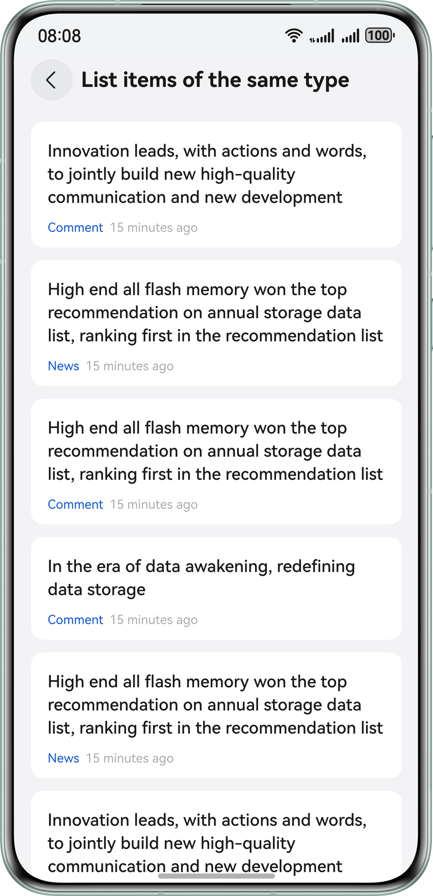
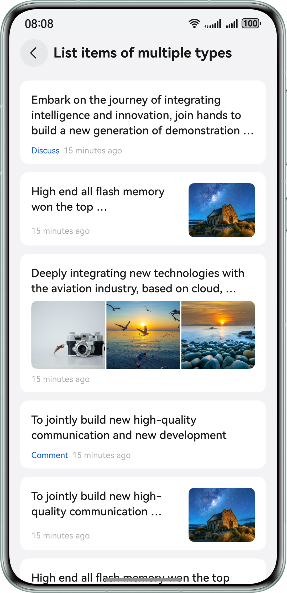
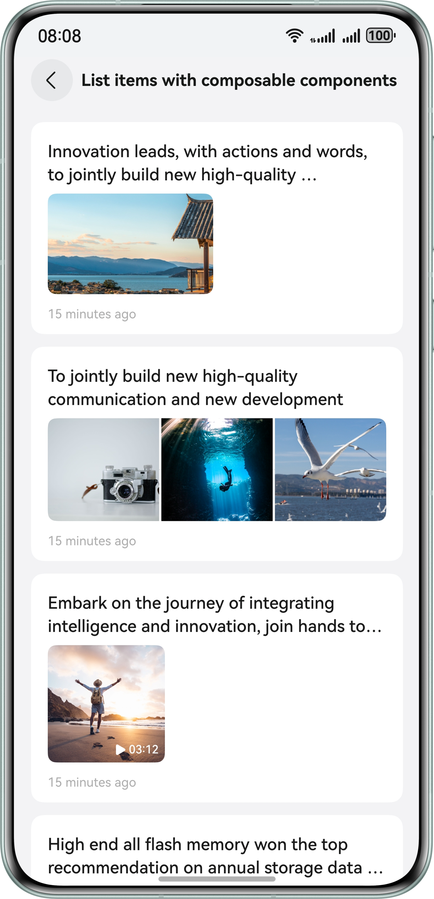
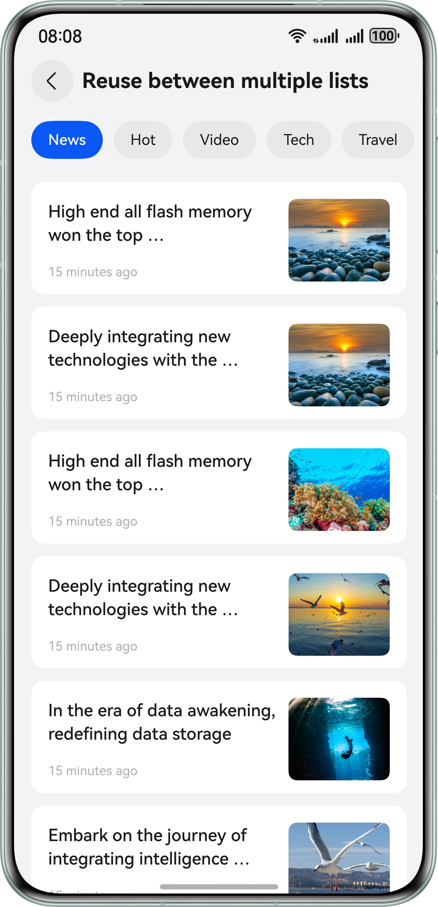

# Component Reuse

### Overview
This sample shows typical development scenarios of component reuse, including component reuse in the same list and component reuse between multiple lists.


### Effect

| Same Layout in the Same List                                                                    | Different Layouts in the Same List                                  | Modular Child Components in the Same List                               | 
|------------------------------------------------------------------------------------|--------------------------------------------------|--------------------------------------------------|
|  |  |  |

| Component Reuse Between Multiple Lists                                       | 
|--------------------------------------------------|
|  | 

How to Use
1. Start the application and tap a scenario category to access the corresponding list.
2. Swipe up or down and observe the component reuse effect. Make sure there is no frame loss.

### Project Directory

```
├──ets
│  ├──common
│  │  └──MockData.ets                      // Mock data source
│  ├──entryability
│  │  └──EntryAbility.ets                  // Entry ability
│  ├──entrybackupability
│  │  └──EntryBackupAbility.ets            // Entry for restoration
│  ├──model
│  │  ├──ItemData.ets                      // List item data model
│  │  ├──ItemDataSource.ets                // List item data source
│  │  └──TitleDataSource.ets               // Tab data source
│  ├──pages
│  │  ├──ComposableItemPage.ets            // Page for list items with composable child components
│  │  ├──DiffListReusePage.ets             // Page for component reuse between multiple lists 
│  │  ├──Index.ets                         // Home page
│  │  ├──MultiTypeItemPage.ets             // Page for list items in different layouts 
│  │  ├──OneTypeItemPage.ets               // Page for list items in the same layout
│  │  └──SameListReusePage.ets             // Index page for component reuse in the same list 
│  ├──utils
│  │  ├──IdleCallback.ets                  // Pre-cache logic of list items 
│  │  └──BuilderNodePool.ets               // Node cache and reuse pool
│  └──view
│     ├──DiffListItemNode.ets              // Placeholder node of list items in multiple lists 
│     ├──DiffListItemView.ets              // List item view in multiple lists
│     ├──TabContentView.ets                // Encapsulated tab content page in multiple lists 
│     └──TabTitleView.ets                  // Encapsulated tab option view
└──resources                               // Resources
```

### How to Implement

* Component reuse in the same list: Use @Reusable and call the aboutToReuse lifecycle to implement the reuse.
* Component reuse between multiple lists: Use NodeContainer and NodePool to implement child component reuse in different parent components.


### Required Permissions

N/A

### Dependencies

N/A

### Constraints

1. This sample is only supported on Huawei phones with standard systems.
2. The HarmonyOS version must be HarmonyOS 5.0.5 Release or later.
3. The DevEco Studio version must be DevEco Studio 5.0.5 Release or later.
4. The HarmonyOS SDK version must be HarmonyOS 5.0.5 Release SDK or later.

