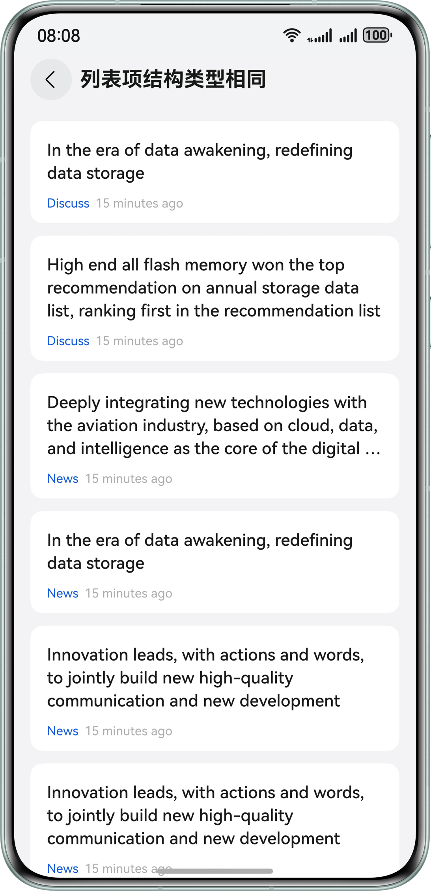

# 实现组件复用

### 介绍
本示例为开发者展示组件复用的典型开发场景，包括同一列表内的组件复用、多个列表间的组件复用。


### 效果预览

| 同一列表内-列表项结构类型相同                                                                    | 同一列表内-列表项结构类型不同                                  | 同一列表内-列表项内子组件可拆分组合                               | 
|------------------------------------------------------------------------------------|--------------------------------------------------|--------------------------------------------------|
|  |  |  |

| 多个列表间的组件复用                                       | 
|--------------------------------------------------|
|  | 

使用说明
1. 启动应用，点击具体场景分类，进入对应列表场景中。
2. 上下滑动列表，观察体验组件复用效果，滑动时不丢帧。

### 工程目录

```
├──ets
│  ├──common
│  │  └──MockData.ets                      // mock数据源
│  ├──entryability
│  │  └──EntryAbility.ets                  // ability入口
│  ├──entrybackupability
│  │  └──EntryBackupAbility.ets            // ability恢复入口
│  ├──model
│  │  ├──ItemData.ets                      // 列表项数据模型
│  │  ├──ItemDataSource.ets                // 列表项数据源
│  │  └──TitleDataSource.ets               // 标签数据源
│  ├──pages
│  │  ├──ComposableItemPage.ets            // 子组件可组合布局的列表项页面
│  │  ├──DiffListReusePage.ets             // 多个列表间的组件复用页面
│  │  ├──Index.ets                         // 首页
│  │  ├──MultiTypeItemPage.ets             // 多种结构类型的列表项页面
│  │  ├──OneTypeItemPage.ets               // 相同结构类型的列表项页面
│  │  └──SameListReusePage.ets             // 同一列表内的组件复用索引页面
│  ├──utils
│  │  ├──IdleCallback.ets                  // 列表项预缓存逻辑
│  │  └──BuilderNodePool.ets               // Node缓存复用池工具
│  └──view
│     ├──DiffListItemNode.ets              // 多个列表间的列表项占位结点
│     ├──DiffListItemView.ets              // 多个列表间的列表项视图
│     ├──TabContentView.ets                // 多个列表间封装的Tab内容页
│     └──TabTitleView.ets                  // 封装的标签选项视图
└──resources                               // 资源
```

### 具体实现

* 同一列表内的组件复用：使用@Reusable实现，复用时需要实现aboutToReuse生命周期。
* 多个列表间的组件复用：使用NodeContainer占位结点，结合NodePool全局缓存复用池，实现在不同父组件中的子组件复用。


### 相关权限

不涉及。

### 依赖

不涉及。

### 约束与限制

1. 本示例仅支持标准系统上运行，支持设备：华为手机。
2. HarmonyOS系统：HarmonyOS 5.0.5 Release及以上。
3. DevEco Studio版本：DevEco Studio 5.0.5 Release及以上。
4. HarmonyOS SDK版本：HarmonyOS 5.0.5 Release SDK及以上。

