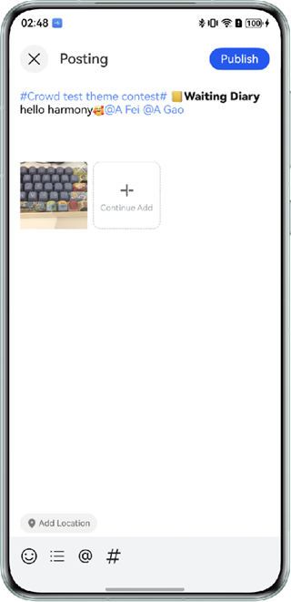

# Content Publisher

## Overview

This sample uses the RichEditor component and common ArkUI component to implement an image and text content publisher.

## Preview



## How to Use

1. Tap **Add High-Quality Image**. After you select an image, the image is displayed in the horizontal list.
2. Tap the **Body** text box to input the corresponding information.
3. Tap  at the bottom of the page. The graphic title list is displayed at the bottom of the page. After you select a graphic title, it will show up in the text box.
4. Tap @ at the bottom of the page to go to the contact page. Select the target contact to mention using @ and return to the post page. The nickname of the selected contact is displayed in the text box.
5. Tap # at the bottom of the page to go to the topic list page. Select a topic, and close the dialog box. The selected topic is displayed in the text box.
6. Tap **Add Location** in the lower left corner to select a location. **Add Location* will be replaced by the selected location.
7. Tap Emoji Button # at the bottom of the page to open emoji keyboard. Select a emoji to display in the text box.

## Project Directory

```
├──entry/src/main/ets                         // Code area
│  ├──constants
│  │  └──CommonConstants.ets                  // Common constants
│  ├──entryability
│  │  └──EntryAbility.ets       
│  ├──model
│  │  └──CommonModel.ets                      // Common entity class      
│  ├──pages
│  │  ├──ContactListPage.ets                  // Contact page
│  │  └──Home.ets                             // Home page      
│  ├──utils
│  │  ├──CommonUtil.ets                       // Common util class.
│  │  ├──PermissionUtil.ets                   // Permission util class.
│  │  ├──FileUtil.ets                         // Image selection util class.
│  │  ├──LocationUtil.ets                     // Local location util class.
│  │  └──Logger.ets                           // Log file
│  └──view
│     ├──ContactListView.ets                  // Contact module.
│     ├──PictureListView.ets                  // Add an image module.
│     ├──ToolbarView.ets                      // Bottom tool bar
│     ├──EditorView.ets                       // Edit the input module.
│     ├──GraphicTitleView.ets                 // Graphic title component
│     ├──TopView.ets                          // Top area module
│     └──TopicView.ets                        // Topic content component
└──entry/src/main/resources                   // App resource directory
```

## How to Implement
Use the RichEditor component capabilities.

## Required Permissions

- Apply for the ohos.permission.APPROXIMATELY_LOCATION and ohos.permission.LOCATION permissions to obtain device location information.

## Dependencies

N/A

## Constraints

1. The sample is only supported on Huawei phones and tablets with standard systems.

2. The HarmonyOS version must be HarmonyOS 5.1.1 Release or later.

3. The DevEco Studio version must be DevEco Studio 5.1.1 Release or later.

4. The HarmonyOS SDK version must be HarmonyOS 5.1.1 Release SDK or later.
