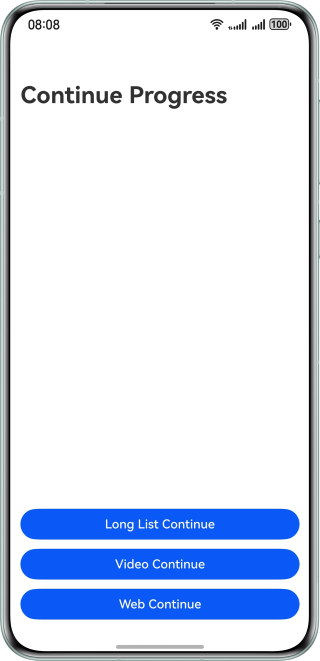
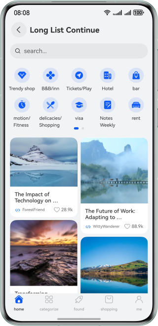
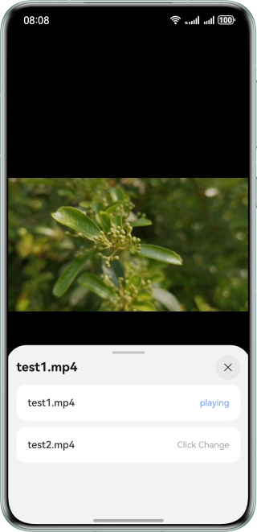
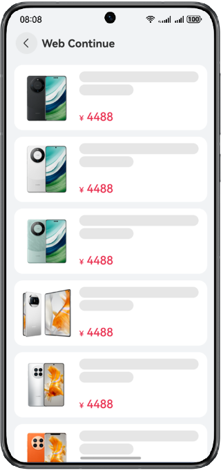

# Application Continuation (for Browsing Progress)

### Overview

This sample implements progress continuation for long list browsing, media browsing, and web page browsing based on the application continuation and distribution capabilities. The long list is implemented by embedding **WaterFlow** in **List**, and **currentOffset** needs to be continued. The media browsing is continued by using AVPlayer, and the **seek()** API is used to continue with an episode stopped at a specific playback time. The web progress is obtained by using the JS statement.

### Preview

| Home                               | Long list                             | Media                              | Web                              |
|------------------------------------|---------------------------------------|------------------------------------|----------------------------------|
|  |  |  |  |

### How to Use

In this sample, three buttons are provided to trigger progress continuation in different scenarios.
1. Long list progress continuation: Tap this button to enter the long list browsing page and complete the progress continuation.
2. Media browsing progress continuation: Tap this button to watch a video and switch from it to another and complete the progress continuation.
3. Web page browsing progress continuation: Tap this button to view the web page and complete the progress continuation.

### Project Directory

```
├──entry/src/main/ets/
│  ├──entryability
│  │  └──EntryAbility.ets               // Entry ability
│  ├──entrybackupability
│  │  └──EntryBackupAbility.ets         // Data backup and restoration
│  └──pages
│     └──Index.ets                      // Home page
├──entry/src/main/resources             // App resource directory
├──features/longList/src/main/ets/
│  ├──constants
│  │  ├──BreakpointConstants.ets        // Breakpoint constants
│  │  ├──CommonConstants.ets            // Common constants
│  │  └──HomeConstants.ets              // Home page constants
│  ├──longlistability
│  │  └──LongListAbility.ets
│  ├──model
│  │  ├──FooterTabData.ets              // Data related to the footer tab
│  │  ├──FunctionEntryData.ets          // Data for function entries
│  │  ├──FunctionEntryListData.ets      // List of data in the function entry
│  │  ├──WaterFlowData.ets              // Waterfall data
│  │  ├──WaterFlowDescriptionData.ets   // Description data at the bottom of a waterfall item
│  │  ├──WaterFlowHeadData.ets          // Header data of a waterfall item
│  │  └──WaterFlowListData.ets          // List of waterfall data
│  ├──pages
│  │  └──Index.ets                      // Page entry
│  ├──utils
│  │  ├──BreakpointSystem.ets           // Breakpoint listening
│  │  ├──BreakpointType.ets             // Breakpoint type
│  │  ├──Logger.ets                      // Logger
│  │  └──NetworkUtil.ets                // Network request utility
│  └──view
│     ├──FunctionView.ets               // Function view
│     ├──HomeContent.ets                // Home page
│     ├──IndexNavDestination.ets        // Navigation bar entry
│     ├──NavigationBarView.ets          // Navigation bar view
│     ├──SearchBarView.ets              // Search bar view
│     ├──WaterFlowDescriptionView.ets   // View for the description at the bottom of a waterfall item
│     ├──WaterFlowImageView.ets         // View for the image description of a waterfall item
│     ├──WaterFlowLivingView.ets        // View for the live video description of a waterfall item
│     ├──WaterFlowVideoView.ets         // View for the video description of a waterfall item
│     └──WaterFlowView.ets              // Waterfall view
├──features/longList/src/main/resources // Resources
├──features/video/src/main/ets/         // Code area
│  ├──components
│  │  ├──ExitVideo.ets                  // App exit component
│  │  ├──SpeedDialog.ets                // Playback speed dialog
│  │  └──VideoOperate.ets               // Video operation component
│  ├──pages
│  │  └──Index.ets                      // Home page
│  ├──utils
│  │  ├──GlobalContext.ets              // Context utility
│  │  ├──Logger.ets                     // Logger
│  │  ├──ResourceUtil.ets               // Resource utility
│  │  └──TimeUtils.ets                  // Video time help utilities
│  ├──videoability
│  │  └──VideoAbility.ets
│  └──videomanager
│     └──AvPlayManager.ets              // Video management interface, encapsulating the external functional APIs
├──features/video/src/main/resources    // App resource directory
├──features/web/src/main/ets            // Code area
│  ├──common
│  │  ├──constants
│  │  │  └──CommonConstants.ets         // Common constants
│  │  └──utils
│  │     └──Logger.ets                  // Logger
│  ├──model
│  │  └──ProductModel.ets               // Product model
│  ├──pages
│  │  ├──IndexPage.ets                  // Home page
│  │  └──OrderConfirmPage.ets           // Order confirm page
│  └──webability
│     └──WebAbility.ets
└──features/web/src/main/resources      // Resource folder

```

### How to Implement
1. The long list is implemented by embedding **WaterFlow** in **List**, and **currentOffset** needs to be continued.
2. The media browsing is continued with an episode stopped at a specific playback time by using AVPlayer.
3. The web progress is obtained by using the JS statement.

### Permissions
N/A

### Dependencies
N/A

### Constraints

1. The sample is only supported on Huawei phones with standard systems.

2. The HarmonyOS version must be HarmonyOS 5.0.5 Release or later.

3. The DevEco Studio version must be DevEco Studio 5.0.5 Release or later.

4. The HarmonyOS SDK version must be HarmonyOS 5.0.5 Release SDK or later.

5. Both devices must be logged in with the same HUAWEI ID.

6. Wi-Fi and Bluetooth must be enabled on both devices. If the source and target devices are connected to the same LAN, data transmission speed can be improved.

7. Application continuation can be triggered only between the same application (UIAbility) of both devices, that is, the application must have been installed on the two devices.