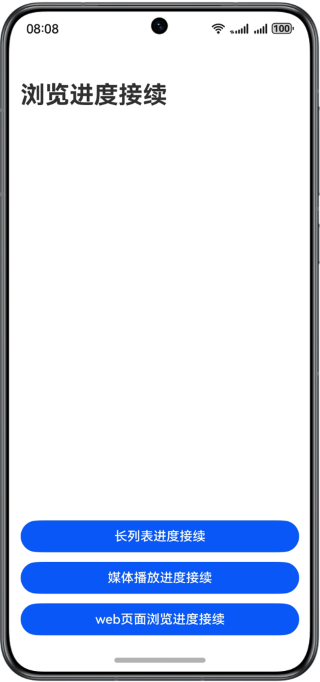
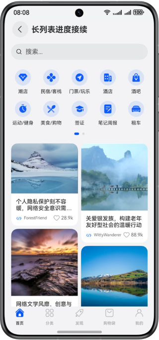
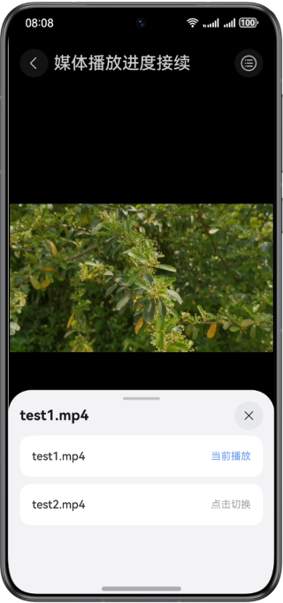
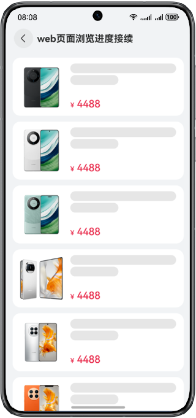

# 实现浏览进度接续功能

### 介绍

本示例基于应用接续和分布式能力实现了长列表浏览、媒体浏览和web页面浏览的进度接续。长列表是List嵌套WaterFlow组件，需要将currentOffset接续； 媒体进度接续使用Avplayer实现，接续其集数和播放时间，使用seek()接口实现；Web进度使用js语句获取进度。

### 效果预览

| 首页                              | 长列表                                | 媒体                              | web                           |
|---------------------------------|------------------------------------|---------------------------------|-------------------------------|
|  |  |  |  |

### 使用说明：

本示例提供3个按钮触发使用不同场景的进度接续：

1. 长列表进度：点击该按钮完成进入长列表浏览页面，点击对端接续图标，对端恢复页面到长列表页面并且浏览位置在源端离开的条目附近。
2. 媒体浏览进度接续：可以观看视频切换视频，点击对端接续图标，对端恢复视频播放页面，并且从源端当前播放的位置开始播放。
3. Web页面浏览进度接续：可以查看web页面，点击对端接续图标，对端恢复页面到web页面并且浏览位置在源端离开的条目附近。


### 工程目录

```
├───ets                                         
│   ├───constants                               
│   │   ├───BreakpointConstants.ets             // 断点相关常量
│   │   ├───CommonConstants.ets                 // 一般常量
│   │   └───HomeConstants.ets                   // 主页的常量
│   ├───entryability                            
│   │   └───EntryAbility.ets                    // 程序入口类
│   ├───entrybackupability                      
│   │   └───EntryBackupAbility.ets              // 备份恢复类
│   ├───pages                                   
│   │   └───Index.ets                           // 首页
│   ├───utils                                   
│   │   ├───BreakpointSystem.ets                // 一多断点监听
│   │   ├───BreakpointType.ets                  // 一多断点类型
│   │   ├───GlobalContext.ets                   // 上下文工具类
│   │   ├───NetworkUtil.ets                     // 网络请求
│   │   ├───ResourceUtil.ets                    // 资源工具类
│   │   └───TimeUtils.ets                       // 视频时间帮助类
│   ├───view                                    
│   │   ├───longlist                            
│   │   │   ├───FunctionView.ets                // 功能区页面
│   │   │   ├───HomeContent.ets                 // 主页
│   │   │   ├───LongListPageComponent.ets       // 列表页面
│   │   │   ├───NavigationBarView.ets           // 导航栏页面
│   │   │   ├───SearchBarView.ets               // 搜索栏页面
│   │   │   ├───WaterFlowDescriptionView.ets    // 瀑布流item底部描述页面
│   │   │   ├───WaterFlowImageView.ets          // 瀑布流item图片描述页面
│   │   │   ├───WaterFlowLivingView.ets         // 瀑布流item直播描述页面
│   │   │   ├───WaterFlowVideoView.ets          // 瀑布流item视频描述页面
│   │   │   └───WaterFlowView.ets               // 瀑布流页面
│   │   ├───video                               
│   │   │   ├───ExitVideo.ets                   // 退出应用组件
│   │   │   ├───SpeedDialog.ets                 // 播放倍速弹窗
│   │   │   ├───VideoOperate.ets                // 视频操作组件
│   │   │   └───VideoPageComponent.ets          // 视频页面
│   │   └───web                                 
│   │       └───WebPageComponent.ets            // 网页显示页面
│   └───viewmodel                               
│       ├───longlist                            
│       │   ├───FooterTabData.ets               // 底部导航栏
│       │   ├───FunctionEntryData.ets           // 功能区
│       │   ├───FunctionEntryListData.ets       // 功能区数据列表
│       │   ├───WaterFlowData.ets               // 瀑布流数据
│       │   ├───WaterFlowDescriptionData.ets    // 瀑布流item底部描述信息
│       │   ├───WaterFlowHeadData.ets           // 瀑布流item媒体信息
│       │   └───WaterFlowListData.ets           // 瀑布流数据列表
│       ├───video                               
│       │   └───AvPlayManager.ets               // 视频管理接口，统一封装了对外提供的功能接口
│       └───web                                 
│           └───ProductModel.ets                // 产品模型
└───entry/src/main/resources                    // 应用资源目录

```

### 具体实现
1. 长列表是List嵌套WaterFlow组件，需要接续currentOffset。
2. 媒体进度接续使用AVplayer实现，接续其集数和播放进度。
3. Web进度使用js语句获取进度。

### 相关权限
不涉及

### 依赖
不涉及

### 约束与限制

1.本示例仅支持标准系统上运行，支持设备：华为手机、华为平板、华为电脑。

2.HarmonyOS系统：HarmonyOS 5.0.5 Release及以上。

3.DevEco Studio版本：DevEco Studio 5.0.5 Release及以上。

4.HarmonyOS SDK版本：HarmonyOS 5.0.5 Release SDK及以上。

5.双端设备需要登录同一华为账号。

6.双端设备建议打开Wi-Fi和蓝牙开关。条件允许时，建议双端设备接入同一个局域网，可提升数据传输的速度。

7.应用接续只能在同应用（UIAbility）之间触发，双端设备都需要有该应用。