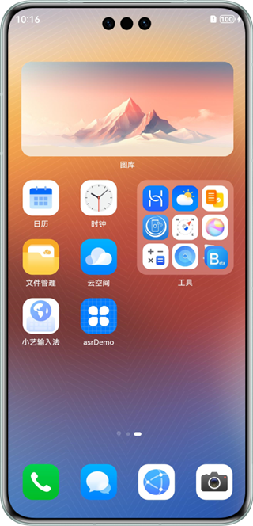
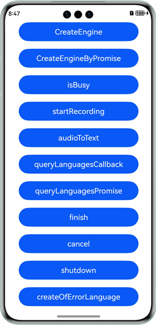
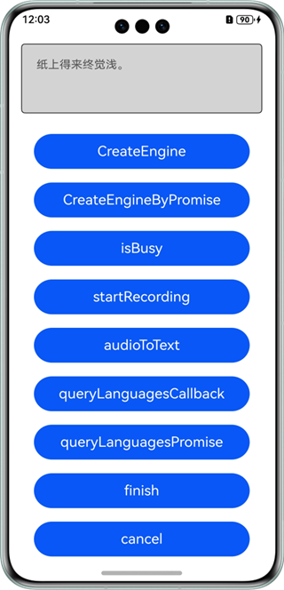

# 语音识别

## 介绍

本示例展示了使用基础语音服务提供的语音识别能力。

本示例展示了对一段音频流转换成文字的能力展示。

需要使用语音识别接口@hms.ai.speechRecognizer.d.ts.

## 效果预览

|           **桌面**            |         **主页面**          |         **录音播报**          |
|:---------------------------:|:------------------------:|:-------------------------:|
|  |  |  | 

使用说明：

1. 在手机的主屏幕，点击”asrDemo“，启动应用。
2. 点击“CreateEngine”，进行能力初始化。
3. 可以选择以下其中一种方式进行操作,两者同时使用回调会发生异常：
   a)点击“startRecording”，开始录音识别。
   b)点击“audioToText”读取应用音频文件，写流进行识别。
   如选择后者则需开发者将PCM格式的音频信息存放在 entry\src\main\resources\resfile 路径下。
4. 点击“finish”等按钮对识别事件进行控制。
5. 点击“queryLanguagesCallback/queryLanguagesPromise”，查询支持的语种和音色。

### 工程目录
```
├─entry/src/main/ets                         // 代码区
│  ├─entryability
│  │  └─EntryAbility.ets       
│  └─pages
│     ├─AsrConstants.ts                      // 常量类
│     ├─AudioCapturer.ts                     // 录音器实现1
│     ├─FileCapturer.ts                      // 录音器实现2
│     ├─ICapturerInterface.ts                // 录音器接口类
│     ├─Index.ets                            // 主界面
│     └─Util.ts                              // 工具类
├─entry/src/main/resources                   // 应用资源目录
└─screenshots                                // 截图
```

## 具体实现

本示例展示了在@hms.ai.speechRecognizer.d.ts定义的API：
~~~
* createEngine(createEngineParams: CreateEngineParams, callback: AsyncCallback<SpeechRecognizerEngine>): void;
* createEngine(createEngineParams: CreateEngineParams): Promise<SpeechRecognizerEngine>;
* setListener(listener: RecognizerListener): void;
* queryLanguages(params: LanguageQuery, callback: AsyncCallback<Array<string>>): void;
* queryLanguages(params: LanguageQuery): Promise<Array<string>>;
* startListening(params: StartParams): void;
* writeAudio(sessionId: string, audio: Uint8Array): void;
* finish(sessionId: string): void;
* cancel(sessionId: string): void;
* shutdown(): void;
~~~
业务使用时，需要先进行import导入speechRecognizer。
调用writeAudio等接口，传入想要识别的音频，得到识别结果，观察日志等。参考entry/src/main/ets/pages/Index.ets.

## 相关权限

ohos.permission.MICROPHONE

## 依赖

不涉及。

## 约束与限制

1. 本示例仅支持标准系统上运行，支持设备：华为手机、华为平板、2in1。
2. HarmonyOS系统：HarmonyOS NEXT Developer Beta1及以上。
3. DevEco Studio版本：DevEco Studio NEXT Developer Beta1及以上。
4. HarmonyOS SDK版本：HarmonyOS NEXT Developer Beta1 SDK及以上。

