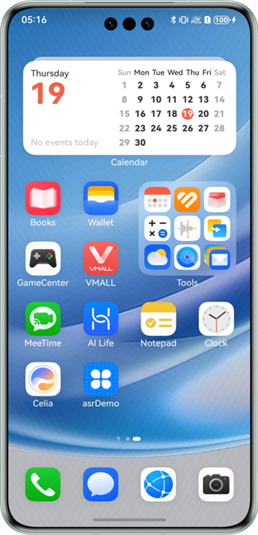
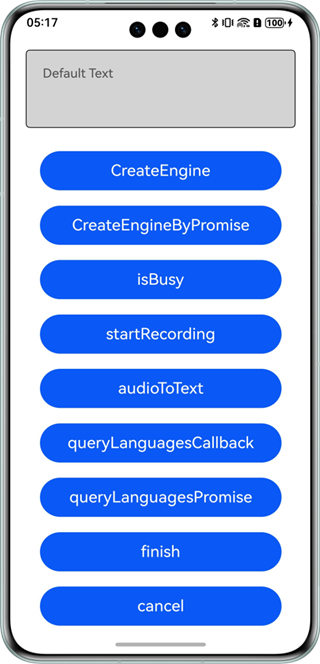
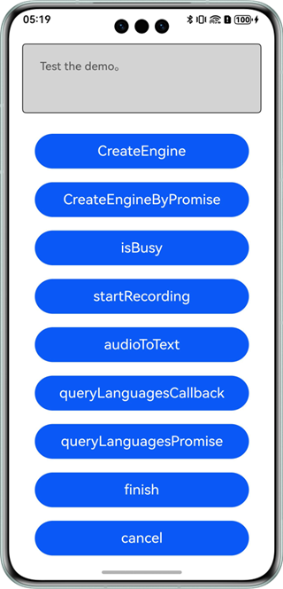

# Speech Recognition

## Overview

This sample code illustrates how to use the speech recognition capability provided by Core Speech Kit.

In this sample code, audio streams will be converted into text.

You need to use **@hms.ai.speechRecognizer.d.ts**, which contains the APIs for speech recognition.

## Preview

|           **Home screen**           |         **Main page**         |          **Broadcast**         |
|:---------------------------:|:------------------------:|:------------------------:|
|  |  |  | 

How to use:

1. On the home screen of a mobile phone, tap **asrDemo** to start the app.
2. Tap **CreateEngine** to initialize the capability.
3. You can choose either of the following methods to perform the operation. If you use the callback at the same time, an exception occurs.
   a) Tap **startRecording** to start recording recognition.
   b) Tap **audioToText** to read the application audio file and write streams for identification.
   If the latter is selected, the developer needs to save the audio information in PCM format to entry\src\main\resources\resfile.
4. Tap **finish** and other buttons to control the recognition event.
5. Tap **queryLanguagesCallback/queryLanguagesPromise** to query the supported languages and timbres.

### Project Directory
```
├─entry/src/main/ets                         // Code area
│  ├─entryability
│  │  └─EntryAbility.ets       
│  └─pages
│     ├─AsrConstants.ts                      // Constants
│     ├─AudioCapturer.ts                     // Recorder 1
│     ├─FileCapturer.ts                      // Recorder 2
│     ├─ICapturerInterface.ts                // Recorder API class
│     ├─Index.ets                            // Main page
│     └─Util.ts                              // Utility class
├─entry/src/main/resources                   // App resource directory
└─screenshots                                // Screenshots
```

## How to Implement

This example shows the APIs defined in **@hms.ai.speechRecognizer.d.ts**.
~~~
* createEngine(createEngineParams: CreateEngineParams, callback: AsyncCallback<SpeechRecognizerEngine>): void;
* createEngine(createEngineParams: CreateEngineParams): Promise<SpeechRecognizerEngine>;
* setListener(listener: RecognizerListener): void;
* queryLanguages(params: LanguageQuery, callback: AsyncCallback<Array<string>>): void;
* queryLanguages(params: LanguageQuery): Promise<Array<string>>;
* startListening(params: StartParams): void;
* writeAudio(sessionId: string, audio: Uint8Array): void;
* finish(sessionId: string): void;
* cancel(sessionId: string): void;
* shutdown(): void;
~~~
Before using the service, you need to import **speechRecognizer**.
Call APIs such as **writeAudio** to pass the audio to be recognized, obtain the recognition result, and view logs. For details, please refer to **entry/src/main/ets/pages/Index.ets**.

## Required Permissions

ohos.permission.MICROPHONE

## Dependencies

N/A

## Constraints

1. The sample app is only supported on Huawei phones, tablets, and 2-in-1 devices with standard systems.
2. The HarmonyOS version must be HarmonyOS NEXT Developer Beta1 or later.
3. The DevEco Studio version must be DevEco Studio NEXT Developer Beta1 or later.
4. The HarmonyOS SDK version must be HarmonyOS NEXT Developer Beta1 or later.
