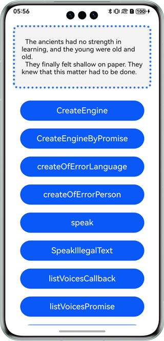
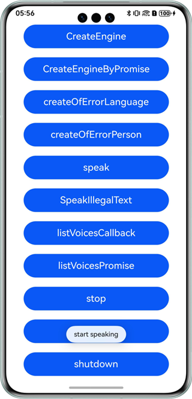

# 文本转语音

## 介绍

本示例展示了使用基础语音服务提供的文本转语音能力。

本示例展示了对一段文本，进行语音合成及播报的能力。

需要使用文本转语音接口@hms.ai.textToSpeech.d.ts.

## 效果预览

|           **桌面**            |            **主页面**            |          **播报**          |
|:---------------------------:|:-----------------------------:|:------------------------:|
|  |  |  | 

使用说明：

1. 在手机的主屏幕，点击”ttsDemo“，启动应用。
2. 点击“CreateEngine”按钮，进行能力初始化。
3. 点击“speak”按钮，试听文本播报。 
4. 点击“stop”等按钮对播报进行事件控制。
5. 点击“listVoicesCallback/listVoicesPromise”查询支持的语种和音色。

### 工程目录
```
├─entry/src/main/ets                         // 代码区
│  ├─entryability
│  │  └─EntryAbility.ets       
│  └─pages
│     ├─Index.ets                            // 主页界面
│     └─UuidBasics.ts                        // Uuid工具类
├─entry/src/main/resources                   // 应用资源目录
└─screenshots                                // 截图
```

## 具体实现

本示例展示了在@hms.ai.textToSpeech.d.ts定义的API：
~~~
* createEngine(createEngineParams: CreateEngineParams, callback: AsyncCallback<TextToSpeechEngine>): void;
* createEngine(createEngineParams: CreateEngineParams): Promise<TextToSpeechEngine>;
* speak(text: string, speakParams: SpeakParams, listener: SpeakListener): void;
* listVoices(params: VoiceQuery, callback: AsyncCallback<Array<VoiceInfo>>): void;
* listVoices(params: VoiceQuery): Promise<Array<VoiceInfo>>;
* stop(): void;
* isBusy(): boolean;
* shutdown(): void;
~~~
业务使用时，需要先进行import导入textToSpeech。
调用speak等接口，传入想要识别的文本，试听播报，观察日志等。参考entry/src/main/ets/pages/Index.ets.

## 相关权限

不涉及。

## 依赖

不涉及。

## 约束与限制

1. 本示例仅支持标准系统上运行，支持设备：华为手机、华为平板、2in1。
2. HarmonyOS系统：HarmonyOS NEXT Developer Beta1及以上。
3. DevEco Studio版本：DevEco Studio NEXT Developer Beta1及以上。
4. HarmonyOS SDK版本：HarmonyOS NEXT Developer Beta1 SDK及以上。


