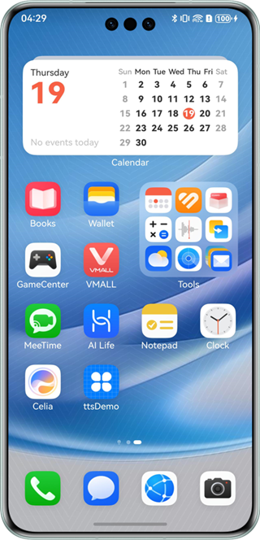
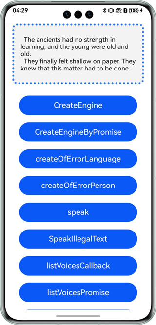
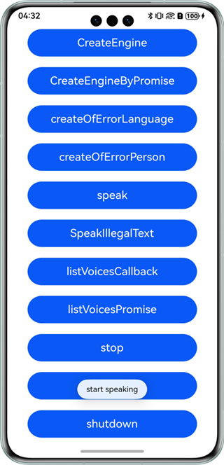

# Text-to-Speech

## Overview

This sample code illustrates how to use the text-to-speech capability provided by Core Speech Kit.

In this sample, a piece of text is synthesized to speech, which will be broadcast.

You need to use **@hms.ai.textToSpeech.d.ts**, which contains the APIs for text-to-speech.

## Preview

|           **Home screen**           |            **Main page**           |          **Broadcast**         |
|:---------------------------:|:-----------------------------:|:------------------------:|
|  |  |  | 

How to use:

1. On the home screen of a mobile phone, tap **ttsDemo** to start the app.
2. Tap **CreateEngine** to initialize the capability.
3. Tap **speak** to listen to the broadcast text.
4. Tap **stop** and other buttons to control the broadcast event.
5. Tap **listVoicesCallback/listVoicesPromise** to query the supported languages and timbres.

### Project Directory
```
├─entry/src/main/ets                         // Code area
│  ├─entryability
│  │  └─EntryAbility.ets       
│  └─pages
│     ├─Index.ets                            // Main page
     └─UuidBasics.ts                         // UUID class
├─entry/src/main/resources                   // App resource directory
└─screenshots                                // Screenshots
```

## How to Implement

This example shows the APIs defined in **@hms.ai.textToSpeech.d.ts**.
~~~
* createEngine(createEngineParams: CreateEngineParams, callback: AsyncCallback<TextToSpeechEngine>): void;
* createEngine(createEngineParams: CreateEngineParams): Promise<TextToSpeechEngine>;
* speak(text: string, speakParams: SpeakParams, listener: SpeakListener): void;
* listVoices(params: VoiceQuery, callback: AsyncCallback<Array<VoiceInfo>>): void;
* listVoices(params: VoiceQuery): Promise<Array<VoiceInfo>>;
* stop(): void;
* isBusy(): boolean;
* shutdown(): void;
~~~
Before using the service, you need to import **textToSpeech**.
Call **speak** and other APIs to pass the text to be recognized, listen to the broadcast, and view logs. For details, please refer to **entry/src/main/ets/pages/Index.ets**.

## Required Permissions

N/A

## Dependencies

N/A

## Constraints

1. The sample app is only supported on Huawei phones, tablets, and 2-in-1 devices with standard systems.
2. The HarmonyOS version must be HarmonyOS NEXT Developer Beta1 or later.
3. The DevEco Studio version must be DevEco Studio NEXT Developer Beta1 or later.
4. The HarmonyOS SDK version must be HarmonyOS NEXT Developer Beta1 or later.
