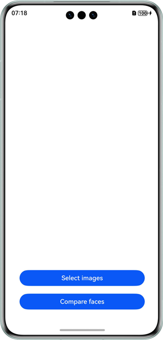
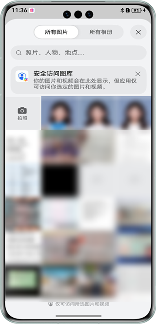
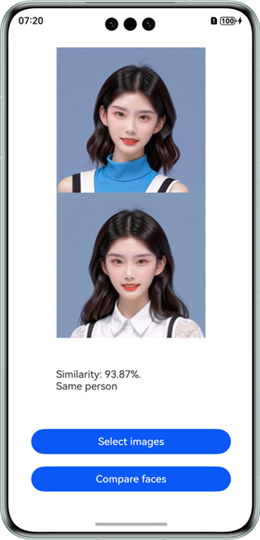

# 人脸比对

## 介绍

本示例展示了使用基础视觉服务提供的人脸比对能力。

本示例模拟了在应用里，选择两张图片，计算两个图中最大人脸的相似度

需要使用人脸比对接口@hms.ai.face.faceComparator.d.ts。

## 效果预览

|         **主窗口**          |             **选择图片**             |             **开始比对**             |
|:------------------------:|:--------------------------------:|:--------------------------------:|
|  |  |  | 

使用说明：

1. 在手机的主屏幕，点击”faceComparatorDemo“，启动应用。
2. 点击“Select images”按钮，用户可以在图库中选择图片，或者通过相机拍照。
3. 点击“Compare faces”按钮，比对人脸信息，结果通过文本展示。

## 工程目录
```
├─entry/src/main/ets
│  ├─entryability
│  │  ├─EntryAbility.ets            // 程序入口
│  └─pages
│     └─Index.ets                   // 应用主界面
└─entry/src/main/resources          // 资源文件目录
```

## 具体实现

本示例展示的控件在@hms.ai.face.faceComparator.d.ts定义了人脸比对API：
~~~
*     function compareFaces(visionInfo1: VisionInfo, visionInfo2: VisionInfo): Promise<FaceCompareResult>;
~~~
业务使用时，需要先进行import导入faceComparator
调用通用人脸比对接口，并传入想要比对的图片，接收处理返回的结果（文字信息）。参考entry/src/main/ets/pages/Index.ets.

## 相关权限

不涉及。

## 依赖

不涉及。

## 约束与限制

1. 本实例仅支持标准系统上运行，支持设备：华为手机、华为平板、2in1。
2. HarmonyOS系统：HarmonyOS NEXT Developer Beta1及以上。
3. DevEco Studio版本：DevEco Studio NEXT Developer Beta1及以上。
4. HarmonyOS SDK版本：HarmonyOS NEXT Developer Beta1 SDK及以上。