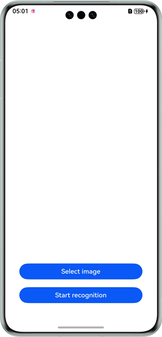
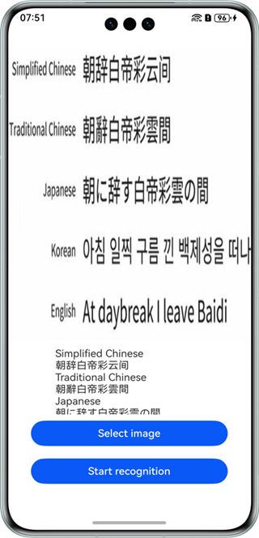

# 通用文字识别

## 介绍

本示例展示了使用基础视觉服务提供的通用文字识别能力。

本示例模拟了在应用里，选择一张图片，识别其文字信息并展示出来（可复制）。

需要使用通用文字识别接口@hms.ai.ocr.textRecognition.d.ts。

## 效果预览

|         **主窗口**          |             **选择图片**             |             **开始识别**             |
|:------------------------:|:--------------------------------:|:--------------------------------:|
|  |  |  | 

使用说明：

1. 在手机的主屏幕，点击”ocrDemo“，启动应用。
2. 点击“Select image”按钮，在图库中选择图片，或者通过相机拍照。
3. 点击“Start recognition”按钮，识别图本信息，文本展示并可复制。

## 工程目录
```
├─entry/src/main/ets
│  ├─entryability
│  │  └─EntryAbility.ets            // 程序入口
│  └─pages
│     └─Index.ets                   // 应用主界面
└─entry/src/main/resources          // 资源文件目录
```

## 具体实现

本示例展示的控件在@hms.ai.ocr.textRecognition.d.ts定义了文字识别API：
~~~
* recognizeText(visionInfo: VisionInfo, callback: AsyncCallback<TextRecognitionResult>): void
~~~
业务使用时，需要先进行import导入textRecognition。
调用通用文字识别接口，并传入想要识别的图片，接收处理返回的结果（文字信息）。参考entry/src/main/ets/pages/Index.ets.

## 相关权限

不涉及。

## 依赖

不涉及。

## 约束与限制

1. 本实例仅支持标准系统上运行，支持设备：华为手机、华为平板、2in1。
2. HarmonyOS系统：HarmonyOS NEXT Developer Beta1及以上。
3. DevEco Studio版本：DevEco Studio NEXT Developer Beta1及以上。
4. HarmonyOS SDK版本：HarmonyOS NEXT Developer Beta1 SDK及以上。