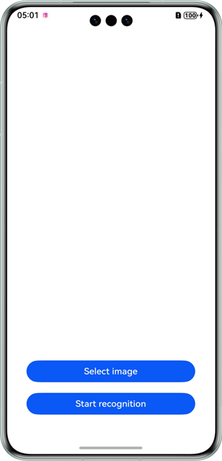
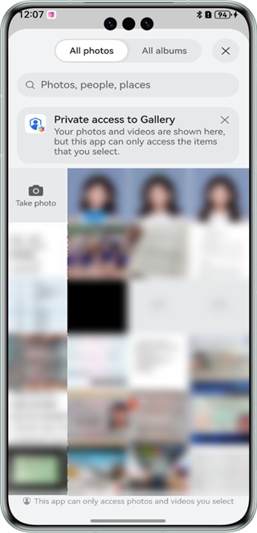
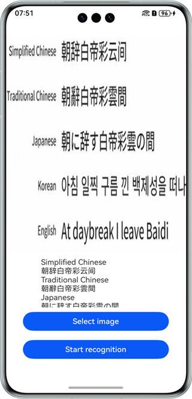

# OCR

## Overview

This sample code illustrates how to use the Optical Character Recognition (OCR) capability of Core Vision Kit.

It simulates how to select an image, recognize its text information, and display the result. The text result can be copied.

You need to use **@hms.ai.ocr.textRecognition.d.ts**, which contains the APIs for OCR.

## Preview

|         **App home screen**         |             **Selecting an image**            |             **Starting recognition**            |
|:------------------------:|:--------------------------------:|:--------------------------------:|
|  |  |  |

Instructions:

1. On the home screen of a mobile phone, tap **ocrDemo** to start the app.
2. Tap **Select image** to select an image from the gallery or take a photo using the camera.
3. Tap **Start recognition** to recognize text information from the image. The text is displayed and can be copied.

## Project Directory
```
├─entry/src/main/ets
│  ├─entryability
│  │  └─EntryAbility.ets            // Entry ability
│  └─pages
│     └─Index.ets                   // App home screen
└─entry/src/main/resources          // Directory for storing resource files
```

## How to Implement

The APIs for the OCR control in this sample have been defined in **@hms.ai.ocr.textRecognition.d.ts**.
~~~
* recognizeText(visionInfo: VisionInfo, callback: AsyncCallback<TextRecognitionResult>): void
~~~
Before using the service, you need to import **textRecognition**.
Call the OCR API, pass an image to be recognized, and receive the processing result (text information). For details, please refer to **entry/src/main/ets/pages/Index.ets**.

## Required Permissions

N/A

## Dependencies

N/A

## Constraints

1. The sample app is only supported on Huawei phones, tablets, and 2-in-1 devices with standard systems.
2. The HarmonyOS version must be HarmonyOS NEXT Developer Beta1 or later.
3. The DevEco Studio version must be DevEco Studio NEXT Developer Beta1 or later.
4. The HarmonyOS SDK version must be HarmonyOS NEXT Developer Beta1 SDK or later.
