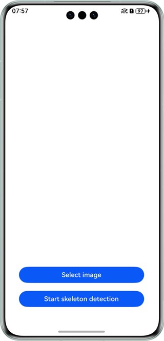

# Skeleton Detection

## Overview

This sample code illustrates how to use the skeleton detection capability of Core Vision Kit.

It simulates how to select a full-body image of a person and identify skeleton points.

You need to use **@hms.ai.vision.skeletonDetection.d.ts**, which contains the APIs for skeleton detection.

## Preview

|          **App home screen**         |             **Selecting an image**             |              **Starting skeleton detection**              |
|:-------------------------:|:---------------------------------:|:-----------------------------------:|
|  |  |  |

Instructions:

1. On the home screen of a mobile phone, tap **skeletonDetectDemo** to start the app.
2. Tap **Select image** to select an image from the gallery or take a photo using the camera.
3. Tap **Start skeleton detection** to identify skeleton points in the image. The result is displayed in text.

## Project Directory
```
├─entry/src/main/ets
│  ├─entryability
│  │  └─EntryAbility.ets            // Entry ability
│  ├─entrybackupability
│  │  └─EntryBackupAbility.ets
│  └─pages
│     └─Index.ets                   // App home screen
└─entry/src/main/resources          // Directory for storing resource files
```

## How to Implement

The APIs for the skeleton detection control in this sample have been defined in **@hms.ai.vision.skeletonDetection.d.ts**.
~~~
*     process(request: visionBase.Request): Promise<SkeletonDetectionResponse>;
~~~
Before using the service, you need to import **skeletonDetection**.
Call the skeleton detection API, pass an image to be recognized, and receive the processing result (text information). For details, please refer to **entry/src/main/ets/pages/Index.ets**.

## Required Permissions

N/A

## Dependencies

N/A

## Constraints

1. The sample app is only supported on Huawei phones, tablets, and 2-in-1 devices with standard systems.
2. The HarmonyOS version must be HarmonyOS NEXT Developer Beta1 or later.
3. The DevEco Studio version must be DevEco Studio NEXT Developer Beta1 or later.
4. The HarmonyOS SDK version must be HarmonyOS NEXT Developer Beta1 SDK or later.
