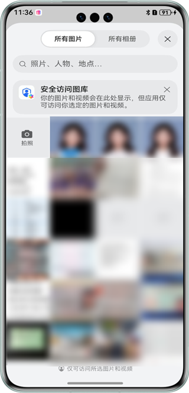

# 主体分割

## 介绍

本示例展示了使用基础视觉服务提供的主体分割能力。

本示例模拟了在应用里，选择一张图片，识别其图片中的显著性主体并展示出来主体的边界框的数据。

需要使用主体分割接口@hms.ai.vision.subjectSegmentation.d.ts。

## 效果预览

|         **主窗口**          |             **选择图片**             |             **开始识别**             |
|:------------------------:|:--------------------------------:|:--------------------------------:|
|  |  |  | 

使用说明：

1. 在手机的主屏幕，点击”imgSegDemo“，启动应用，默认自带一张图片。
2. 点击“Select image”按钮，用户可以在图库中选择图片，或者通过相机拍照。
3. 点击“Start subject segmentation”按钮，识别图片中的显著性主体，结果通过主体边界框的坐标显示。

## 具体实现

本示例展示的控件在@hms.ai.vision.subjectSegmentation.d.ts定义了主体分割API：
~~~
*   function doSegmentation(visionInfo: VisionInfo, config?: SegmentationConfig): Promise<SegmentationResult>;
~~~
业务使用时，需要先进行import导入subjectSegmentation
调用通用主体分割接口，并传入想要识别的图片，接收处理返回的结果（文字信息）。参考entry/src/main/ets/pages/Index.ets.

## 相关权限

不涉及。

## 依赖

不涉及。

## 约束与限制

1. 本实例仅支持标准系统上运行，支持设备：华为手机、华为平板、2in1。
2. HarmonyOS系统：HarmonyOS NEXT Developer Beta1及以上。
3. DevEco Studio版本：DevEco Studio NEXT Developer Beta1及以上。
4. HarmonyOS SDK版本：HarmonyOS NEXT Developer Beta1 SDK及以上。