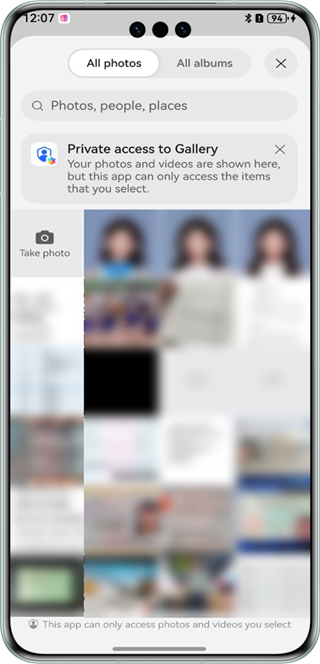

# Subject Segmentation

## Overview

This sample code illustrates how to use the subject segmentation capability of Core Vision Kit.

It simulates how to select an image, identify salient subjects in the image, and display the subjects within bounding boxes.

You need to use **@hms.ai.vision.subjectSegmentation.d.ts**, which contains the APIs for subject segmentation.

## Preview

|         **App home screen**         |             **Selecting an image**            |             **Starting subject segmentation**            |
|:------------------------:|:--------------------------------:|:--------------------------------:|
|  |  |  |

Instructions:

1. On the home screen of a mobile phone, tap **imgSegDemo** to start the app. By default, there is an image on the displayed app home screen.
2. Tap **Select image** to select an image from the gallery or take a photo using the camera.
3. Tap **Start subject segmentation** to identify salient subjects in the image. The subject bounding boxes with coordinates are displayed in the result.

## How to Implement

The APIs for the subject segmentation control in this sample have been defined in **@hms.ai.vision.subjectSegmentation.d.ts**.
~~~
*   function doSegmentation(visionInfo: VisionInfo, config?: SegmentationConfig): Promise<SegmentationResult>;
~~~
Before using the service, you need to import **subjectSegmentation**.
Call the subject segmentation API, pass an image to be recognized, and receive the processing result (text information). For details, please refer to **entry/src/main/ets/pages/Index.ets**.

## Required Permissions

N/A

## Dependencies

N/A

## Constraints

1. The sample app is only supported on Huawei phones, tablets, and 2-in-1 devices with standard systems.
2. The HarmonyOS version must be HarmonyOS NEXT Developer Beta1 or later.
3. The DevEco Studio version must be DevEco Studio NEXT Developer Beta1 or later.
4. The HarmonyOS SDK version must be HarmonyOS NEXT Developer Beta1 SDK or later.
