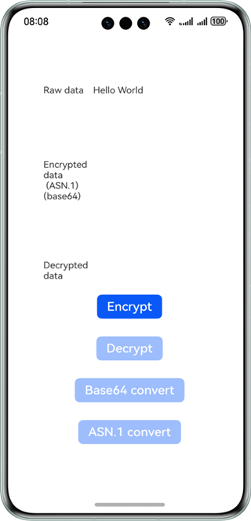
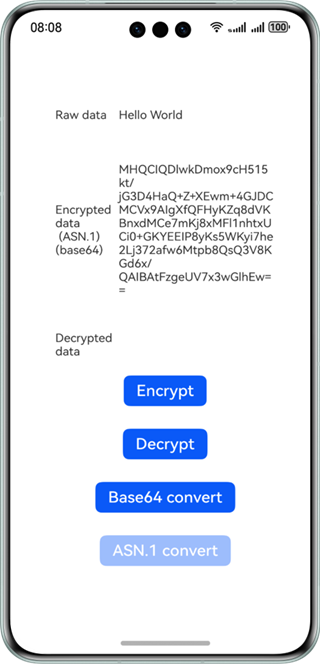
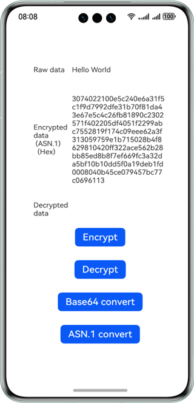
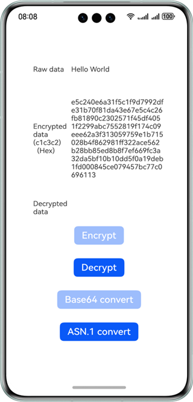
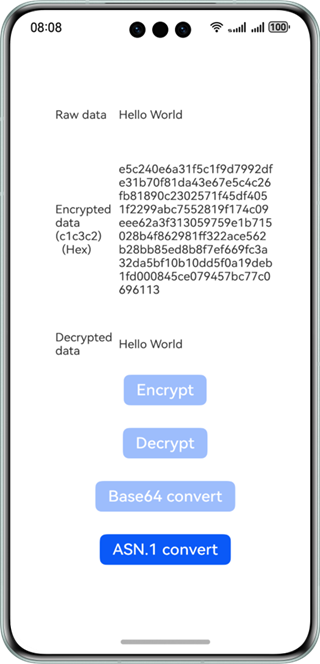

# Converting ASN.1 Ciphertext

### Overview

This sample shows how to convert the format of the ciphertext encrypted by @kit.CryptoArchitectureKit. The default format of the ciphertext encrypted by using @kit.CryptoArchitectureKit is Base64 ASN.1. 

The ciphertext is encoded by Base64 into a character array, which is then displayed in hexadecimal format. This sample shows how to convert the ciphertext from ASN.1 to c1c3c2 format and then decrypt the raw ciphertext in c1c3c2 format to verify the correctness of the conversion.

### Preview

| Home Page                                 | Encryption                                  | Base64 Conversion                     | Ciphertext Format Conversion                | Decryption                                  |
|-------------------------------------------|---------------------------------------------|---------------------------------------|---------------------------------------------|---------------------------------------------|
|  |  |  |  |  |

### How to Use

1. Tap **Encrypt** on the home page. The raw data is encrypted using SM2. The encrypted data is displayed in the **Encrypted data** text box. In this case, the **Decrypt** and **Base64** buttons become available.
2. Tap **Base64** to perform Base64 transformation on the original ciphertext. The converted ciphertext is displayed in the **Encrypted data** text box. In this case, the **ASN.1** button becomes available.
3. Tap **ASN.1** to convert the ciphertext to ASN.1 format. The converted ciphertext is displayed in the **Encrypted data** text box. In this case, **Encrypt** and **Base64** buttons become unavailable.
4. Tap **Decrypt** on the home page to decrypt the ciphertext. The decrypted text is displayed in the **Decrypted data** text box. In this case, **Decrypt** becomes unavailable.

### Project Directory

```
entry/src/main/                          // Code
├──ets
│  ├──entryability
│  │  └──EntryAbility.ets
│  ├──pages
│  │  └──Index.ets                       // Home page
│  └──utils
│     ├──SM2.ets                         // SM2 encryption/decryption
│     ├──SM2CipherText.ets               // Ciphertext conversion
│     └──SM2Sequence.ets                 // Data structure in ASN.1 format
├──module.json5
└──resources                             // Resources of the app
```

### How to Implement


* Encrypt the text. 

  After the **Encrypt** button is tapped, the APIs in [SM2.ets](entry/src/main/ets/utils/SM2.ets) are called to encrypt the text. 

  After the **Decrypt** button is tapped, APIs are called to decrypt the text.

  **cryptoFramework.Cipher()** is used to encrypt and decrypt the text.

* Convert the ciphertext format. 

  After **ASN.1** is tapped, the APIs in [SM2CipherText.ets](entry/src/main/ets/utils/SM2CipherText.ets) are called to convert the ciphertext format.


### Required Permissions

N/A

### Dependencies

N/A

### Constraints

1. The sample is only supported on Huawei phones with standard systems.

2. The HarmonyOS version must be HarmonyOS 5.0.5 Release or later.

3. The DevEco Studio version must be DevEco Studio 5.0.5 Release or later.

4. The HarmonyOS SDK version must be HarmonyOS 5.0.5 Release SDK or later.
