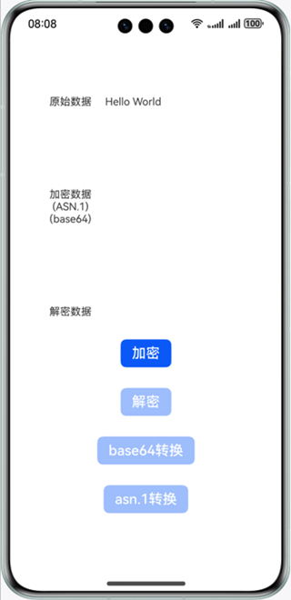
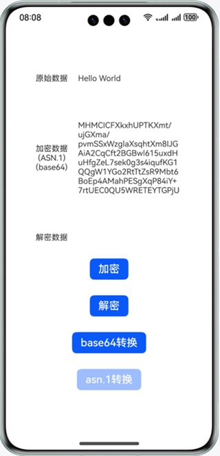
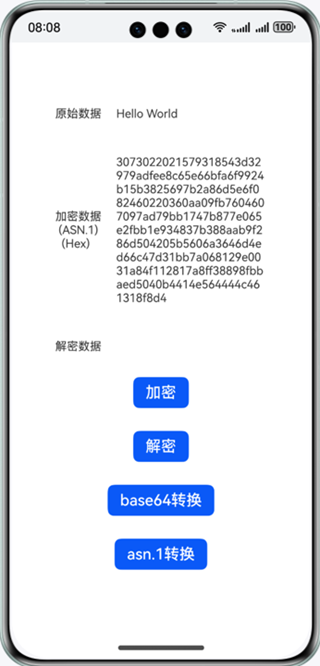
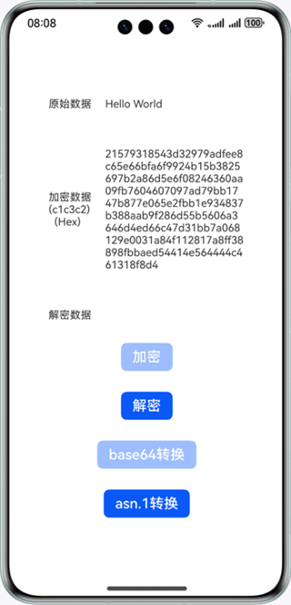
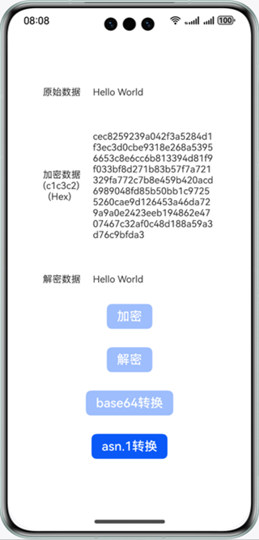

# 基于加解密算法库框架实现ASN.1密文转换

### 介绍

本示例对使用@kit.CryptoArchitectureKit加密后的密文格式进行转换。@kit.CryptoArchitectureKit加密后的密文格式默认为以base64显示的ASN.1格式问题，通过对密文进行base64变换后得到字符数组，以16进制数字显示，在此基础上进行密文格式转换，从ASN.1格式转换为c1c3c2格式的裸密文，再以c1c3c2格式的裸密文进行解密，以验证密文转换的正确性。

### 效果预览

| 首页                                     | 数据加密                                     | base64变换                           | 密文格式变换                                   | 数据解密                                     |
|----------------------------------------|------------------------------------------|------------------------------------|------------------------------------------|------------------------------------------|
|  |  |  |  |  |

使用说明

1. 点击主页面**加密**按钮，对原始数据使用SM2国密算法进行加密，其内容显示在**加密数据**文本框中，此时**解密**按钮和**base64转换**按钮使能。
2. 点击主页面**base64转换**按钮，对原始密文进行base64转换，在**加密数据**文本框中显示转换后的密文，此时**asn.1转换**按钮使能。
3. 点击主页面**asn.1转换**按钮，对密文进行asn.1转换，在**加密数据**文本框中显示转换后的密文，此时**加密**按钮和**base64转换**按钮去使能。
4. 点击主页面**解密**按钮，对密文进行解密，在**解密数据**文本框中显示解密后的文本，此时**解密**按钮去使能。

### 工程目录

```
entry/src/main/                          // 代码区
├──ets
│  ├──entryability
│  │  └──EntryAbility.ets
│  ├──pages
│  │  └──Index.ets                       // 主页界面
│  └──utils
│     ├──SM2.ets                         // SM2加解密
│     ├──SM2CipherText.ets               // 密文格式转换
│     └──SM2Sequence.ets                 // ASN.1格式数据结构
├──module.json5
└──resources                             // 应用资源目录
```

### 具体实现

* 对文本加密：在[SM2.ets](entry/src/main/ets/utils/SM2.ets)点击加密按钮，调用加密函数实现对文本内容进行加密。点击解密按钮，调用解密函数实现对文本内容进行解密。对消息加密的过程中采用cryptoFramework.Cipher完成加解密操作。
* 对密文格式进行转换：在[SM2CipherText.ets](entry/src/main/ets/utils/SM2CipherText.ets)中，点击asn.1按钮，调用密文转换函数实现对密文内容进行转换。完成密文转换操作。

### 相关权限

不涉及。

### 依赖

不涉及。

### 约束与限制

1. 本示例仅支持标准系统上运行，支持设备：华为手机。
2. HarmonyOS系统：HarmonyOS 5.0.5 Release及以上。
3. DevEco Studio版本：DevEco Studio 5.0.5 Release及以上。
4. HarmonyOS SDK版本：HarmonyOS 5.0.5 Release SDK及以上。