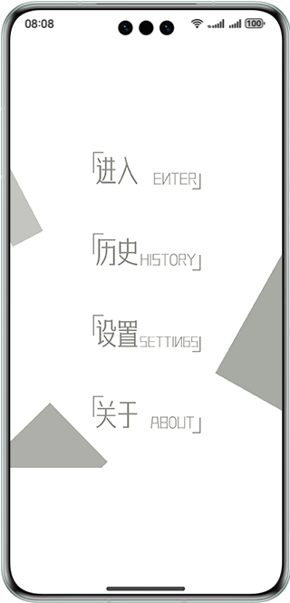

# Subscribing to and Publishing Common Events

### Overview

This sample shows the features related to common events for monitoring some user operations. Specifically, the following features are implemented:

1. Subscribe to system common events to monitor user operations (such as turning on or off the screen, locking or unlocking the screen, and disconnecting from the Wi-Fi).

2. After the users stop monitoring, you can publish custom ordered common events to persistently listen for the user operations.

3. Publish a sticky event when a user sets a listening state of an event to record a list of events that are allowed to be listened for during runtime. In addition, this sticky event can change the temporarily allowed listening to the non-allowed listening when exit from the applications.

### Preview

| Home Page                                  | Monitoring Page                              | Settings Page                              | History Page                         |
|--------------------------------------|------------------------------------| -------------------------------------- | ------------------------------------- |
|  |  |  |  |

### How to Use

1. Install the built HAP file. The following application icon is displayed on the home screen. Tap the icon to access the application.


2. On the home page, four buttons, namely **Enter**, **History**, **Settings**, and **About**, are available.

3. Tap **Enter** to access the monitoring page. Tap **Start Monitoring** on the home page to start listening for system common events and count the time, after which the button changes to **Stop Monitoring**. Tap this button to show the monitoring duration and received interference information on the page. Tap the **Details** button on the lower right corner to access the details page and view the interference information. Currently, the application only listens for system common events that can be operated by users, such as turning on or off the screen, locking or unlocking the screen, and disconnecting from the Wi-Fi. The common events can be quickly extended as required.

4. Return to the home page and tap **History** to view the historical records of user operations. Currently, a maximum of 10 historical records can be stored during each runtime; otherwise, the exceeded records will be deleted.

5. Return to the home page and tap **Settings** to configure the listening for specific system events. The application provides three options: **Always**, **Only this time**, and **Never**. **Only this time** indicates that a specific system common event will be listened during the runtime, after you exit the application, this option is automatically changed to **Never**.

6. Return to the home page and tap **About** to check the application version information and sample description.

### Project Directory
```
├──entry/src/main/ets                           // Code area
│  ├──application
│  │  └──MyAbilityStage.ets                    
│  ├──component
│  │  └──Header.ets                             // Header
│  ├──entryability
│  │  └──EntryAbility.ets
│  ├──feature
│  │  ├──HistoryFeature.ets                    
│  │  ├──LaunchFeature.ets                    
│  │  ├──MainFeature.ets                    
│  │  └──SettingFeature.ets                    
│  ├──launcherability 
│  │  └──LauncherAbility.ets
│  ├──model
│  │  ├──Consts.ets                             // Data definition
│  │  ├──GlobalContext.ets                      // Variable utility class
│  │  ├──Logger.ets                             // Log printing 
│  │  ├──SurveillanceEventsManager.ets          // Common event module
│  │  └──Utils.ts                        
│  └──pages
│     ├──About.ets                              // About
│     ├──Detail.ets                             // Details
│     ├──History.ets                            // History
│     ├──Launch.ets                             // Home
│     ├──Main.ets                               // Enter
│     └──Setting.ets                            // Settings
└──entry/src/main/resources                     // Resources

```

### How to Implement

* This sample consists of four modules:
  * Access module
    * This module uses application context. You can use the **createSubscriber** method to create a subscriber and use the **getCurrentTime** method to obtain the time elapsed since the Unix epoch to develop the **Monitoring** page.
    * Source code links: [Consts.ets](entry/src/main/ets/module/Consts.ets), [LaunchFeature.ets](entry/src/main/ets/feature/LaunchFeature.ets), [LauncherAbility.ets](entry/src/main/ets/launcherability/LauncherAbility.ets), and [SurveillanceEventsManager.ets](entry/src/main/ets/module/SurveillanceEventsManager.ets)
    * Reference APIs: @ohos.app.ability.common, @ohos.commonEventManager, @ohos.data.preferences,@ohos.commonEvent, @ohos.router, and @ohos.systemTime
  
  * History module
    * This module uses application context. You can use the **getPreferences** method to obtain the **Preferences** instance and use the **Header** component to develop the **History** page.
    * Source code link: [Header.ets](entry/src/main/ets/component/Header.ets), [Consts.ets](entry/src/main/ets/module/Consts.ets), and [HistoryFeature.ets](entry/src/main/ets/feature/HistoryFeature.ets)
    * Reference APIs: @ohos.app.ability.common and @ohos.data.preferences
  
  * Settings module
    * This module uses application context and consists of three events: turning on or off the screen, locking or unlocking the screen, and disconnecting from the Wi-Fi. Three options including **Always**, **Only this time**, and **Never** can be configured for each event. You can use the **commonEvent.publish** method to publish common events and use the **getPreferences** method to obtain the **Preferences** instance to develop function pages.
    * Source code links: [Header.ets](entry/src/main/ets/component/Header.ets), [Consts.ets](entry/src/main/ets/module/Consts.ets), [SettingFeature.ets](entry/src/main/ets/feature/SettingFeature.ets), and [SurveillanceEventsManager.ets](entry/src/main/ets/module/SurveillanceEventsManager.ets)
    * Reference APIs: @ohos.app.ability.common, @ohos.data.preferences, @ohos.commonEvent, and @ohos.router
  
  * About module
    * This module describes the features of this sample and the scenarios where this sample cannot be used.
    * Source code link: [Header.ets](entry/src/main/ets/component/Header.ets) and [Consts.ets](entry/src/main/ets/module/Consts.ets)
    
### Required Permissions

ohos.permission.COMMONEVENT_STICKY

### Dependencies

N/A

### Constraints

1. The sample is supported only on Huawei phones with standard systems.

2. The HarmonyOS version must be HarmonyOS 5.0.5 Release or later.

3. The DevEco Studio version must be DevEco Studio 5.0.5 Release or later.

4. The HarmonyOS SDK version must be HarmonyOS 5.0.5 Release SDK or later.
