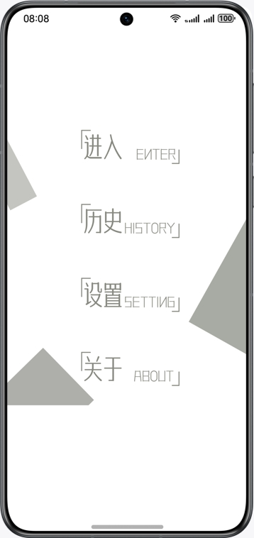
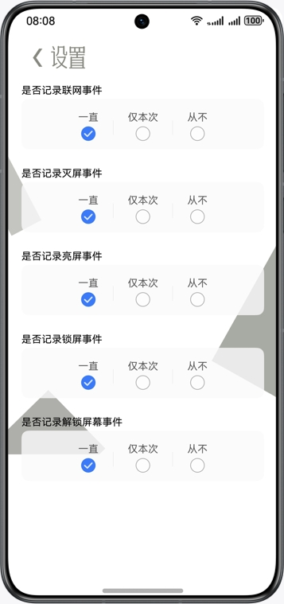
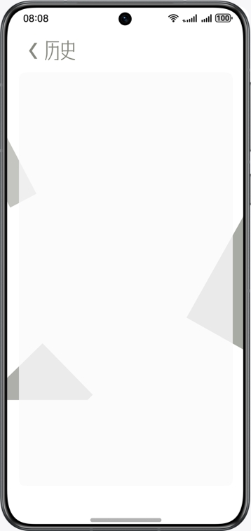

# 实现公共事件的订阅和发布

### 介绍

本示例主要展示了公共事件相关的功能，实现了一个检测用户部分行为的应用。具体而言实现了如下几点功能：

1.通过订阅系统公共事件，实现对用户操作行为（亮灭屏、锁屏和解锁屏幕、Wi-Fi状态变化）的监测；

2.通过在用户主动停止监测行为时发布自定义有序公共事件，实现对用户主动触发监听行为的持久化记录；

3.通过在用户设置对某一事件的监听状态时发布粘性事件，记录下本次应用运行期间允许监听的事件列表，同时在应用退出时将临时允许的修改为不允许。

### 效果预览

| 主页                                   | 监控页面                               | 设置页面                               | 历史记录页面                          |
|--------------------------------------|------------------------------------| -------------------------------------- | ------------------------------------- |
|  |  |  |  |

使用说明：

1.安装编译生成的hap包，桌面上显示应用图标如下，点击图标即可进入应用。


2.进入应用显示菜单页，可选择“进入”，“历史”，“设置”及“关于”几个选项。

3.点击“进入”后跳转至主页面，点击主页面“开始监控”按钮，将开始监听系统公共事件，并进行计时，此时按钮内容变更为“停止监听”；点击停止监听按钮，页面上将显示本次监听时长及监听期间收到的干扰信息汇总，并在页面右下角显示“查看详情”按钮，点击按钮将跳转至详情页，显示监听期间收到的干扰信息，应用当前仅监听了亮灭屏、锁屏和解锁屏幕、Wi-Fi状态变化等用户可操作的系统公共事件，后续可根据需求快速扩展。

4.返回至应用菜单页面，点击“历史”可查看用户操作监听的历史记录，当前支持每次运行期间最多存储10条历史记录，超过10条后将删除历史数据。

5.返回至应用菜单页面，点击“设置”可进行具体系统事件的监听配置，应用提供了“一直”、“仅本次”及“从不”三个选项，其中“仅本次”选项是指本次应用运行期间将监听特定系统公共事件，应用退出后该选项将自动调整为“从不”。

6.返回至应用菜单页面，点击“关于”可查看应用版本信息及本示例的说明。

### 工程目录
```
├──entry/src/main/ets                           // 代码区
│  ├──application
│  │  └──MyAbilityStage.ets                    
│  ├──component
│  │  └──Header.ets                             // 头部组件
│  ├──entryability
│  │  └──EntryAbility.ets
│  ├──feature
│  │  ├──HistoryFeature.ets                    
│  │  ├──LaunchFeature.ets                    
│  │  ├──MainFeature.ets                    
│  │  └──SettingFeature.ets                    
│  ├──launcherability 
│  │  └──LauncherAbility.ets
│  ├──module
│  │  ├──Consts.ets                             // 数据定义
│  │  ├──GlobalContext.ets                      // 变量工具类
│  │  ├──Logger.ets                             // 日志打印  
│  │  ├──SurveillanceEventsManager.ets          // 公共事件模块
│  │  └──Utils.ts                        
│  └──pages
│     ├──About.ets                              // 关于页面
│     ├──Detail.ets                             // 详情页面
│     ├──History.ets                            // 历史页面
│     ├──Launch.ets                             // 发起页面
│     ├──Main.ets                               // 进入页面
│     └──Setting.ets                            // 设置页面
└──entry/src/main/resources                     // 资源文件夹

```
   
### 具体实现

* 该示例分为四个模块：
  * 进入模块
    * 使用到应用文上下文，createSubscriber方法创建订阅者，systemDateTime.getTime()获取自Unix纪元以来经过的时间进行对用户操作行为的监测功能页面开发。
    * 源码链接：[Consts.ets](entry/src/main/ets/module/Consts.ets)，[LaunchFeature.ets](entry/src/main/ets/feature/LaunchFeature.ets)，[LauncherAbility.ets](entry/src/main/ets/launcherability/LauncherAbility.ets)，[SurveillanceEventsManager.ets](entry/src/main/ets/module/SurveillanceEventsManager.ets)
    * 参考接口：@ohos.app.ability.common，@ohos.commonEventManager，@ohos.data.preferences，@ohos.commonEvent， @ohos.router， @ohos.systemTime
  
  * 历史模块
    * 使用到应用文上下文，getPreferences方法获取Preferences实例，组件Header进行历史页面开发。
    * 源码链接：[Header.ets](entry/src/main/ets/component/Header.ets)，[Consts.ets](entry/src/main/ets/module/Consts.ets)，[HistoryFeature.ets](entry/src/main/ets/feature/HistoryFeature.ets)
    * 参考接口：@ohos.app.ability.common，@ohos.data.preferences
  
  * 设置模块
    * 本模块分为三个事件，分别为记录Wi-Fi状态变化事件，记录灭屏事件，记录亮屏事件，进行锁屏事件、进行解锁屏幕事件，每一个事件都可进行一直，仅本次和从不的单项选择，使用到应用文上下文吗，CommonEvent.publish发布公共事件，getPreferences方法获取Preferences实例进行功能页面开发。
    * 源码链接：[Header.ets](entry/src/main/ets/component/Header.ets)，[Consts.ets](entry/src/main/ets/module/Consts.ets)，[SettingFeature.ets](entry/src/main/ets/feature/SettingFeature.ets)，[SurveillanceEventsManager.ets](entry/src/main/ets/module/SurveillanceEventsManager.ets)
    * 参考接口：@ohos.app.ability.common，@ohos.data.preferences，@ohos.commonEvent， @ohos.router
  
  * 关于模块
    * 该模块开发主要介绍了本示例的功能作用以及说明了什么情况下不能使用。
    * 源码链接：[Header.ets](entry/src/main/ets/component/Header.ets)，[Consts.ets](entry/src/main/ets/module/Consts.ets)
    
### 相关权限

ohos.permission.COMMONEVENT_STICKY

### 依赖

不涉及。

### 约束与限制

1.本示例仅支持标准系统上运行，支持设备：华为手机。

2.HarmonyOS系统：HarmonyOS 5.0.5 Release及以上。

3.DevEco Studio版本：DevEco Studio 5.0.5 Release及以上。

4.HarmonyOS SDK版本：HarmonyOS 5.0.5 Release SDK及以上。