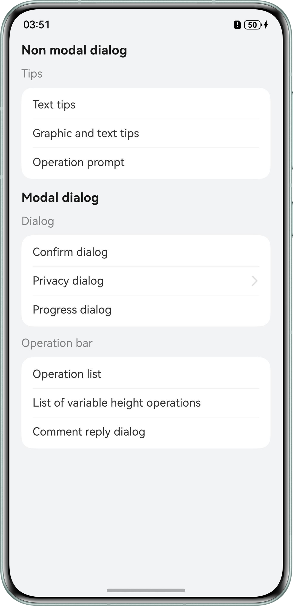

# **Custom Dialog Box Selection and Development**
## Overview
This sample demonstrates how to add custom dialogs to an application, including non-modal dialogs (text tips, graphic and text tips, and operation prompt) and modal dialogs (confirm dialog, privacy dialog, progress dialog, operation list, and comment reply dialog). It aims to help developers understand how to implement these interactive dialogs, enhancing user experience.

## Preview


## Project Directory
``` 
├──entry/src/main/ets                                   // Code area 
│  ├──entryability
│  |  └──EntryAbility.ets                               // Entry point class 
│  ├──entrybackupability
│  |  └──EntryBackupAbility.ets
│  ├──pages
│  |  ├──AgreementPage.ets                              // Privacy agreement page
│  |  ├──CommentList.ets                                // Comment reply dialogs
│  |  ├──Index.ets                                      // Home page 
│  |  ├──NavigationDialog.ets                           // Navigation dialogs
│  |  └──PrivacyDialog.ets                              // Privacy dialogs
|  ├──uiComponent.ets
│  |  ├──ItemHead.ets                                   // Heading of the home page
│  |  └──SubItemHead.ets                                // Subheading of the home page
|  └──utils.ets
│     └──PromptActionClass.ets                          // Custom dialogs
└──entry/src/main/resources                             // Application resources
``` 

## Concepts

* Non-modal dialog: This type of dialog can be ignored, allowing users to continue operations, such as touching or scrolling on the background screen. It can either automatically disappear or be closed by slightly touching it.
* Modal dialog: This type of dialog blocks user operations until the user addresses it (e.g., touching a relevant button or closing the dialog). It usually darkens or blurs the background screen (to prevent accidental touch).

## How to Use
1. Touch Text tips to display the text tips dialog box.
2. Touch Graphic and text tips to display the graphic and text tips dialog box.
3. Touch Operation prompt to display the operation prompt dialog box.
4. Touch Confirm dialog to display the confirm dialog. Users need to confirm the message to close the dialog box.
5. Touch Privacy dialog to go to the level-2 page. Touch the button to open the privacy dialog box, and touch the privacy agreement to go to the level-2 page. The privacy dialog box does not disappear after you return to the previous page.
6. Touch Progress dialog to display the progress dialog box. The progress bar stops moving when paused and resumes moving when restarted.
7. Touch Operation list to display operation list dialog box.
8. Touch List of variable height operations to display the variable height operation list dialog box. Touch and hold the list and swipe up or down to change the height.
9. Touch Comment reply dialog to display the reply dialog box.

## Required Permissions
N/A.

## Constraints
* This sample is only supported on Huawei phones running standard systems.

* The HarmonyOS version must be HarmonyOS 5.0.5 Release or later.

* The DevEco Studio version must be DevEco Studio 5.0.5 Release or later.

* The HarmonyOS SDK version must be HarmonyOS 5.0.5 Release SDK or later.