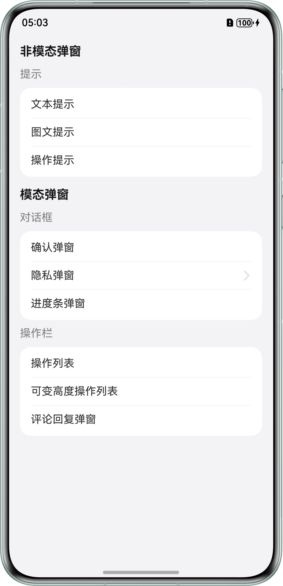

# **自定义弹窗选型与开发**
## 介绍
本示例主要介绍如何给应用添加自定义样式的弹窗，包括非模态弹窗：文本提示、图文提示、操作提示等；以及模态弹窗：确认弹窗、隐私弹窗、进度条、操作列表、评论回复弹窗等。旨在帮助开发者了解
如何实现这些弹窗，给应用添加这些交互弹窗，也能提升用户体验。
## 预览效果


## 工程目录
``` 
├──entry/src/main/ets                                   // 代码区
│  ├──entryability
│  |  └──EntryAbility.ets                               // 程序入口类
│  ├──entrybackupability
│  |  └──EntryBackupAbility.ets
│  ├──pages
│  |  ├──AgreementPage.ets                              // 隐私协议页面
│  |  ├──CommentList.ets                                // 评论回复弹窗
│  |  ├──Index.ets                                      // 首页
│  |  ├──NavigationDialog.ets                           // 导航弹窗
│  |  └──PrivacyDialog.ets                              // 隐私弹窗
|  ├──uiComponent.ets
│  |  ├──ItemHead.ets                                   // 首页标题
│  |  └──SubItemHead.ets                                // 首页副标题
|  └──utils.ets
│     └──PromptActionClass.ets                          // 自定义弹窗
└──entry/src/main/resources                             // 应用资源目录
``` 

## 相关概念

* 非模态弹窗：用户可忽略弹窗，继续操作其他内容。弹窗出现时，背景界面仍可点击或滚动。通常自动消失或手动轻触关闭。
* 模态弹窗：用户必须处理弹窗内容（点击按钮或关闭），否则无法操作其他界面。弹窗出现时，背景内容通常变暗或模糊（防止误触）。

## 使用说明
1. 打开应用首页，点击文本提示，展示文本提示弹框。
2. 打开应用首页，点击图文提示，展示图文提示弹框。
3. 打开应用首页，点击操作提示，展示操作提示弹框。
4. 打开应用首页，点击确认弹窗，展示确认弹窗，需点击确认按钮关闭。
5. 打开应用首页，点击隐私弹窗，跳转至二级页面，点击按钮打开隐私弹窗，点击隐私协议跳转到二级页面，返回后隐私弹窗不消失。
6. 打开应用首页，点击进度条，展示进度条弹框，点击暂停后，进度停止增长；点击开始后，进度继续增长。
7. 打开应用首页，点击操作列表，展示操作列表弹框。
8. 打开应用首页，点击可变高度操作列表，展示可变高度操作列表弹框，长按并上下滑动可以改变其高度。
9. 打开应用首页，点击评论回复弹窗，展示评论回复弹窗。

## 相关权限
不涉及。

## 约束与限制
* 本示例仅支持标准系统上运行，支持设备：华为手机。

* HarmonyOS系统：HarmonyOS 5.0.5 Release及以上。

* DevEco Studio版本：DevEco Studio 5.0.5 Release及以上。

* HarmonyOS SDK版本：HarmonyOS 5.0.5 Release SDK及以上。