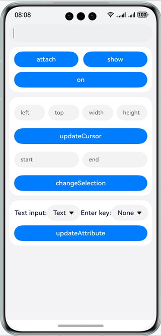

# Custom Edit Box

### Overview
This sample demonstrates how to use the input method framework to develop a custom edit box. You can bind an input method app, enter text through the app, and display or hide the input method.

### Preview

|                   Home                    |
|:-----------------------------------------:|
|  |

How to Use

1. Touch the edit box to bind an input method app and start the input method. Then, enter text into the edit box through the input method keyboard.

2. Tap the **attach**/**detach**, **show**/**hide**, or **on****/off** button to bind/unbind an input method app, display/hide the input method, or enable/disable listening for input method events.

3. Enter the cursor information, and tap **updateCursor** to send the cursor information to the input method app. If success, a toast message is displayed on the right.

4. Enter the start and end positions of the selected text, and tap **changeSelection** to select the text.

5. Set the text input type and **Enter** key type, and tap **updateAttribute** to update the input type and **Enter** key type of the input method app. This function requires support from the input method app.

### Project Directory

```
├──entry/src/main/ets/
│  ├──entryability
│  ├──components                         // Custom components
│  │  └──CustomInputText.ets             // Custom edit box
│  ├──pages
│  │  └──Index.ets                       // Homepage
│  └──utils
│     ├──Logger.ets                      // Log utility
│     └──InputAttributeInit.ets          // Edit box attribute utility
└──entry/src/main/resources              // Static resources of the app

```

### How to Implement

Use the input method framework to bind the edit box to the input method app, enable listening for input method events, display and hide the input method, and send the cursor and edit box attributes to the input method app.

Source code: [Index.ets](./entry/src/main/ets/pages/Index.ets) and [CustomInputText.ets](./entry/src/main/ets/components/CustomInputText.ets)

Reference APIs: @ohos.inputMethod

### Required Permissions

N/A

### Dependencies

N/A

### Constraints

1. The sample app is supported only on Huawei phones running the standard system.

2. The HarmonyOS version must be HarmonyOS 5.0.5 Release or later.

3. The DevEco Studio version must be DevEco Studio 5.0.5 Release or later.

4. The HarmonyOS SDK version must be HarmonyOS 5.0.5 Release SDK or later.
