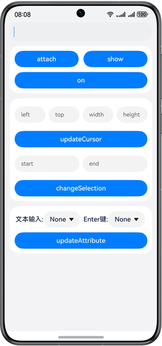

# 实现自绘编辑框

### 介绍

本示例通过输入法框架实现一个自绘编辑框，该自绘编辑框能够绑定输入法应用，实现监听输入法事件，显示和隐藏输入法，发送光标和编辑框属性等功能。

### 效果预览

|                  主页                   |
|:-------------------------------------:|
|  |

使用说明

1.点击编辑框可以绑定并拉起输入法，可以从输入法键盘输入内容到编辑框。

2.可以点击**attach**/**detach**、**show**/**hide**、**on**/**off**按钮来绑定/解绑、显示/隐藏、开启监听/关闭监听。

3.输入光标信息后点击**updateCursor**向输入法应用发送光标信息，发送成功会右toast提示。

4.输入选中文本的开始和结束位置，点击**changeSelection**可以选中文本。

5.选择文本输入类型和Enter键类型后，点击**updateAttribute**可以更新拉起的输入法的输入类型和Enter键类型，依赖输入法应用是否适配。

### 工程目录

```
├──entry/src/main/ets/
│  ├──entryability
│  ├──components                         //自定义组件
│  │  └──CustomInputText.ets             //自绘编辑框组件
│  ├──pages
│  │  └──Index.ets                       //主页
│  └──utils
│     ├──Logger.ets                      //日志工具类
│     └──InputAttributeInit.ets          //编辑框属性工具类
└──entry/src/main/resources              // 应用静态资源目录

```

### 具体实现

* 自绘编辑框
  * 使用输入法框架实现组件绑定输入法应用，监听输入法事件，显示和隐藏输入法，发送光标和编辑框属性到输入法应用功能。
  * 源码链接：[Index.ets](./entry/src/main/ets/pages/Index.ets)，[CustomInputText.ets](./entry/src/main/ets/components/CustomInputText.ets)
  * 参考接口：@ohos.inputMethod
### 相关权限

不涉及。

### 依赖

不涉及。

### 约束与限制

1.本示例仅支持标准系统上运行，支持设备：华为手机。

2.HarmonyOS系统：HarmonyOS 5.0.5 Release及以上。

3.DevEco Studio版本：DevEco Studio 5.0.5 Release及以上。

4.HarmonyOS SDK版本：HarmonyOS 5.0.5 Release SDK及以上。