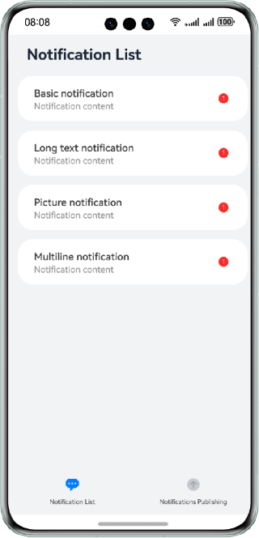
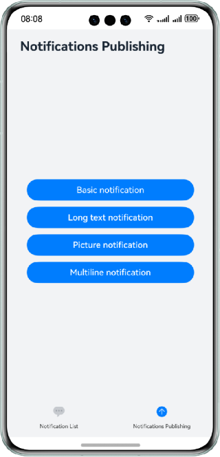
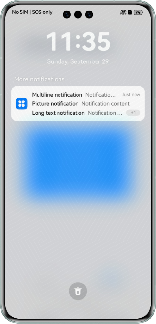

# Custom Notification Badge

### Overview

This sample shows how to use the **@ohos.notificationManager** APIs to set a badge on the home screen and send and obtain notifications.

### Preview

| Home Page/Notification List       | Notification Publishing Page                   | Notification Panel                                 |
|-----------------------------------|------------------------------------------------|----------------------------------------------------|
|  |  |  |

### How to Use

1. On the home page, you can check all notifications of the current application.
2. Tap the tab in the lower right corner to access the notification publishing page and tap a button to publish the corresponding notification as required.
3. Tap the tab in the lower left corner to access the notification list, in which you can check the published notifications. The number of published notifications is displayed on the right side. Tap a notification to read or cancel it.
4. Swipe down from the notification panel to check the number of badges, which corresponds to the number of published notifications.

### Project Directory

```
├──entry/src/main/ets/
│  ├──components
│  │  ├──NotificationList.ets                 // Notification list control
│  │  ├──NotificationPublish.ets              // Notification publishing control
│  │  └──TitleBar.ets                         // Title bar control
│  ├──entryability
│  │  └──EntryAbility.ets                     // Entry ability
│  ├──feature
│  │  └──NotificationOperations.ets           // APIs for publishing notification
│  └──pages
│     └──Index.ets                            // Home page 
├──entry/src/main/resources                   // Static resources of the app
│
├──notification/src/main/ets/
│  ├──notification
│  │  ├──NotificationContentUtil.ets          // Encapsulates the main content of different notifications
│  │  ├──NotificationManagementUtil.ets       // Encapsulates APIs for the notification list and badge settings
│  │  ├──NotificationRequestUtil.ets          // Receives the main content of the notification and returns a complete notification
│  │  └──NotificationUtil.ets                 // Encapsulates APIs that allow publishing, publish and close notifications
│  └──util                                     
│     └──Logger.ets                           // Log files
└──notification/src/main/resources            // Static resources of the app
```

### How to Implement

* The following APIs are encapsulated into the **NotificationUtil.ets** file. For details about the source code, see [NotificationUtil.ets](notification/src/main/ets/notification/NotificationUtil.ets).
    * For notification request: Before accessing the [Index.ets](entry/src/main/ets/pages/Index.ets) page,
      call the **notification.requestEnableNotification()** API through **notificationUtil.enableNotification()** to send a notification request to the user.
    * For publishing notifications: Encapsulate the notification publishing API through **publishNotification()**.

* The following APIs are encapsulated in the **NotificationManagementUtil.ets** file. For details about the source code, see [NotificationManagementUtil.ets](notification/src/main/ets/notification/NotificationManagementUtil.ets).
    * For obtaining all application notifications: Call the **getActiveNotifications** API of @ohos.notificationManager in **constructor()** to obtain all notifications and the number of specific notifications. Then encapsulate the **getAllNotifications()** API to obtain all notifications and their quantity.
    * For canceling specific notifications: Encapsulate this API through **cancelNotificationType()**.
    * For badge management: Encapsulate the API for setting the badge quantity through **setBadgeNumber()** and the API for obtaining the current badge quantity through **getBadgeNumber()**.
    * For adding a notification: Encapsulate this API through **addNotification()** and add a notification to the message manager. Call this API when publishing a notification.

* The following API is encapsulated in the **NotificationOperations.ets** file. For details about the source code, see [NotificationOperations.ets](entry/src/main/ets/feature/NotificationOperations.ets).
    * For publishing notifications: Access the tab page through the [Index.ets](entry/src/main/ets/pages/Index.ets) page
      and call the specific method encapsulated in the **NotificationOperations.ets** when a notification is tapped. Then obtain the corresponding content from the **NotificationContentUtil.ets**
      and pass it to the **NotificationRequestUtil.ets** to obtain the complete notification. Finally, call **NotificationUtil.publishNotification()** to publish the notification and **addNotification()** of the **NotificationManagementUtil.ets** to add a notification.

### Required Permissions

N/A

### Dependencies

N/A

### Constraints

1. The sample app is supported only on Huawei phones running the standard system.

2. The HarmonyOS version must be HarmonyOS 5.0.5 Release or later.

3. The DevEco Studio version must be DevEco Studio 5.0.5 Release or later.

4. The HarmonyOS SDK version must be HarmonyOS 5.0.5 Release or later.
