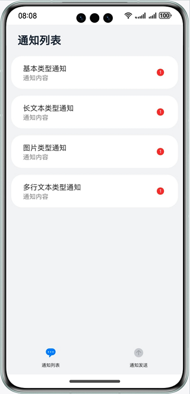

# 实现自定义通知角标功能

### 介绍

本示例主要展示了设定应用的桌面图标角标的功能，使用@ohos.notificationManager接口，进行桌面角标的设置，通知的发送，获取等。帮助开发者实现桌面图标的角标展示及通知栏通知数量的展示。

### 效果预览

| 主页/通知列表                        | 通知发送界面| 通知栏                                             |
|--------------------------------|--------------------------------|-------------------------------------------------|
|  |  |  |

使用说明

1. 在主界面，可以看到当前应用的所有消息通知；
2. 点击右下角Tab页签进入通知发送页面，点击对应的通知即可发送相应类型的通知，点击几次发送几条；
3. 点击左下角Tab页签进入通知列表，可以查看刚才发送的通知，通知右边会显示通知数量，点击相应的通知可进行通知读取，取消相应通知数量；
4. 下拉通知栏，可以看到角标数量，对应的通知数量。

### 工程目录

```
├──entry/src/main/ets/
│  ├──components
│  │  ├──NotificationList.ets                 // 通知列表控件
│  │  ├──NotificationPublish.ets              // 通知发送控件
│  │  └──TitleBar.ets                         // 标题栏控件
│  ├──entryability
│  │  └──EntryAbility.ets                     // 程序入口类
│  ├──feature
│  │  └──NotificationOperations.ets           // 对外提供发布通知的接口
│  └──pages
│     └──Index.ets                            // 首页  
├──entry/src/main/resources                   // 应用静态资源目录
│
├──notification/src/main/ets/
│  ├──notification
│  │  ├──NotificationContentUtil.ets          // 封装各种通知的主体内容
│  │  ├──NotificationManagementUtil.ets       // 封装通知列表，角标设置的接口
│  │  ├──NotificationRequestUtil.ets          // 接收通知的主体内容，返回完整的通知
│  │  ├──NotificationUtil.ets                 // 封装允许发布通知、发布通知、关闭通知的接口
│  │  └──WantAgentUtil.ets                    // 封装wantAgent
│  └──util                                     
│     └──Logger.ets                           // 日志文件
└──notification/src/main/resources            // 应用静态资源目录
```

### 具体实现

* 允许发送通知，发送通知的功能接口封装在NotificationUtil，源码参考：[NotificationUtil.ets](notification/src/main/ets/notification/NotificationUtil.ets)
    * 允许发送通知：在进入[Index.ets](entry/src/main/ets/pages/Index.ets)
      前通过notificationUtil.enableNotification()调用notification.requestEnableNotification()接口向用户请求发送通知；
    * 发送通知：通过publishNotification()封装发布通知的接口；

* 获取应用所有消息通知、取消相关类型通知，角标管理接口封装在NotificationManagementUtil，源码参考：[NotificationManagementUtil.ets](notification/src/main/ets/notification/NotificationManagementUtil.ets)
    * 获取应用所有消息通知：在constructor()构造函数中调用@ohos.notificationManager中的getActiveNotifications接口获取所有通知及相应类型通知数量，通过封装getAllNotifications()对外提供接口获取当前消息及消息数量。
    * 取消相关类型通知：通过cancelNotificationType()封装取消相关通知类型的接口；
    * 角标管理接口：通过setBadgeNumber()封装设置应用角标数量的接口，通过getBadgeNumber()封装获取当前应用角标数量的接口。
    * 添加一条通知：通过addNotification()封装接口添加一条通知到消息管理器，当发送通知的时候进行调用。

* NotificationOperations向外提供接口，在页面中调用它们来实现功能，源码参考：[NotificationOperations.ets](entry/src/main/ets/feature/NotificationOperations.ets)
    * 发布通知：在[Index.ets](entry/src/main/ets/pages/Index.ets)
      页面中进入发送通知Tab页签，通过点击事件调用NotificationOperations中封装的对应的方法，然后从NotificationContentUtil中获取对应的主体内容content，将
      content传递给NotificationRequestUtil得到完整的发布信息，最后调用NotificationUtil.publishNotification()发布内容，并调用NotificationManagementUtil的addNotification()添加一条消息；

### 相关权限

无

### 依赖

无

### 约束与限制

1.本示例仅支持标准系统上运行，支持设备：华为手机。

2.HarmonyOS系统：HarmonyOS 5.0.5 Release及以上。

3.DevEco Studio版本：DevEco Studio 5.0.5 Release及以上。

4.HarmonyOS SDK版本：HarmonyOS 5.0.5 Release SDK及以上。