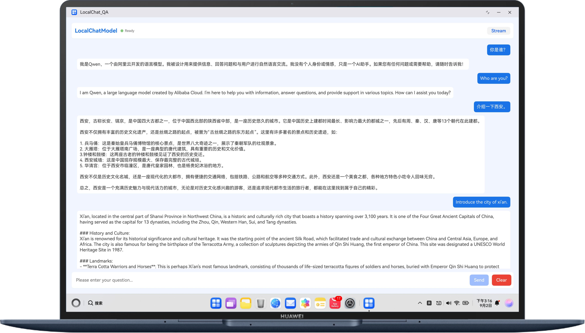

# 基于端侧模型实现智能问答系统

## 介绍

本示例基于端侧问答模型，专为自然聊天对话场景设计，旨在打造轻量高效、响应迅速的智能问答助手。模型部署于本地设备，无需依赖云端，保障数据隐私与安全，同时支持实时交互与离线运行。通过模拟人类对话习惯，具备上下文理解能力，可精准识别用户意图，实现多轮对话与个性化回复，广泛适用于客服、教育、生活助手等场景，提升用户体验与交互自然度。

## 效果预览

| 对话                                            | 
|-----------------------------------------------|
|  | 
## 使用说明

### 编译安装

使用DevEco Studio打开工程，并进行编译安装。

### 白名单申请


### 应用使用

1. 打开应用，同时会拉起模型管理应用。
2. 模型管理应用首次被拉起，前台弹出模型管理应用界面，同意在HarmonyOS上管理本地AI模型后，下载Qwen模型。
3. 模型管理应用非首次被拉起，打开桌面右下角隐藏的图标菜单，点击AI字样图标，弹出模型管理应用界面，下载Qwen模型。
4. 等待模型下载完成后，开始进行端侧问答。

## 工程目录

```
├──LocalChat/src/main/ets/
│  ├──localchatability
│  │   └──LocalChatAbility.ets              // Ability的生命周期回调内容
│  ├──localchatbackupability
│  │   └──LocalChatBackupAbility.ets        // BackupAbility的生命周期回调内容
│  └──pages
│      └──Index.ets                         // 端侧模型问答界面
├──resource
└──module.json5

```

## 具体实现

1. 使用@kit.DataAugmentationKit 能力实现。
2. 使用Init接口实现拉起端侧大模型。
3. 使用Chat接口实现智慧问答。

## 相关权限

需要网络权限：ohos.permission.INTERNET

## 依赖

不涉及

## 约束与限制

1. 本示例仅支持标准系统上运行，支持设备：PC/2in1。
2. HarmonyOS系统：HarmonyOS 6.0 Beta3及以上。
3. DevEco Studio版本：DevEco Studio 6.0 Beta3及以上。
4. HarmonyOS SDK版本：HarmonyOS 6.0 Bete3 SDK及以上。
5. 请参考[端侧问答模型](https://developer.huawei.com/consumer/cn/doc/harmonyos-guides/dataaugmentation-localchatmodel)中：[约束与限制](https://developer.huawei.com/consumer/cn/doc/harmonyos-guides/dataaugmentation-localchatmodel#section2323123112812)
