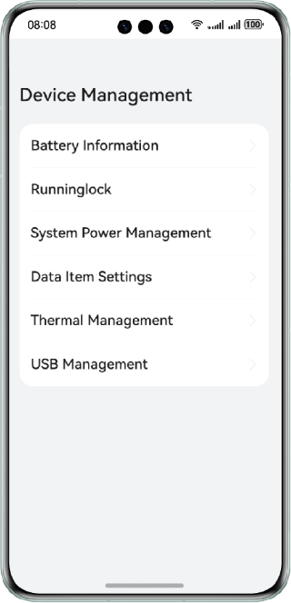
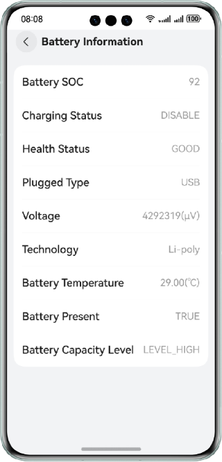
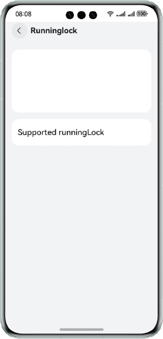
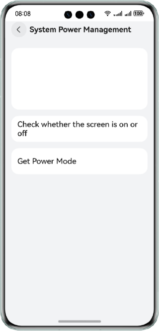
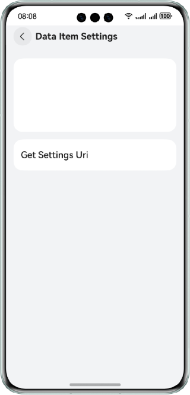
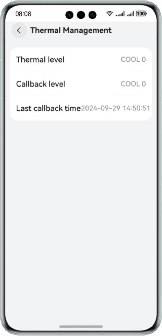
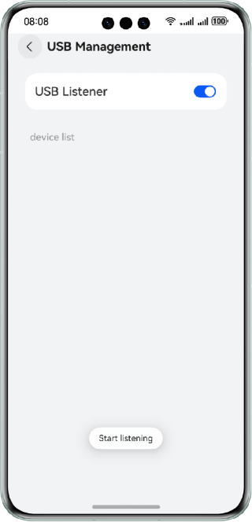

# Device Management Collection (Non-system Feature)

### Overview

This sample shows the basic device management (non-system feature) modules that do not require complex functionality display, including:

- @ohos.batteryInfo (battery information)
- @ohos.runningLock (running lock)
- @ohos.power (system power management)
- @ohos.settings (data item settings)
- @ohos.thermal (thermal management)
- @ohos.usbManager (usb management)

### Preview

|                  **Home Page**                   |                **Battery Info**                |                    **Running Lock**                    |        **System Power Management**         |
|:------------------------------------------------:|:----------------------------------------------:|:------------------------------------------------------:|:------------------------------------------:|
|          |  |  |  |
|                 **Setting Data**                 |             **Thermal Management**             |                   **USB Management**                   |
|  |  |                  |

### How to Use

1. Tap the module name on the home page to open the page of the module.

2. Tap the buttons on each module page to perform related operations.

3. On the battery info page, view battery information.

4. On the running lock page, set the sleep lock supported by the device.

5. On the system power management page, check the screen-on/off status and obtain the power mode.

6. On the setting data page, tap the button to obtain the URI of the data item.

7. On the thermal management page, view the thermal level of the current device and callback information.

8. On the USB management page, enable and disable USB listening. 

   Enable USB listening and insert a USB device. A message is displayed and the device list is refreshed. 

   Disable USB listening, clear the device list, and insert a USB device. No message is displayed and the device list will not be automatically refreshed. You can pull down the device list to manually refresh it.

### Project Directory

```

├──common/src/main/ets/                       // Common components and utilities
│  ├──components
│  │  └──CustomDataSource.ets                 // Custom DataSource, which is used by LazyForEach
│  └──util
│     └──Logger.ets                           // Logging utility
│     └──ResourceUtil.ets                     // Resource management utility
├──common/src/main/resource                   // Static resources of the app  
├──entry/src/main/ets                         // Code
│  ├──entryability
│  │  └──EntryAbility.ts                      // Entry ability
│  └──pages
│     └──Index.ets                            // Home page entry
├──entry/src/main/resources                   // Static resources of the app        
└──feature 
   ├──capabilities/src/main/ets/              // Feature set
   │  ├──capabilities                         // Functional components of modules
   │  │  ├──BatteryInfo.ets                   // Battery information
   │  │  ├──PowerManager.ets                  // System power management
   │  │  ├──RunningLockManager.ets            // Running lock
   │  │  ├──SettingsManager.ets               // Data settings
   │  │  ├──Thermal.ets                       // Thermal management
   │  │  └──UsbManager.ets                    // USB management
   │  ├──components                           // Components of sub-modules
   │  │  ├──usbmanager                        // usbmanager components
   │  │  │  ├──DeviceCustomDialog.ets
   │  │  │  └──DeviceList.ets
   │  │  ├──ColumnOperation.ets               // Component for displaying buttons in a column
   │  │  ├──InfoItemView.ets            
   │  │  └──RadiusColumn.ets                  // Custom column with rounded corners
   │  ├──model                                // Data models
   │  │  ├──DeviceAttribute.ts
   │  │  └──ListModel.ets
   │  └──utils                                // Utilities
   │     ├──AlertDialogUtil.ets
   │     ├──BatteryUtil.ets
   │     ├──CheckEmptyUtils.ets
   │     ├──PowerManagerUtil.ets
   │     ├──ThermalUtil.ets
   │     └──UsbManagerUtil.ets
   ├──capabilities/src/main/resources         // Static resources of the app
   ├──menuitems/src/main/ets/                 // Menu
   │  ├──components                           // Custom components related to menus                  
   │  │  └──MainItem.ets                        
   │  └──menulist                        
   │     └──MenuList.ets                      // Menu list            
   └──menuitems/src/main/resources            // Static resources of the app  
```

### How to Implement

1. Home page. 

   Use a module and **menuitems** to implement the menu components. Pass in the strarray resources of the menu to display and tap the corresponding component. 

   Use the **Navigation** and **NavRouter** components to implement the access to a page when a menu is tapped. 

   Use **LocalStorage** to implement data share in an ability of the app. 

   Use **selectedLabel** to indicate the menu tapped, and display the functional component based on **selectedLabel** in the **Capabilities** component of **entry**.

2. Battery info. 

   Use @ohos.batteryInfo APIs to obtain the battery information and charging/discharging status.

3. Running lock.

   Use @ohos.runningLock APIs to create and query a running lock.

4. System power management.

   Use @ohos.power APIs to obtain the screen-on/off status and query the power mode.

5. Data item settings.

   Use @ohos.settings APIs to obtain the URI of a data item.

6. Thermal management.

   Use @ohos.thermal APIs to obtain the thermal level and register a callback for the temperature control level.

7. USB management.

   Use @ohos.usbManager APIs to obtain the USB device list, and use @ohos.commonEventManager APIs to listen for insertion and removal of USB devices.

### Required Permissions

**ohos.permission.RUNNING_LOCK**: allows an app to obtain the running lock.

### Dependencies

N/A

### Constraints

1. The sample app is supported only on Huawei phones running the standard system.

2. The HarmonyOS version must be HarmonyOS 5.0.5 Release or later.

3. The DevEco Studio version must be DevEco Studio 5.0.5 Release or later.

4. The HarmonyOS SDK version must be HarmonyOS 5.0.5 Release or later.
