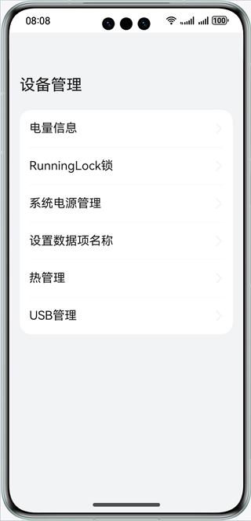
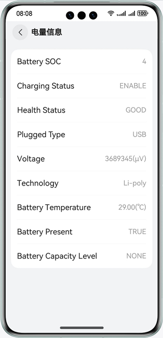
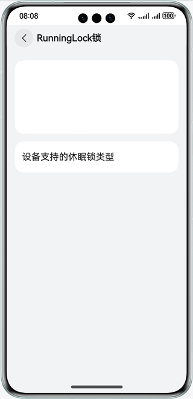
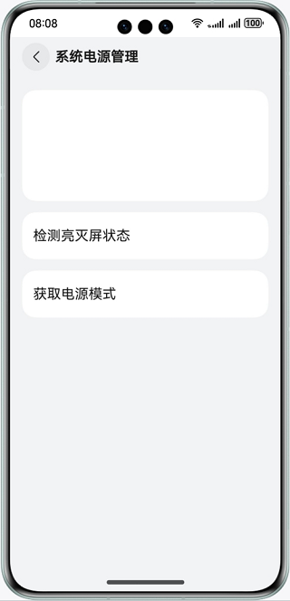
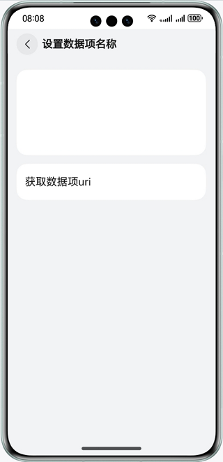
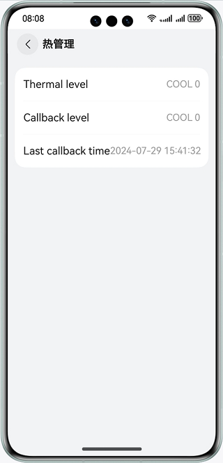
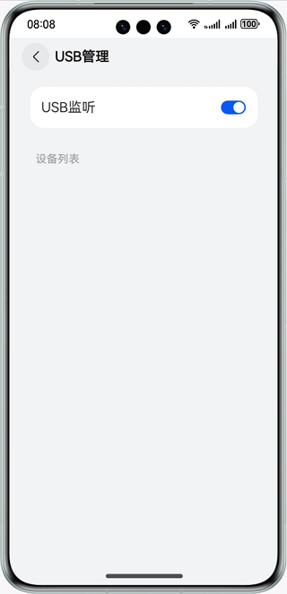

# 实现设备管理功能

### 介绍

本示例集合设备管理相关（非系统特性）不需要复杂功能展示的模块，展示了各个模块的基础功能。帮助开发者了解设备管理相关（非系统特性）的模块功能。包含：

- @ohos.batteryInfo (电量信息)
- @ohos.runningLock (Runninglock锁)
- @ohos.power (系统电源管理)
- @ohos.settings (设置数据项名称)
- @ohos.thermal (热管理)
- @ohos.usbManager (USB管理)

### 效果预览

|                   **主页**                   |                  **电量信息**                  |                  **RunningLock锁**                   |               **系统电源管理**               |
|:------------------------------------------:|:------------------------------------------:|:---------------------------------------------------:|:--------------------------------------:|
|       |   |  |  |
|                **设置数据项名称**                 |                   **热管理**                   |                      **USB管理**                      |
|  |     |                |

使用说明

1.首页展示语言基础类库各个子模块菜单，点击进入对应的模块页面。

2.各个子模块界面中点击功能按钮完成各个功能。

3.电量信息：进入电量信息页面，展示设备电量相关信息。

4.RunningLock锁：点击按钮实现设备支持的休眠锁类型。

5.系统电源管理：点击按钮分别实现获取亮灭屏状态、获取电源模式功能。

6.设置数据项名称：点击按钮分别实现获取数据项uri。

7.热管理：进入热管理页面，展示当前设备热档位信息、设备过热时提示用户。

8.USB管理：打开监听开关后插入USB设备，会有提示并刷新设备列表，关闭监听后清空列表，再次插入USB设备不会提示和自动刷新，下拉设备列表可以手动刷新设备列表。

### 工程目录

```

├──common/src/main/ets/                       // 公共组件及工具类
│  ├──components
│  │  └──CustomDataSource.ets                 // 自定义DataSource，LazyForEach时使用
│  └──util
│     ├──Logger.ets                           // 日志工具类
│     └──ResourceUtil.ets                     // 资源管理工具类
├──common/src/main/resource                   // 应用静态资源目录   
├──entry/src/main/ets/                        // 代码区
│  ├──entryability
│  │  └──EntryAbility.ts                      // 程序入口类
│  └──pages
│     └──Index.ets                            // 主页入口
├──entry/src/main/resources                   // 应用静态资源目录                     
└──feature 
   ├──capabilities/src/main/ets/              // 功能集
   │  ├──capabilities                         // 各个子模块功能组件
   │  │  ├──BatteryInfo.ets                   // 电量信息
   │  │  ├──PowerManager.ets                  // 系统电源管理
   │  │  ├──RunningLockManager.ets            // RunningLock锁
   │  │  ├──SettingsManager.ets               // 设置数据项名称
   │  │  ├──Thermal.ets                       // 热管理
   │  │  └──UsbManager.ets                    // USB管理
   │  ├──components                           // 子模块相关组件
   │  │  ├──usbmanager                        // usbmanager相关组件
   │  │  │  ├──DeviceCustomDialog.ets
   │  │  │  └──DeviceList.ets
   │  │  ├──ColumnOperation.ets               // 展示一列功能按钮的组件
   │  │  ├──InfoItemView.ets            
   │  │  └──RadiusColumn.ets                  // 白色圆角的自定义Columm组件
   │  ├──model                                // 相关数据模型
   │  │  ├──DeviceAttribute.ts
   │  │  └──ListModel.ets
   │  └──utils                                // 相关工具类
   │     ├──AlertDialogUtil.ets
   │     ├──BatteryUtil.ets
   │     ├──CheckEmptyUtils.ets
   │     ├──PowerManagerUtil.ets
   │     ├──ThermalUtil.ets
   │     └──UsbManagerUtil.ets
   ├──capabilities/src/main/resources         // 应用静态资源目录  
   ├──menuitems/src/main/ets/                 // 菜单
   │  ├──components                           // 菜单相关自定义组件
   │  │  └──MainItem.ets      
   │  └──menulist                        
   │     └──MenuList.ets                      // 菜单组件            
   └──menuitems/src/main/resources            // 应用静态资源目录  
```

### 具体实现

1.首页菜单展示：使用一个module，menuitems完成菜单组件的实现，传入要展示的菜单的strarray类型的资源和菜单点击对应的组件即可。使用Navigation和NavRouter组件实现菜单点击进入功能界面，使用LocalStorage实现应用内Ability内数据共享，点击菜单时标记selectedLabel，在entry中的Capabilities组件中，通过selectedLabel显示对应的功能组件。

2.电量信息：使用@ohos.batteryInfo接口获取电池和充放电状态信息。

3.RunningLock锁：使用@ohos.runningLock实现对Runninglock锁的创建、查询等操作。

4.系统电源管理：使用@ohos.power实现获取亮灭屏状态、查询电源模式功能。

5.设置数据项名称：使用@ohos.settings实现获取获取数据项uri。

6.热管理：使用@ohos.thermal提供热管理相关的接口，查询热档位以及注册温控等级回调。

7.USB管理：使用@ohos.usbManager实现usb设备列表的获取，使用@ohos.commonEventManager订阅USB设备插入和拔出监听。

### 相关权限

1.允许应用获取运行锁权限：ohos.permission.RUNNING_LOCK

### 依赖

不涉及。

### 约束与限制

1.本示例仅支持标准系统上运行，支持设备：华为手机。

2.HarmonyOS系统：HarmonyOS 5.0.5 Release及以上。

3.DevEco Studio版本：DevEco Studio 5.0.5 Release及以上。

4.HarmonyOS SDK版本：HarmonyOS 5.0.5 Release SDK及以上。