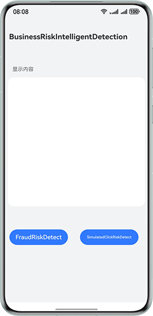

# 设备安全服务-业务风险检测

## 介绍

本示例向您介绍如何在应用中使用业务风险检测接口进行涉诈剧本检测与模拟点击检测。

需要使用设备安全服务接口 **@kit.DeviceSecurityKit**。

## 效果预览


## 工程的配置与使用

### 在DevEco中配置工程的步骤如下

1. [创建项目](https://developer.huawei.com/consumer/cn/doc/app/agc-help-create-project-0000002242804048)及[应用](https://developer.huawei.com/consumer/cn/doc/app/agc-help-create-app-0000002247955506)。
2. 打开应用，使用[AppGallery Connect](https://developer.huawei.com/consumer/cn/service/josp/agc/index.html)配置的应用包名替换app.json5文件中的bundleName属性值。
3. 在[AppGallery Connect](https://developer.huawei.com/consumer/cn/service/josp/agc/index.html)开通涉诈剧本检测服务，具体参考[Device Security Kit开发指南](https://developer.huawei.com/consumer/cn/doc/harmonyos-guides/devicesecurity-deviceverify-activateservice)，模拟点击检测无需开通服务。

#### 工程使用说明
1. 运行该应用前，先对设备进行联网。
2. 运行该应用，点击"FraudRiskDetect"按钮获取涉诈剧本检测结果，点击"SimulatedClickRiskDetect"按钮获取模拟点击检测结果，如果获取成功，页面会显示检测结果，如果获取失败，页面会显示相应的错误码。
3. 获取检测结果后，涉诈剧本检测结果建议在服务端侧进行结果解析和签名验证，模拟点击检测结果建议在服务端侧进行结果解析。

## 工程目录
```
└──entry/src/main/ets            // 代码区  
   └── entryability                    
   │   └── EntryAbility.ets          // 程序入口类  
   └── model                
   │   └── FraudRiskDetectModel.ets    // 涉诈剧本检测结果获取类  
   │   └── SimulatedClickRiskDetectModel.ets    // 模拟点击检测结果获取类  
   └── pages                                     
       └── Index.ets              // 首页，获取风险检测结果的页面  
```

## 具体实现

本示例展示业务风险检测的功能在页面中直接调用。
使用 **businessRiskIntelligentDetection.detectFraudRisk()** 方法获取涉诈剧本检测结果，源码参考FraudRiskDetectModel.ets。
使用 **businessRiskIntelligentDetection.detectSimulatedClickRisk()** 方法获取模拟点击检测结果，源码参考SimulatedClickRiskDetectModel.ets。

参考
1. entry\src\main\ets\entryability\EntryAbility.ets
2. entry\src\main\ets\model\FraudRiskDetectModel.ets
3. entry\src\main\ets\model\SimulatedClickRiskDetectModel.ets
4. entry\src\main\ets\pages\Index.ets

## 相关权限

不涉及。

## 依赖

依赖设备联网。

## 约束与限制

1.本示例仅支持标准系统上运行，支持设备：Phone、Tablet。

2.HarmonyOS系统：HarmonyOS 6.0.0 Beta3及以上。

3.DevEco Studio版本：DevEco Studio 6.0.0 Beta3及以上。

4.HarmonyOS SDK版本：HarmonyOS 6.0.0 Beta3 SDK及以上。