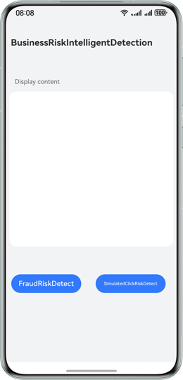

# Device Security Kit - BusinessRiskIntelligentDetection

## Overview

This sample code illustrates how to use the BusinessRiskIntelligentDetection API to detect fraud and simulated clicks.

The API that you need to use is packaged into **@kit.DeviceSecurityKit**.

## Preview


## How to Configure and Use

### Configuring the Sample App in DevEco Studio

1. [Create a project](https://developer.huawei.com/consumer/en/doc/app/agc-help-create-project-0000002242804048). Under the project, [create an app](https://developer.huawei.com/consumer/en/doc/app/agc-help-create-app-0000002247955506).
2. Open the sample app and set **bundleName** in the **app.json5** file to the app package name configured in [AppGallery Connect](https://developer.huawei.com/consumer/en/service/josp/agc/index.html).
3. Enable **Fraud detection** in [AppGallery Connect](https://developer.huawei.com/consumer/en/service/josp/agc/index.html). For details, please refer to [here](https://developer.huawei.com/consumer/en/doc/harmonyos-guides/devicesecurity-deviceverify-activateservice). **Simulated click detection** requires no activation.

#### Using the Sample App
1. Before running the sample app, connect the device to the network.
2. Run the sample app. Tap **FraudRiskDetect** to obtain the fraud detection result. Tap **SimulatedClickRiskDetect** to obtain the simulated click detection result. If the result is obtained successfully, it will be displayed on the page. If the result fails to be obtained, an error code will be displayed on the page.
3. After obtaining the detection result, you are advised to parse the fraud detection result and verify the signature on the server, and parse the simulated click detection result on the server.

## Project Directory
```
└──entry/src/main/ets            // Code area. 
   └── entryability                    
   │   └── EntryAbility.ets          // Entry point class. 
   └── model                
   │   └── FraudRiskDetectModel.ets    // Class for obtaining the fraud detection result. 
   │   └── SimulatedClickRiskDetectModel.ets    // Class for obtaining the simulated click detection result. 
   └── pages                                     
       └── Index.ets              // Home page, where the business risk detection result can be obtained. 
```

## How to Implement

This demo illustrates how to call the business risk detection functions on a page.
Call the **businessRiskIntelligentDetection.detectFraudRisk()** method to obtain the fraud detection result. For details, please refer to **FraudRiskDetectModel.ets**.
Call the **businessRiskIntelligentDetection.detectSimulatedClickRisk()** method to obtain the simulated click detection result. For details, please refer to **SimulatedClickRiskDetectModel.ets**.

Reference
1. entry\src\main\ets\entryability\EntryAbility.ets
2. entry\src\main\ets\model\FraudRiskDetectModel.ets
3. entry\src\main\ets\model\SimulatedClickRiskDetectModel.ets
4. entry\src\main\ets\pages\Index.ets

## Required Permissions

None

## Dependencies

The device where the sample app runs must connect to the network.

## Constraints

1. The sample app is only supported on phones and tablets with standard systems.

2. The HarmonyOS version must be HarmonyOS 6.0.0 Beta3 or later.

3. The DevEco Studio version must be DevEco Studio 6.0.0 Beta3 or later.

4. The HarmonyOS SDK version must be HarmonyOS 6.0.0 Beta3 SDK or later.
