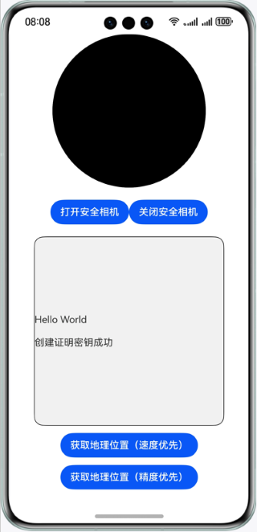

# 设备安全服务-可信应用服务

## 介绍

本示例向您介绍如何在应用中使用可信应用服务开发安全摄像头和安全地理位置功能。

需要使用可信应用服务接口 **@kit.DeviceSecurityKit**。

## 效果预览


## Sample工程的配置与使用

### 在DevEco中配置Sample工程的步骤如下

1. [创建项目](https://developer.huawei.com/consumer/cn/doc/app/agc-help-create-project-0000002242804048)及[应用](https://developer.huawei.com/consumer/cn/doc/app/agc-help-create-app-0000002247955506)。
2. 打开Sample应用，使用[AppGallery Connect](https://developer.huawei.com/consumer/cn/service/josp/agc/index.html)配置的应用包名替换app.json5文件中的bundleName属性值。
3. 在[AppGallery Connect](https://developer.huawei.com/consumer/cn/service/josp/agc/index.html)开通可信应用服务，具体请参见[Device Security Kit开发指南](https://developer.huawei.com/consumer/cn/doc/harmonyos-guides/devicesecurity-deviceverify-activateservice)。

#### Sample工程使用说明
1. 运行该Sample应用前，先对设备进行联网，并打开位置信息。
2. 运行该Sample应用，点击"打开安全相机"按钮打开安全摄像头，圆形组件中会显示前置摄像头采集到的安全图像，如果验证签名失败会显示文字提示，点击"关闭安全相机"按钮关闭安全摄像头。
3. 运行该Sample应用，点击"获取地理位置（速度优先）"按钮，文本框中会显示速度优先策略下获取到的位置信息，点击"获取地理位置（精度优先）"按钮，文本框中会显示速度优先策略下获取到的位置信息，如果获取位置信息失败，或者验证签名失败，会显示文字提示。

## 工程目录
```
├─entry/src/main/ets             // 代码区  
│ ├─common  
│ │ └─CertChain.ets              // 证书链相关操作类  
│ │ └─Permission.ets             // 权限相关操作类  
│ │ └─TrustedServiceOption.ets   // 可信应用服务接口参数  
│ ├─entryability  
│ │ └─EntryAbility.ets           // 程序入口类  
│ ├─entrybackupability  
│ │ └─EntryBackupAbility.ets  
│ ├─model  
│ │ └─SecureCamera.ets           // 安全相机类  
│ │ └─EntryBackupAbility.ets     // 安全地理位置类  
│ ├─pages  
│ │ └─Index.ets                  // 首页，获取安全图像、安全地理位置的页面  
```

## 具体实现

本示例展示可信应用服务的两种使用场景，分别是安全摄像头和安全地理位置，使用`initCamera(surfaceId: string, context: common.BaseContext, callback: AsyncCallback<string>)`方法初始化安全摄像头，在`image.ImageReceiver`的`imageArrival`事件中处理安全图像；使用`LocationService.getVerifiedSecureLocation(priority: trustedAppService.LocatingPriority)`获取验证签名后的安全地理位置信息。

参考
1. entry/src/main/ets/entryability/EntryAbility.ets
2. entry/src/main/ets/model/SecureCamera.ets
3. entry/src/main/ets/model/SecureLocation.ets

## 相关权限

1. 允许应用使用相机权限：[ohos.permission.CAMERA](https://developer.huawei.com/consumer/cn/doc/harmonyos-guides/permissions-for-all-user#ohospermissioncamera)
2. 允许应用获取设备位置信息权限：[ohos.permission.LOCATION](https://developer.huawei.com/consumer/cn/doc/harmonyos-guides/permissions-for-all-user#ohospermissionlocation)
3. 允许允许应用获取设备模糊位置信息权限：[ohos.permission.APPROXIMATELY_LOCATION](https://developer.huawei.com/consumer/cn/doc/harmonyos-guides/permissions-for-all-user#ohospermissionapproximately_location)

## 依赖

依赖设备联网，并且打开位置信息开关。

## 约束与限制

1.本示例仅支持标准系统上运行，支持设备：手机、平板和2in1设备。

2.HarmonyOS系统：HarmonyOS NEXT Developer Beta1及以上。

3.DevEco Studio版本：DevEco Studio NEXT Developer Beta1及以上。

4.HarmonyOS SDK版本：HarmonyOS NEXT Developer Beta1 SDK及以上。