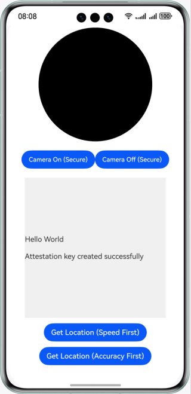

# Device Security Kit - TrustedAppService

## Overview

This sample code illustrates how to use TrustedAppService to develop image security verification and location security verification functions in an app.

The APIs that you need to use are packaged into **@kit.DeviceSecurityKit**.

## Preview


## How to Configure and Use

### Configuring the Sample App in DevEco Studio

1. [Create a project](https://developer.huawei.com/consumer/en/doc/app/agc-help-create-project-0000002242804048). Under the project, [add an app](https://developer.huawei.com/consumer/en/doc/app/agc-help-create-app-0000002247955506).
2. Open the sample app and set **bundleName** in the **app.json5** file to the app package name configured in [AppGallery Connect](https://developer.huawei.com/consumer/en/service/josp/agc/index.html).
3. Enable **Trusted Application Service** in [AppGallery Connect](https://developer.huawei.com/consumer/en/service/josp/agc/index.html). For details, please refer to [here](https://developer.huawei.com/consumer/en/doc/harmonyos-guides/devicesecurity-deviceverify-activateservice).

#### Using the Sample App
1. Before running the sample app, connect the device to the network and enable the location function.
2. Run the sample app. Tap **Camera On (Secure)** to turn on the camera in secure mode. The image captured by the front camera will be displayed in the circular component. If the signature fails to be verified, an error message will be displayed. Tap **Camera Off (Secure)** to turn off the camera in secure mode.
3. Run the sample app. Tap **Get Location (Speed First)**. The location information obtained in the speed first policy will be displayed in the text box. Tap **Get Location (Accuracy First)**. The location information obtained in the accuracy first policy will be displayed in the text box. If the location information fails to be obtained or the signature fails to be verified, an error message will be displayed.

## Project Directory
```
├─entry/src/main/ets             // Code area.  
│ ├─common  
│ │ └─CertChain.ets              // Certificate chain-related operation class.  
│ │ └─Permission.ets             // Permission-related operation class.  
│ │ └─TrustedServiceOption.ets   // TrustedAppService API parameters.  
│ ├─entryability  
│ │ └─EntryAbility.ets           // Entry point class.  
│ ├─entrybackupability  
│ │ └─EntryBackupAbility.ets  
│ ├─model  
│ │ └─SecureCamera.ets           // Image security verification class.  
│ │ └─EntryBackupAbility.ets     // Location security verification class.  
│ ├─pages  
│ │ └─Index.ets                  // Home page, where data can be obtained to verify image security and location security.
```

## How to Implement

Call the `initCamera(surfaceId: string, callback: AsyncCallback<string>)` method to initialize a camera in secure mode, and verify image security in the `imageArrival` event of `image.ImageReceiver`. Call the `LocationService.getVerifiedSecureLocation(priority: trustedAppService.LocatingPriority)` method to obtain the secure geographical location information whose signature has been verified.

Reference
1. entry/src/main/ets/entryability/EntryAbility.ets
2. entry/src/main/ets/model/SecureCamera.ets
3. entry/src/main/ets/model/SecureLocation.ets

## Required Permissions

1. **[ohos.permission.CAMERA](https://developer.huawei.com/consumer/en/doc/harmonyos-guides/permissions-for-all-user#ohospermissioncamera)**: Allows the app to use the camera.
2. **[ohos.permission.LOCATION](https://developer.huawei.com/consumer/en/doc/harmonyos-guides/permissions-for-all-user#ohospermissionlocation)**: Allows the app to obtain the device location.
3. **[ohos.permission.APPROXIMATELY_LOCATION](https://developer.huawei.com/consumer/en/doc/harmonyos-guides/permissions-for-all-user#ohospermissionapproximately_location)**: Allows the app to obtain the device's approximate location information.

## Dependencies

The device where the sample app runs must connect to the network and enable the location function.

## Constraints

1. The sample app is only supported on Phones, tablets, and 2-in-1 devices.

2. The HarmonyOS version must be HarmonyOS NEXT Developer Beta1 or later.

3. The DevEco Studio version must be DevEco Studio NEXT Developer Beta1 or later.

4. The HarmonyOS SDK version must be HarmonyOS NEXT Developer Beta1 SDK or later.
