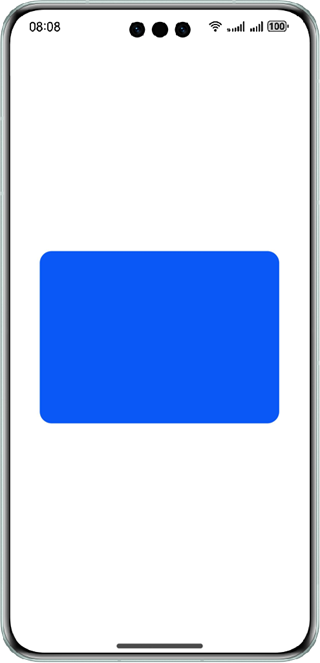

# XComponent Double Buffering

## Overview

This sample shows how to use the Drawing module to create a bitmap, which is subsequently rendered onto the **XComponent** using double buffering via NativeWindow.

Double buffering: This technique involves the creation of a memory area where the image to be drawn is pre-drawn. For the display of the drawing, the image from this buffer is directly accessed. To be more specific, all graphics to be drawn are pre-drawn on a bitmap by using the Drawing methods (which means to complete the drawing in the memory space), and then the pixel addresses of the bitmap are obtained and copied to the address of the **XComponent**'s NativeWindow. Once the texturizing process is complete, the image is displayed on the screen.

## Preview



## Project Directory

```
├──entry/src/main/cpp                         // C++ code
│  ├──common
│  │  └──log_common.h                         // Log files
│  ├──plugin                                  // Lifecycle management module
│  │  ├──plugin_manager.cpp                   
│  │  └──plugin_manager.h                     
│  ├──samples                                 // Rendering module of samples
│  │  ├──sample_bitmap.cpp                    
│  │  └──sample_bitmap.h  
│  ├──types
│  │  └──libentry                             // C++ APIs
│  │     ├──index.d.ts                        
│  │     └──oh-package.josn5                 
│  ├──CMakeLists.txt                          // CMake configuration file
│  └──hello.cpp                               // Native module registration
├──entry/src/main/ets                         // ets code
│  ├──common
│  │  └──CommonConstants.ets                  // Common constants
│  ├──entryability
│  │  └──EntryAbility.ets       
│  ├──interface
│  │  └──XComponentContext.ts                 // Interface file
│  └──pages
│     └──Index.ets                            // Home page
└──entry/src/main/resources                   // Static resources
```

## Concepts

- Drawing: a module provides the functions for 2D graphics rendering, text drawing, and image display.
- NativeWindow: a module provides the native window capability for connection to the EGL.
- Native XComponent: describes the surface and touch event held by the ArkUI **XComponent**. These events can be used for the EGL/OpenGL ES and media data input and displayed on the ArkUI **XComponent**.
- NativeBuffer: a module provides the native buffer capability. Using the functions provided by this module, you can apply for, use, and release the shared memory, and query its attributes.

## Required Permissions

N/A

## How to Use

Run the app. The app draws a rounded rectangle with a blue background in the center of the screen.

## Constraints

1. The sample is only supported on Huawei phones with standard systems.

2. The HarmonyOS version must be HarmonyOS 5.0.5 Release or later.

3. The DevEco Studio version must be DevEco Studio 5.0.5 Release or later.

4. The HarmonyOS SDK version must be HarmonyOS 5.0.5 Release SDK or later.
