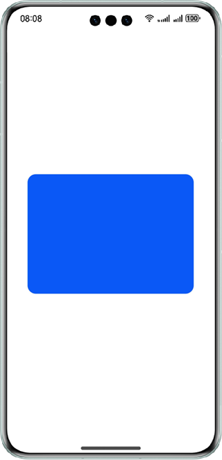

# 基于XComponent组件实现双缓冲功能

## 简介

本篇Sample主要介绍如何使用Drawing绘制一个bitmap，然后通过NativeWindow贴图到XComponent的双缓冲实现。

双缓冲：在内存中创建一片内存区域，把将要绘制的图片预先绘制到内存中，在绘制显示的时候直接获取缓冲区的图片进行绘制。更具体一点来说：先通过Drawing方法将要绘制的所有的图形绘制到一个Bitmap上也就是先在内存空间完成，然后获取位图的像素地址、并将其拷贝到XComponent的NativeWindow地址。完成贴图，将图片显示在屏幕上。

界面如下所示：



## 工程目录

```
├──entry/src/main/cpp                         // C++ 代码区
│  ├──common
│  │  └──log_common.h                         // 日志文件
│  ├──plugin                                  // 生命周期管理模块
│  │  ├──plugin_manager.cpp                   
│  │  └──plugin_manager.h                     
│  ├──samples                                 // samples渲染模块
│  │  ├──sample_bitmap.cpp                    
│  │  └──sample_bitmap.h  
│  ├──types
│  │  └──libentry                             // C++接口导出
│  │     ├──index.d.ts                        
│  │     └──oh-package.josn5                 
│  ├──CMakeLists.txt                          // CMake配置文件
│  └──hello.cpp                               // Native模块注册
├──entry/src/main/ets                         // ets 代码区
│  ├──common
│  │  └──CommonConstants.ets                  // 常量定义文件
│  ├──entryability
│  │  └──EntryAbility.ets       
│  ├──interface
│  │  └──XComponentContext.ts                 // 接口文件
│  └──pages
│     └──Index.ets                            // 主页界面
└──entry/src/main/resources                   // 应用资源目录
```

## 相关概念

- Drawing: 提供包括2D图形渲染、文字绘制和图片显示等功能函数。
- NativeWindow: 提供NativeWindow功能，作为数据生产者，可用来和egl对接。
- Native XComponent: 描述ArkUI XComponent持有的surface和触摸事件，该事件可用于EGL/OpenGLES和媒体数据输入，并显示在ArkUI XComponent上。
- NativeBuffe: 提供NativeBuffer功能，通过提供的接口，可以实现共享内存的申请、使用、属性查询、释放等操作。

## 相关权限

不涉及

## 使用说明

运行应用程序。应用会在界面中央绘制一个蓝底圆角矩形。

## 约束与限制

1.本示例仅支持标准系统上运行，支持设备：华为手机。

2.HarmonyOS系统：HarmonyOS 5.0.5 Release及以上。

3.DevEco Studio版本：DevEco Studio 5.0.5 Release及以上。

4.HarmonyOS SDK版本：HarmonyOS 5.0.5 Release SDK及以上。
