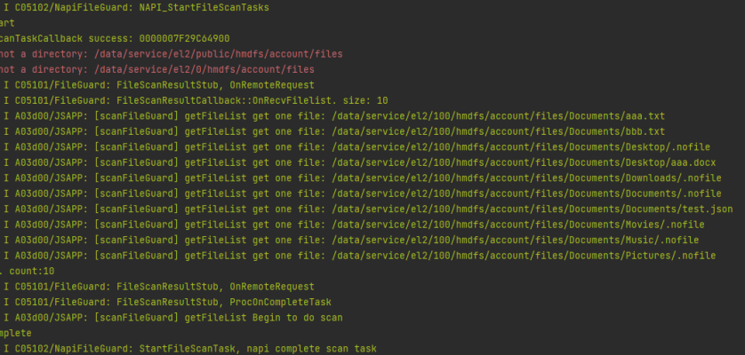

# 企业数据保护服务

## 介绍

本示例主要展示了数据保护服务相关的功能，使用@kit.EnterpriseDataGuardKit、@kit.CoreFileKit等接口，实现了打开读取文件、设置查询文件标签、扫描公共目录文件清单、删除文件、下发KIA文件清单、下发网络拦截策略和查询文件URI的功能。

仅供企业安全管控类MDM应用申请权限后使用。

## 效果预览

| 应用入口                                                  | 应用主页                                                   | 接口使用按钮                                                   | 日志输出                                                     |
|-------------------------------------------------------|--------------------------------------------------------|----------------------------------------------------------|----------------------------------------------------------|
| 点击图标打开应用                                              | 应用主页显示在设备屏幕                                            | 点击接口测试按钮调用接口                                             | 接口调用通过日志输出                                               |
|  |  |  |  |

使用说明

1.在项目根目录下执行[test.bat](test.bat)脚本，发送[test.json](test.json)到设备上。

2.在应用中心选中应用"label"打开sample应用。

3.打开应用后应用界面会显示在屏幕上。

4.点击按钮调用对应接口，如点击"测试1：扫描公共目录"。

5.接口调用结果输出到日志中。

## 工程目录

```
├──entry/src/main/ets                         // 代码区
│  ├──svcability
│  │  ├──ScanFileGuard.ts                     // 文件扫描工具类
│  ├──entryAbility  
│  │  └──EntryAbility.ts                      // 程序入口类
│  └──pages  
│     ├──Index.ets                            // 主页面
└──entry/src/main/resources                   // 应用资源目录

```

## 具体实现（接口参考@hms.pcService.fileGuard.d.ts）

- 扫描公共目录接口清单接口代码实现都在ScanFileGuard.ts中

    - 使用new fileGuard Guard()获取FileGuard对象

    - 实现两个回调函数用于接收文件清单和通知扫描结束

  ```
  onReceiveFileList(files: Array<string>): void;
  onTaskCompleted(count: number): void;
  ```

    - 调用fileGuard.startFileScanTask开始扫描公共目录

- 打开文件接口代码实现都在ScanFileGuard.ts中

    - 使用new fileGuard.FileGuard()获取FileGuard对象
    - 调用fileGuard.openFile传入文件路径打开文件

- 设置文件标签和查询文件标签代码实现都在ScanFileGuard.ts中

    - 使用new fileGuard.FileGuard()获取FileGuard对象
    - 调用fileGuard.setFileTag设置文件标签
    - 调用fileGuard.queryFileTag查询文件标签

- 查询文件URI代码实现都在ScanFileGuard.ts中

    - 使用new fileGuard.FileGuard()获取FileGuard对象
    - 调用fileGuard.getFileUri查询文件URI

- 删除文件代码实现都在ScanFileGuard.ts中

    - 使用new fileGuard.FileGuard()获取FileGuard对象
    - 调用fileGuard.deleteFile删除文件

- 设置KIA文件清单代码实现都在ScanFileGuard.ts中

    - 使用new fileGuard.FileGuard()获取FileGuard对象

    - 调用fileGuard.setKiaFilelist设置KIA清单

  ```json
  {
    "kia_filelist":[
      "/data/service/el2/100/hmdfs/account/files/Docs/Documents/aaa.docx",
      "/data/service/el2/100/hmdfs/account/files/Docs/Documents/bbb.docx"
    ]
  }
  ```

- 下发网络拦截策略代码实现都在ScanFileGuard.ts中

    - 使用new fileGuard.FileGuard()获取FileGuard对象
    - 调用fileGuard.updatePolicy下发策略

  ```json
  {
    "net_intercept_toggle":0,
    "boundary":[
        "10.10.0.0-10.10.255.255.255",
        "0.0.0.0-1.1.1.1"
    ],
    "netsegment_trustlist":["10.10.0.0-10.10.255.255.255"],
    "netsegment_blocklist":[ "0.0.0.0-1.1.1.1"],
    "default_policy":0
  }
  ```
- 订阅和取消订阅KIA文件拷贝、重命名和压缩事件代码实现都在ScanFileGuard.ts中

    - 使用new fileGuard.FileGuard()获取FileGuard对象
    - 调用fileGuard.setKiaFilelist设置KIA文件清单和压缩类型
    - 调用接口on或off，订阅或取消订阅KIA文件拷贝、重命名和压缩事件
    - 对KIA文件进行变种操作如拷贝、重命名和压缩时处理回调事件，如果确认是拷贝、重命名变种事件时需要更新并重新下发KIA清单
  ```json
  {
    "kia_filelist":[
      "/data/service/el2/100/hmdfs/account/files/Docs/Documents/aaa.txt",
      "/data/service/el2/100/hmdfs/account/files/Docs/Documents/bbb.txt"
    ],
    "compress_suffix":	[".rar", ".zip"]
  }
  ```
- 设置KIA文件水印图片代码实现都在ScanFileGuard.ts中

    - 使用new fileGuard.FileGuard()获取FileGuard对象
    - 将图片转为Uint8Array类型，然后调用fileGuard.setKiaWatermarkImage设置KIA文件水印图片

## 相关权限

ohos.permission.SET_FILE_GUARD_POLICY

ohos.permission.FILE_GUARD_MANAGER

该权限为企业MDM应用权限，如需使用，需先申请发布证书和发布Profile，更多详情请参见[申请企业MDM应用发布证书](https://developer.huawei.com/consumer/cn/doc/app/agc-help-enterprise-mdm-cert-0000002283256801)和[申请企业MDM应用发布Profile](https://developer.huawei.com/consumer/cn/doc/app/agc-help-enterprise-mdm-profile-0000002248341094)。

## 约束与限制

1. 本示例仅支持PC/2in1上运行。
2. HarmonyOS系统：HarmonyOS NEXT Developer Beta1及以上。
3. DevEco Studio版本：DevEco Studio NEXT Developer Beta1及以上。
4. HarmonyOS SDK版本：HarmonyOS NEXT Developer Beta1 SDK及以上。