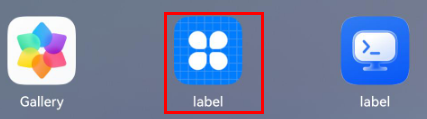
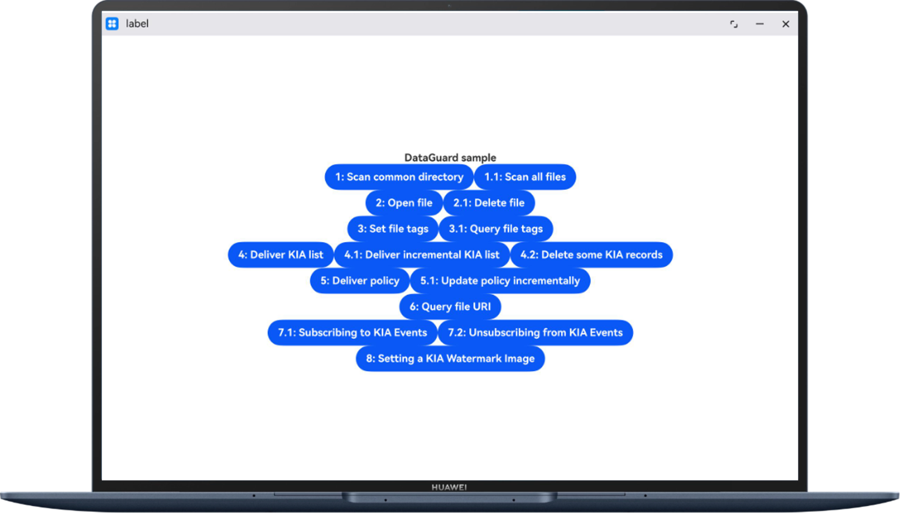
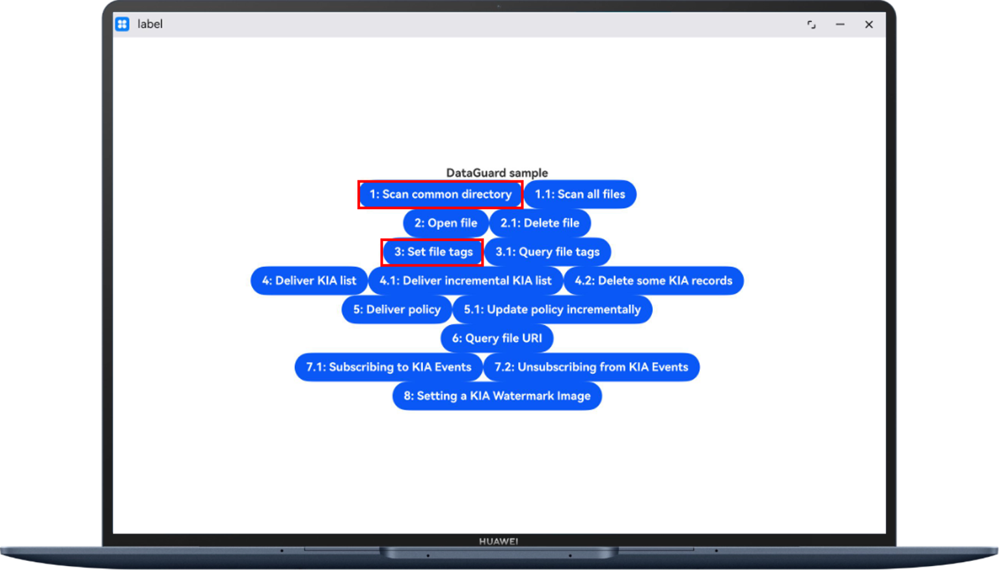
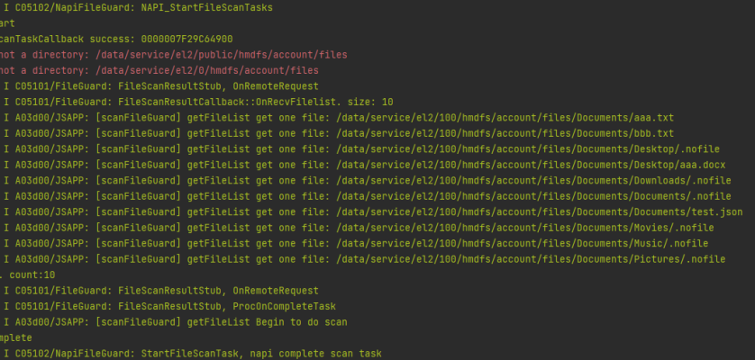

# Enterprise Data Guard Kit

## Overview

This sample code illustrates functions of Enterprise Data Guard Kit. APIs packaged in **@kit.EnterpriseDataGuardKit** and **@kit.CoreFileKit** can be called to implement functions such as reading files, setting file tags, scanning files in common directories, deleting files, delivering the KIA file list, delivering interception policies, and querying file URIs.

This sample code is available only for MDM apps with required permissions.

## Preview

| App Entry                                                | Main UI                                                   | API Call Button                                             | Log Output                                               |
|----------------------------------------------------------|-----------------------------------------------------------|-------------------------------------------------------------|----------------------------------------------------------|
| The app can be launched by tapping the app icon.         | The app main UI is displayed on the device screen.        | Tapping the button will call the corresponding API.         | Output logs record the call result.                      |
|  |  |  |  |

How to Configure and Use

1. In the root directory of the project, run the [test.bat](test.bat) to send [test.json](test.json) to the target device.

2. Launch the sample app from **App center**.

3. The launched app is opened on the device screen.

4. Tap a button to call the corresponding API. For example, tap **Test 1: Scan common directory**.

5. Check the output logs generated.

## Project Directory

```
├──entry/src/main/ets                         // Code area
│  ├──svcability
│  │  ├──ScanFileGuard.ts                     // File scanning tool class
│  ├──entryAbility  
│  │  └──EntryAbility.ts                      // Entry point class
│  └──pages  
│     ├──Index.ets                            // Main UI
└──entry/src/main/resources                   // App resource directory

```

## How to Implement (See @hms.pcService.fileGuard.d.ts)

- The code of the API for scanning common directories is implemented in **ScanFileGuard.ts**.

    - Call **new fileGuard Guard()** to obtain the **FileGuard** object.

    - Implement two callback functions to receive the file list and send a scanning completion notification.

      ```
      onReceiveFileList(files: Array<string>): void;
      onTaskCompleted(count: number): void;
      ```

    - Call **fileGuard.startFileScanTask** to start scanning the common directory.

- The code for opening a files is implemented in **ScanFileGuard.ts**.

    - Call **new fileGuard.FileGuard()** to obtain the **FileGuard** object.
    - Call **fileGuard.openFile** to pass a file path and open the file.

- The code for setting and querying file tags is implemented in **ScanFileGuard.ts**.

    - Call **new fileGuard.FileGuard()** to obtain the **FileGuard** object.
    - Call **fileGuard.setFileTag** to set file tags.
    - Call fileGuard.queryFileTag to query file tags.

- The code for querying file URIs is implemented in **ScanFileGuard.ts**.

    - Call **new fileGuard.FileGuard()** to obtain the **FileGuard** object.
    - Call **fileGuard.getFileUri** to query a file URI.

- The code for deleting a file is implemented in **ScanFileGuard.ts**.

    - Call **new fileGuard.FileGuard()** to obtain the **FileGuard** object.
    - Call **fileGuard.deleteFile** to delete a file.

- The code for setting the KIA file list is implemented in **ScanFileGuard.ts**.

    - Call **new fileGuard.FileGuard()** to obtain the **FileGuard** object.

    - Call **fileGuard.setKiaFilelist** to set the KIA file list.

  ```json
  {
    "kia_filelist":[
      "/data/service/el2/100/hmdfs/account/files/Documents/Desktop/aaa.docx",
      "/data/service/el2/100/hmdfs/account/files/Documents/Desktop/bbb.docx"
    ]
  }
  ```

- The code for delivering network interception policies is implemented in **ScanFileGuard.ts**.

    - Call **new fileGuard.FileGuard()** to obtain the **FileGuard** object.
    - Call **fileGuard.updatePolicy** to deliver a network interception policy.

  ```json
  {
    "net_intercept_toggle":0,
    "boundary":[
        "10.10.0.0-10.10.255.255.255",
        "0.0.0.0-1.1.1.1"
    ],
    "netsegment_trustlist":["10.10.0.0-10.10.255.255.255"],
    "netsegment_blocklist":[ "0.0.0.0-1.1.1.1"],
    "default_policy":0
  }
  ```

- The code for implementing the subscription and unsubscription of KIA file copy, rename, and compress events is stored in the **ScanFileGuard.ts** file.

    - Call **new fileGuard.FileGuard()** to obtain the **FileGuard** object.
    - Call **fileGuard.setKiaFilelist** to set the KIA file list and compression type.
    - Call the **on** or **off** API to respectively subscribe to or unsubscribe from KIA file copy, rename, and compress events.
    - The code for implementing the subscription and unsubscription of KIA file copy, rename, and compress events is stored in the **ScanFileGuard.ts** file.
  ```json
  {
    "kia_filelist":[
      "/data/service/el2/100/hmdfs/account/files/Docs/Documents/aaa.txt",
      "/data/service/el2/100/hmdfs/account/files/Docs/Documents/bbb.txt"
    ],
    "compress_suffix": [".rar", ".zip"]
  }
  ```

- The code for setting the KIA file watermark image is implemented in **ScanFileGuard.ts**.

    - Call **new fileGuard.FileGuard()** to obtain the **FileGuard** object.
    - Convert the image to the Uint8Array type and call **fileGuard.setKiaWatermarkImage** to set the KIA file watermark image.

## Required Permissions

ohos.permission.SET_FILE_GUARD_POLICY

ohos.permission.FILE_GUARD_MANAGER

This permission is an enterprise MDM app permission. To request it, you need to apply for a release certificate and release profile first.

## Constraints

1. This sample code can only run on PC/2-in-1 devices.
2. The HarmonyOS version must be HarmonyOS NEXT Developer Beta1 or later.
3. The DevEco Studio version must be DevEco Studio NEXT Developer Beta1 or later.
4. The HarmonyOS SDK version must be HarmonyOS NEXT Developer Beta1 SDK or later.
