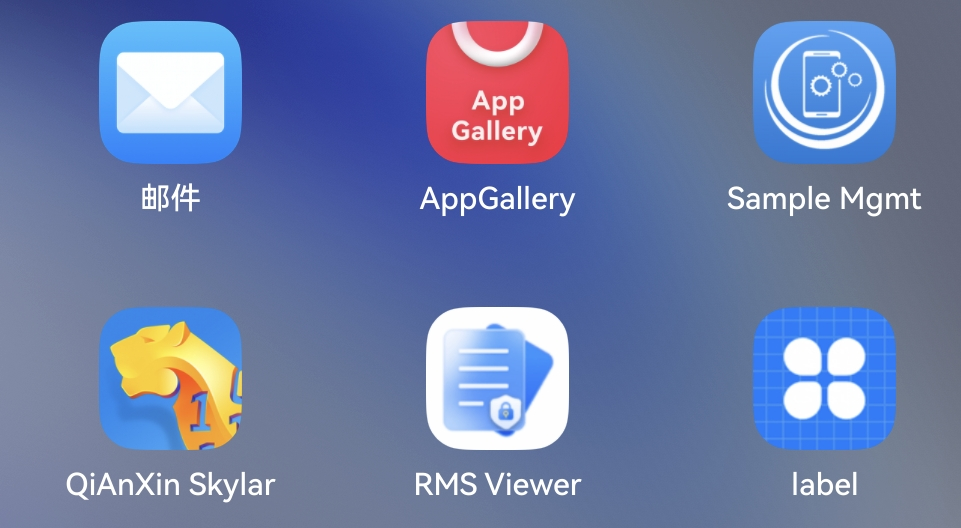

# 实现空间互传的策略下发

## 介绍

本示例主要展示了企业空间服务管理相关的功能，使用@kit.EnterpriseSpaceKit接口，实现了设置审计信息、获取审计信息的功能。

供企业管控类MDM应用申请权限后使用。

## 效果预览

| 应用入口                                                  | 应用主页                                                   | 接口使用按钮                                                           | 日志输出                                                     |
|----------------------------------------------------|-----------------------------------------------------|------------------------------------------------------------------|-------------------------------------------------------|
| 点击图标打开应用                                              | 应用主页显示在设备屏幕                                            | 点击接口测试按钮调用接口                                                     | 接口调用通过日志输出                                               |
|  |  |  |  |

使用说明

1.在应用中心选中应用"label"打开sample应用。

2.打开应用后应用界面会显示在屏幕上。

3.点击按钮调用对应接口，如点击"设置审计信息"。

4.接口调用结果输出到日志中。

## 工程目录

```
├──entry/src/main/ets               // 代码区
│  ├──entryability
│  │  └──EntryAbility.ts            // 程序入口类
│  ├──pages
│  │  └──Index.ets                  // 主界面
│  └──svcability
│     └──fileTransferService.ets    //接口调用
└──entry/src/main/resources         // 资源文件目录
```

## 具体实现（接口参考@hms.enterpriseSpaceService.fileTransfer.d.ts）

- 设置审计信息接口代码实现都在fileTransferService.ets中

    - fileTransfer.setAuditInfo开始设置审计信息

- 获取审计信息接口代码实现都在fileTransferService.ets中

    - fileTransfer.getAuditInfo开始获取审计信息

## 相关权限

ohos.permission.ENTERPRISE_FILE_TRANSFER_AUDIT_POLICY_MANAGEMENT

该权限为企业管控类MDM应用权限，如需使用，需先申请发布证书和发布Profile，参考链接：
https://developer.huawei.com/consumer/cn/doc/app/agc-help-harmonyos-mdm-0000001872217329

## 约束与限制

1. 设备类型仅支持2in1/PC。
2. HarmonyOS系统：HarmonyOS 6.0.0 Release及以上。
3. DevEco Studio版本：DevEco Studio 6.0.0 Release及以上。
4. HarmonyOS SDK版本：HarmonyOS 6.0.0 Release SDK及以上。