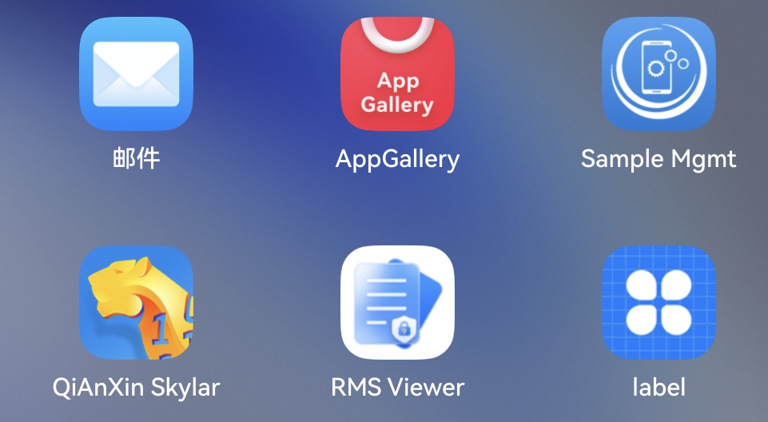
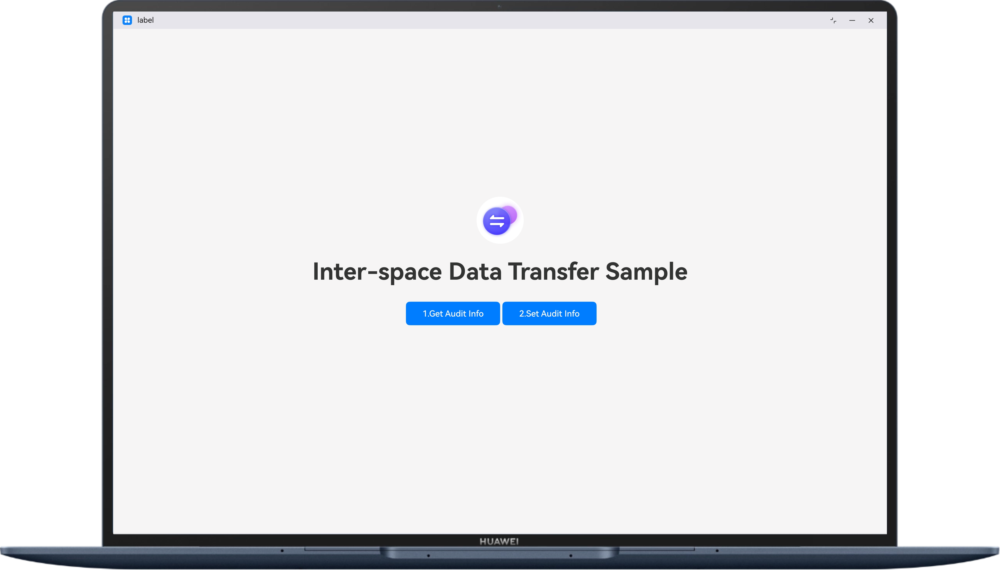
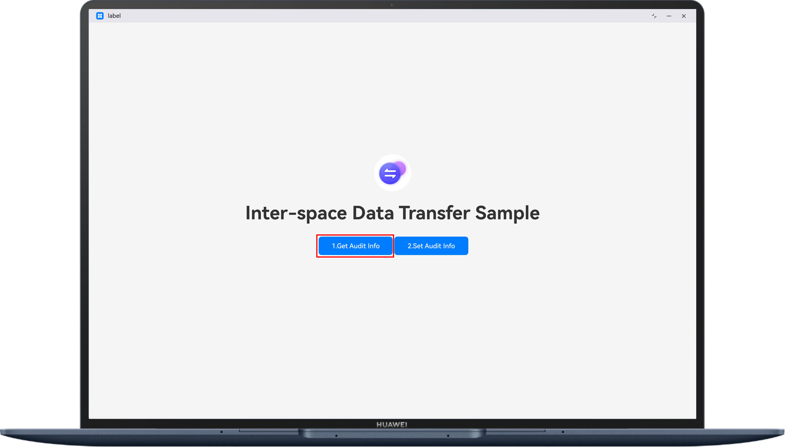

# Inter-space Data Transfer SampleCode

## Overview

The sample code demonstrates functions provided by Enterprise Space Kit and how to use the **@kit.EnterpriseSpaceKit** API to set and obtain audit information.

This sample code is available only for MDM apps that focus on enterprise security control with required permissions.

## Preview

| App entry point                                                   | App home screen                                                  | Button to trigger API calls                                      | Log output                                                     |
|----------------------------------------------------|------------------------------------------------------------------|------------------------------------------------------------------|-------------------------------------------------------|
| Clicking the icon to launch the app                                              | App home screen displayed                                        | Clicking the button to trigger an API call                       | Checking app call logs                                               |
|  |  |  |  |

How to Use

1. Launch the sample app from **App center**.

2. The launched app is opened on the device screen.

3. Click the button to call the corresponding API. For example, click **Set Audit Information**.

4. Check the output logs generated.

## Project Directory

```
├──entry/src/main/ets               // Code area.
│  ├──entryability
│  │  └──EntryAbility.ts            // Entry point class.
│  ├──pages
│  │  └──Index.ets                  // Main UI.
│  └──svcability
│     └──fileTransferService.ets    // App call.
└──entry/src/main/resources         // Directory for storing resource files.
```

## How to Implement (See @hms.enterpriseSpaceService.fileTransfer.d.ts)

- The code of the API for setting audit information is implemented in **fileTransferService.ets**.

    - The **fileTransfer.setAuditInfo** API is used to set audit information.

- The code of the API for obtaining audit information is implemented in **fileTransferService.ets**.

    - The **fileTransfer.getAuditInfo** API is used to obtain audit information.

## Required Permissions

ohos.permission.ENTERPRISE_FILE_TRANSFER_AUDIT_POLICY_MANAGEMENT

This permission is for MDM apps that focus on enterprise security control. To request it, you need to apply for a release certificate and release profile first. For details, please refer to:
https://developer.huawei.com/consumer/en/doc/harmonyos-guides/mdm-kit

## Constraints

1. Only PCs/2-in-1 devices are supported.
2. The HarmonyOS version must be HarmonyOS 6.0.0 Release or later.
3. The DevEco Studio version must be DevEco Studio 6.0.0 Release or later.
4. The HarmonyOS SDK version must be HarmonyOS 6.0.0 Release SDK or later.
