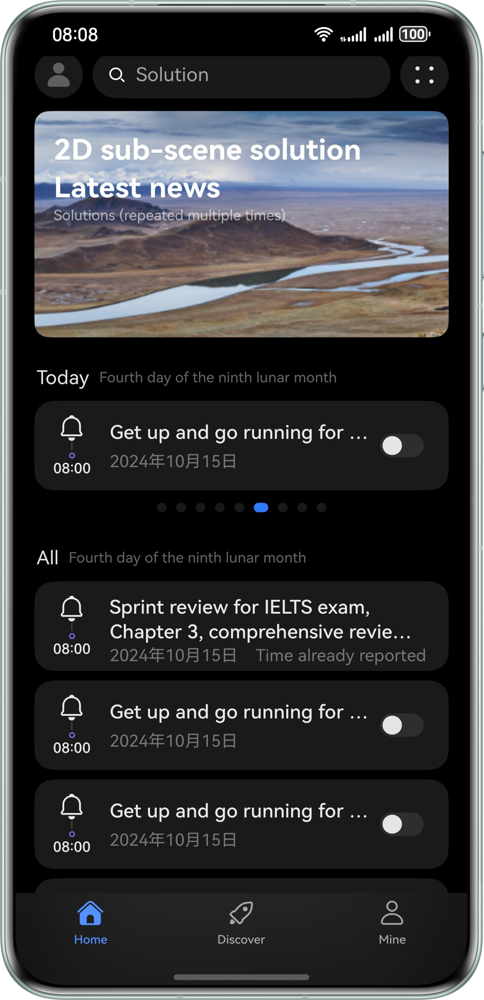

# Dark Mode

### Overview
This sample describes dark mode adaptation, helping you adapt color resources, media resources, and status bar and ensure that the app UI is beautiful and natural when the system switches between the dark and light modes. The app also provides a user-controllable dark/light mode switch to meet users' personalized requirements and to implement dark/light mode switching in different scenarios.

### Preview


### Project Directory

```
├──entry/src/main/ets/
│  ├──entryability
│  │  └──EntryAbility.ets               // Entry ability
│  ├──pages
│  │  ├──DarkModeSetting.ets            // Page for setting the dark mode
│  │  ├──Home.ets                       // Home page
│  │  ├──Index.ets                      // App entry
│  │  └──Mine.ets                       // Me page
│  ├──view
│  │  ├──FinishedTodoItem.ets           // Finished Todo component
│  │  └──TodoItem.ets                   // Todo component
│  └──viewmodel
│     ├──ColorModeChangeFunctions.ets   // Function for switching between the dark and light modes
│     ├──Todo.ets                       // Todo class
│     └──TodoViewModel.ets              // Todo data
└──entry/src/main/resources             // Static resources of the app
```
How to Use
- The color mode of the app is in sync with the system color mode (dark/light) by default. This function can be enabled or disabled by choosing Settings > Display & brightness > Dark mode > Enable all day.
- You can disable the function of switching the color mode in sync with the system by choosing Me > Dark mode in the app. Then, the app will always be in light mode.
- You can manually enable or disable the dark mode by choosing Me > Dark mode in the app. The app will display the dark or light mode based on the settings.

### How to Implement

1. Adapt color resources, such as the text color and component background color. The following two solutions are available:
1. Use the color resource values reserved by the system.
2. Perform manual adaptation: Create the **src/main/resources/dark/element** directory, create the **color.json** file in the directory, set the color values of page elements in dark mode in the file, and set the color values of page elements in light mode in the **src/main/resources/base/element/color.json** file.
2. Adapt images and icons. If you want your app to display different images/icons in dark and light modes, create the **src/main/resources/dark/media** directory to store the images and icons in dark mode, and place different static resources with the same name in **src/main/resources/base/media**.
3. Adapt the system status bar. By default, if the immersive mode is not enabled for the app, there will be no problem for status bar adaptation. If the immersive mode is enabled for the app, the contrast between the background color of the page and the text color of the status bar may be too low. As a result, the text on the status bar is invisible to users, affecting user experience. In this case, you can set the text color of the status bar dynamically through **setWindowSystemBarProperties** by listening for the dark and light mode changes of the system.

### Permissions

N/A

### Constraints

1. The sample is only supported on Huawei phones with standard systems.

2. The HarmonyOS version must be HarmonyOS 5.0.5 Release or later.

3. The DevEco Studio version must be DevEco Studio 5.0.5 Release or later.

4. The HarmonyOS SDK version must be HarmonyOS 5.0.5 Release SDK or later.