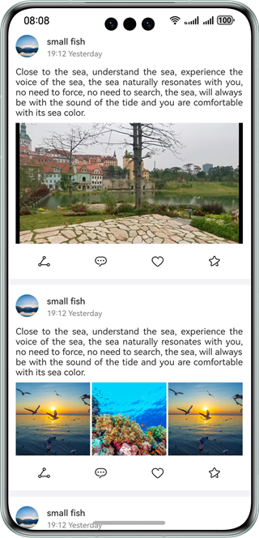

# Smooth Page Refreshing

### Overview

This sample describes how to smoothly refresh a page.

### Preview



##### How to Use

1. Swipe up and down on the page to refresh articles smoothly.
2. Tap the first video to access the video playback page.

### Project Directory

```

├──entry/src/main/ets/
│  ├──constant
│  │  └──Constant.ets                        // Constant class
│  ├──entryability
│  │  └──EntryAbility.ets                    // Entry ability
│  ├──pages
│  │  ├──Index.ets                           // App home page
│  │  └──NewPlayPage.ets                     // Playback page
│  ├──segment
│  │  └──segment.ets                         // Animation example
│  ├──view
│  │  ├──AVPlayerItem.ets                    // AVPlayer page
│  │  ├──ButtonItem.ets                      // Button item page
│  │  ├──ImageModifier.ets                   // Image modifier
│  │  ├──MuliGrid.ets                        // Layout page
│  │  ├──SampleUnitAVPlayView.ets            // AVPlayer sample page
│  │  ├──SampleUnitPicView.ets               // Image sample page
│  │  ├──SampleUnitVideoSecondView.ets       // Video sample page
│  │  ├──SampleUnitVideoView.ets             // Video sample page
│  │  ├──SampleUnitView.ets                  // Sample display page
│  │  └──TitleAreaItem.ets                   // Title page
│  └──viewmodel
│     ├──BasicDataSource.ets                 // Data source
│     ├──ButtonUnitItem.ets                  // Button item
│     ├──SampleUnitItem.ets                  // Case item
│     └──TitleUnitItem.ets                   // Title item
└──entry/src/main/resources                  // Static resources of the app
```

### How to Implement
You can set the **ExpectedFrameRateRange** attribute in the **DisplaySync** and **AnimateTo** APIs to adjust the screen refresh rate, reducing power consumption and ensuring smooth page refreshing.

### Required Permissions

N/A

### Constraints

1. The sample app is supported only on Huawei phones running the standard system.

2. The HarmonyOS version must be HarmonyOS 5.0.5 Release or later.

3. The DevEco Studio version must be DevEco Studio 5.0.5 Release or later.

4. The HarmonyOS SDK version must be HarmonyOS 5.0.5 Release SDK or later.
