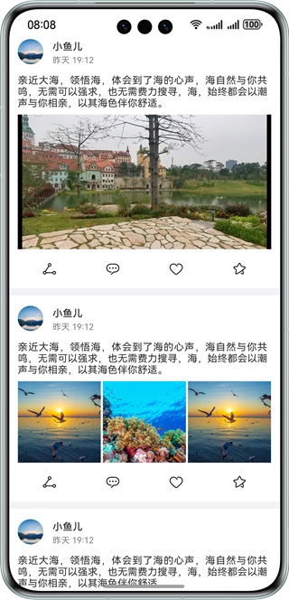

# 实现流畅刷文章功能

### 介绍

本示例实现了文章和媒体文件浏览的功能，通过设置组件的属性来控制屏幕刷新率，达到低功耗的目的，参考本示例可学习开发类似博客场景，并进行低功耗的适配。

### 效果预览



##### 使用说明

1. 上下滑动页面，流畅刷文章；
2. 点击第一个视频，可进入视频播放界面。

### 工程目录

```

├──entry/src/main/ets/
│  ├──constant
│  │  └──Constant.ets                        // 常量类
│  ├──entryability
│  │  └──EntryAbility.ets                    // 程序入口类
│  ├──pages
│  │  ├──Index.ets                           // 应用首页
│  │  └──NewPlayPage.ets                     // 视频页
│  ├──segment
│  │  └──segment.ets                         // 动画案例     
│  ├──view
│  │  ├──AVPlayerItem.ets                    // AVPlayer页
│  │  ├──ButtonItem.ets                      // Button Item页
│  │  ├──ImageModifier.ets                   // 图片页
│  │  ├──MuliGrid.ets                        // 布局页
│  │  ├──SampleUnitAVPlayView.ets            // AVPlayer样例页
│  │  ├──SampleUnitPicView.ets               // 图片样例页
│  │  ├──SampleUnitVideoSecondView.ets       // 视频样例页
│  │  ├──SampleUnitVideoView.ets             // 视频样例页
│  │  ├──SampleUnitView.ets                  // 样例展示页
│  │  └──TitleAreaItem.ets                   // 标题页
│  └──viewmodel
│     ├──BasicDataSource.ets                 // 数据源
│     ├──ButtonUnitItem.ets                  // 按钮item类型
│     ├──SampleUnitItem.ets                  // 案例item类型
│     └──TitleUnitItem.ets                   // 标题item类型
└──entry/src/main/resources                  // 应用静态资源目录
```

### 实现逻辑
通过在DisplaySync与AnimateTo API中设置ExpectedFrameRateRange属性来影响屏幕刷新率，从而达到降低功耗，流畅刷页面的效果。

### 相关权限

不涉及

### 约束与限制

1. 本示例仅支持标准系统上运行，支持设备：华为手机。

2. HarmonyOS系统：HarmonyOS 5.0.5 Release及以上。

3. DevEco Studio版本：DevEco Studio 5.0.5 Release及以上。

4. HarmonyOS SDK版本：HarmonyOS 5.0.5 Release SDK及以上。