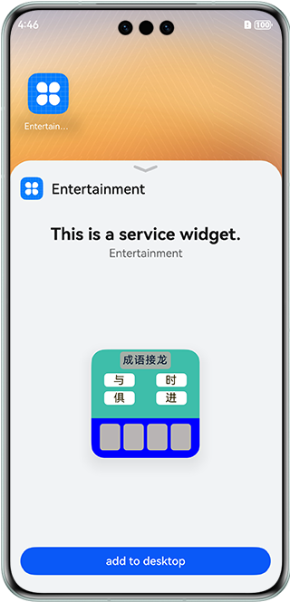
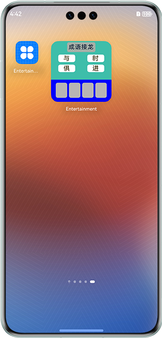

# Gaming Widget

### Overview

This sample shows how to develop a simple game widget based on the stage model.

- Interaction is performed by using tap events supported by the widget, so that the user arranges an out-of-order idiom into a correct idiom based on a tap sequence.

- The hybrid programming mode of C++ and TS is used. The capability of obtaining random numbers is implemented in C++, and the capability implemented in C++ is exposed to TS through NAPIs.

- The widget extension module API @ohos.app.form.FormExtensionAbility is used.


### Preview

| Widget Adding                                              | Widget Operation                                               |
|----------------------------------------------------|-----------------------------------------------------|
|  |  |

How to Use

1. The home screens of some devices do not support widgets. You can create, update, and delete widgets by using your own widget host.

2. Install the app and tap and hold the app icon on the home screen to display the option list.

3. Tap a service widget in the pop-up list to enter the widget adding page.

4. Tap the **Add to home screen** button at the bottom of the screen. The widget will then appear on the home screen.

### Project Directory
```
├──entry/src/main/cpp                         // CPP code area
├──entry/src/main/ets                         // ets code
│  ├──application
│  │  └──AbilityStage.ets    
│  ├──entryability
│  │  └──EntryAbility.ets
│  ├──formability
│  │  └──FormAbility.ets                      // Define the operations to be performed when a widget object is created for the first time
│  └──pages
│     └──Index.ets                            // Home page, including the ArkTS logic
├──entry/src/main/js                          // JavaScript code area
│  ├──common                                  // Card resource 
│  ├──i18n                                    // Card i8n
│  └──widget/pages/index                      // Define the widget content                   
│     ├──index.css                            // Card style
│     ├──index.hml                            // Card content    
│     └──index.json                           // Card event configuration                         
├──entry/src/main/resources                   // App resource directory
└──module.json5                               // Add the widget extension capability
```

### How to Implement

1. In the **module.json5** file, add the extension capability with the type set to service widget, and set the widget entry (srcEntrance) and widget metadata (metadata). For details, see [Source Code Reference](entry/src/main/module.json5).
2. Configure a widget: Use JavaScript to compile a widget and configure the widget into **resources/base/profile/form_config**. 
3. Define the game logic: Initialize data (mock data is used in this sample) when implementing **addform** in **FormExtensionAbility**, store the data to the datastore, and call C++ random numbers to display idioms in disorder.
4. Listen for widget changes: Use **onformEvent()** to listen for widget events, update the selected idiom data, and randomly replace the selected words in the idiom list. For details, see [Source Code Reference](entry/src/main/ets/formability/FormAbility.ets).

### Required Permissions

N/A

### Dependencies

N/A

### Constraints

1. The sample is only supported on Huawei phones with standard systems.
2. The HarmonyOS version must be HarmonyOS 5.0.5 Release or later.
3. The DevEco Studio version must be DevEco Studio 5.0.5 Release or later.
4. The HarmonyOS SDK version must be HarmonyOS 5.0.5 Release SDK or later.
