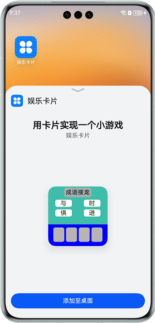
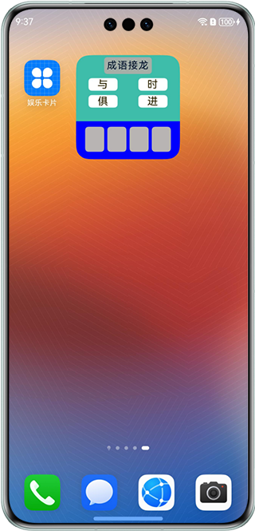

# 基于Stage模型实现简单游戏卡片

### 介绍

本示例使用Stage模型和C++/ArkTS混合编程创建一个成语排序游戏卡片，通过点击事件让用户按正确顺序排列乱序的成语。C++负责随机数生成并通过NAPI接口与ArkTS交互，结合Form Kit增强卡片功能和交互体验。


### 效果预览

| 添加卡片                                               | 操作卡片                                                |
|----------------------------------------------------|-----------------------------------------------------|
|  |  |

使用说明：

1.部分设备的桌面不支持卡片，可以通过自己的开发卡片使用方，进行卡片的创建、更新和删除等操作。

2.安装应用，并在桌面上长按本应用的桌面图标，长按后弹出选项列表。

3.点击弹出列表中的**服务卡片**选项进入卡片添加界面。

4.点击正下方的**添加到桌面**按钮，卡片就会出现在桌面上。

### 工程目录
```
├──entry/src/main/cpp                         // cpp代码区，使用c++实现随机算法
├──entry/src/main/ets                         // ets代码区
│  ├──entryability                               
│  │  └──EntryAbility.ets                     // Ability的生命周期回调
│  ├──formability
│  │  └──FormAbility.ets                      // 定义卡片对象首次被创建时需要做的操作
│  ├──pages 
│  │  └──Index.ets                            // 应用首页
│  └──util
│     └──Logger.ets                           // 日志工具类
├──entry/src/main/js                          // js代码区
│  ├──common                                  // 卡片资源目录
│  ├──i18n                                    // 卡片国际化语言目录
│  └──widget/pages/index                      // 卡片内容目录                     
│     ├──index.css                            // 卡片样式
│     ├──index.hml                            // 卡片内容    
│     └──index.json                           // 卡片事件配置
├──entry/src/main/resources                   // 应用资源目录
└──module.json5                               // 应用配置文件
```

### 具体实现

1、在module.json5文件添加拓展能力，类型为卡片，并设置卡片入口srcEntrance和卡片元数据metadata，[源码参考](entry/src/main/module.json5 )。 
2、配置卡片：用js编写相应的卡片，将卡片配置到resources/base/profile/form_config。  
3、定义小游戏逻辑：实现FormExtensionAbility中addform时初始化数据（本sample中使用的是mock数据)，并将数据存储到dataStore，通过调用c++随机数，将成语顺序打乱显示，
4、监听卡片变化：通过onformEvent()监听卡片事件，更新已选择的成语数据，并随机替换成语待选列表的已被选掉的word，[源码参考](entry/src/main/ets/formability/FormAbility.ets )。

### 相关权限

不涉及。

### 依赖

不涉及。

### 约束与限制

1. 本示例仅支持标准系统上运行，支持设备：华为手机。
2. HarmonyOS系统：HarmonyOS 5.0.5 Release及以上。
3. DevEco Studio版本：DevEco Studio 5.0.5 Release及以上。
4. HarmonyOS SDK版本：HarmonyOS 5.0.5 Release SDK及以上。