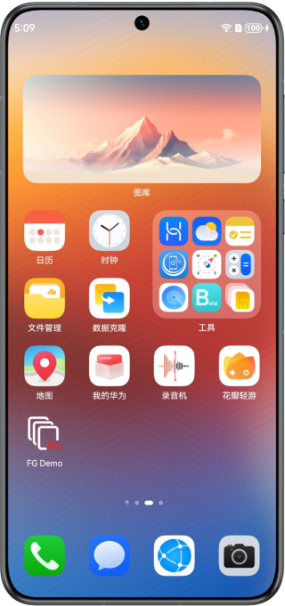
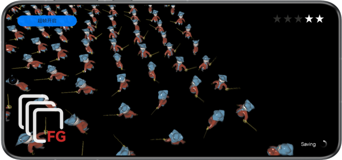

# FrameGeneration -- 超帧

## 介绍

本示例展示了基于Graphics Accelerate Kit提供的OpenGL ES超帧API在图形绘制场景实现超帧功能。

需要编译依赖FrameGeneration的动态库libframegeneration.so。

## 效果预览

|            **桌面**             |                 **主界面**                 |
|:-----------------------------:|:---------------------------------------:|
|  |  |

使用说明：

1. 在手机的主屏幕，点击”FG Demo“，启动应用，进入图形绘制场景。
2. 点击左上角，可手动开启或关闭超帧功能。显示“超帧开启”表示超帧功能已开启，显示“超帧关闭”表示超帧功能已关闭。
3. 退出应用时，自动关闭超帧。

## 工程目录

```
└── entry/src/main                          // 代码区
    ├── cpp
    │    ├── types/libentry
    │    │     └── index.d.ts               // native层接口注册文件
    │    ├── napi_init.cpp                  // native api层接口的具体实现函数
    │    ├── CMakeLists.txt                 // native层编译配置
    │    ├── include                        // 头文件
    │    ├── source                         // C++代码区
    │    │    ├── core.cpp                  // 核心入口，管理生命周期
    │    │    ├── renderer.cpp              // 渲染管理类的实现
    │    │    ├── scene_base.cpp            // 超帧模式基类的实现
    │    │    ├── scene_extrapolation.cpp   // 外插模式类的实现
    │    │    ├── scene_interpolation.cpp   // 内插模式类的实现
    │    │    ├── opaque_layer_base.cpp     // 场景绘制基类的实现
    │    │    ├── opaque_layer.cpp          // 场景绘制派生类的实现
    │    │    ├── gui.cpp                   // UI绘制
    │    │    └── ...
    ├── ets
    │    ├── ability 
    │    │     └── EntryAbility.ts          // 程序入口类，可在此设置超帧模式
    │    ├── pages 
    │    │     └── Index.ets                // 主界面
    └── resources
    │    ├── base/media                     // 图片资源
    │    │   └── logo.png
    │    ├── rawfile                        // 模型和UI资源
    │    │    └── ...                       
```


## 具体实现

本示例展示的功能使用了在FrameGeneration定义的以下API：

* FG_Context_GLES* HMS_FG_CreateContext_GLES(void);
* FG_ErrorCode HMS_FG_SetAlgorithmMode_GLES(FG_Context_GLES* context, const FG_AlgorithmModeInfo* predictionModeInfo);
* FG_ErrorCode HMS_FG_SetResolution_GLES(FG_Context_GLES* context, const FG_ResolutionInfo* resolutionInfo);
* FG_ErrorCode HMS_FG_SetCvvZSemantic_GLES(FG_Context_GLES* context, FG_CvvZSemantic semantic);
* FG_ErrorCode HMS_FG_SetImageFormat_GLES(FG_Context_GLES* context, FG_ImageFormat_GLES format);
* FG_ErrorCode HMS_FG_Activate_GLES(FG_Context_GLES* context);
* FG_ErrorCode HMS_FG_Deactivate_GLES(FG_Context_GLES* context);
* FG_ErrorCode HMS_FG_DestroyContext_GLES(FG_Context_GLES** context);
* FG_ErrorCode HMS_FG_SetExtendedCameraInfo_GLES(FG_Context_GLES* context, const FG_PerFrameExtendedCameraInfo* info);
* FG_ErrorCode HMS_FG_Dispatch_GLES(FG_Context_GLES* context, const FG_DispatchDescription_GLES* desc);

在场景初始化阶段调用HMS_FG_CreateContext_GLES、HMS_FG_SetAlgorithmMode_GLES、HMS_FG_SetResolution_GLES、HMS_FG_Activate_GLES等接口完成超帧实例创建、属性配置和激活。在帧循环阶段调用HMS_FG_Dispatch_GLES接口生成预测帧。将预测帧和真实渲染帧交替送显，实现超帧功能。

## 相关权限

不涉及。

## 依赖

不涉及。

## 约束与限制

1. 本示例仅支持标准系统上运行，支持设备：华为手机、平板设备。
2. HarmonyOS系统：HarmonyOS Next Developer Beta1及以上。
3. DevEco Studio版本：DevEco Studio Next Developer Beta1及以上。
4. HarmonyOS SDK版本：HarmonyOS Next Developer Beta1及以上。

