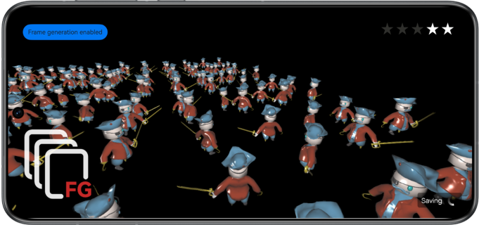

# Frame Generation

## Overview

This sample code illustrates how to implement the frame generation capability of Graphics Accelerate Kit in graphics rendering scenes based on the OpenGL ES graphics API.

You need to compile the dependency on the dynamic library **libframegeneration.so**.

## Preview

|            **Home screen**            |                 **App UI**                |
|:-----------------------------:|:---------------------------------------:|
|  |  |

Instructions:

1. On the home screen of a mobile phone, tap **FG Demo** to start the app.
2. Tap the button in the upper left corner to manually enable or disable the frame generation capability. If **Frame generation enabled** is displayed, the capability is enabled. If **Frame generation disabled** is displayed, the capability is disabled.
3. When you exit the app, the frame generation capability is automatically disabled.

## Project Directory

```
└── entry/src/main                          // Code area
    ├── cpp
    │    ├── types/libentry
    │    │     └── index.d.ts               // API registration file at the native layer
    │    ├── napi_init.cpp                  // Functions of APIs at the native layer
    │    ├── CMakeLists.txt                 // Compilation configurations at the native layer
    │    ├── include                        // Header files
    │    ├── source                         // C++ code area
    │    │    ├── core.cpp                  // Core entry for lifecycle management
    │    │    ├── renderer.cpp              // Rendering management class implementation
    │    │    ├── scene_base.cpp            // Base class implementation for frame generation modes
    │    │    ├── scene_extrapolation.cpp   // Extrapolation mode class implementation
    │    │    ├── scene_interpolation.cpp   // Interpolation mode class implementation
    │    │    ├── opaque_layer_base.cpp     // Base class implementation for scene drawing
    │    │    ├── opaque_layer.cpp          // Derived class implementation for scene drawing
    │    │    ├── gui.cpp                   // UI drawing
    │    │    └── ...
    ├── ets
    │    ├── ability 
    │    │     └── EntryAbility.ts          // Entry point class for setting the frame generation mode
    │    ├── pages 
    │    │     └── index.ets                // App UI
    └── resources
    │    ├── base/media                     // Image resources
    │    │   └── logo.png
    │    ├── rawfile                        // Model and UI resources
    │    │    └── ...                       
```


## How to Implement

The sample code uses the following APIs defined for frame generation:

* FG_Context_GLES* HMS_FG_CreateContext_GLES(void);
* FG_ErrorCode HMS_FG_SetAlgorithmMode_GLES(FG_Context_GLES* context, const FG_AlgorithmModeInfo* predictionModeInfo);
* FG_ErrorCode HMS_FG_SetResolution_GLES(FG_Context_GLES* context, const FG_ResolutionInfo* resolutionInfo);
* FG_ErrorCode HMS_FG_SetCvvZSemantic_GLES(FG_Context_GLES* context, FG_CvvZSemantic semantic);
* FG_ErrorCode HMS_FG_SetImageFormat_GLES(FG_Context_GLES* context, FG_ImageFormat_GLES format);
* FG_ErrorCode HMS_FG_Activate_GLES(FG_Context_GLES* context);
* FG_ErrorCode HMS_FG_Deactivate_GLES(FG_Context_GLES* context);
* FG_ErrorCode HMS_FG_DestroyContext_GLES(FG_Context_GLES** context);
* FG_ErrorCode HMS_FG_Dispatch_GLES(FG_Context_GLES* context, const FG_DispatchDescription_GLES* desc);

In the scene initialization phase, call the **HMS_FG_CreateContext_GLES**, **HMS_FG_SetAlgorithmMode_GLES**, **HMS_FG_SetResolution_GLES**, and **HMS_FG_Activate_GLES** APIs to create a frame generation context instance, set attributes, and activate the frame generation context instance. In the frame loop phase, call **HMS_FG_Dispatch_GLES** to generate predicted frames. Send the predicted frames and real frames for display alternately.

## Required Permissions

None

## Dependencies

None

## Constraints

1. The sample app is only supported on Huawei phones and tablets with standard systems.
2. The HarmonyOS version must be HarmonyOS Next Developer Beta1 or later.
3. The DevEco Studio version must be DevEco Studio Next Developer Beta1 or later.
4. The HarmonyOS SDK version must be HarmonyOS Next Developer Beta1 or later.
