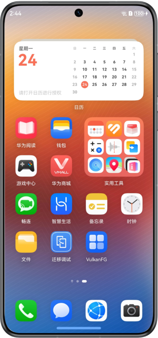
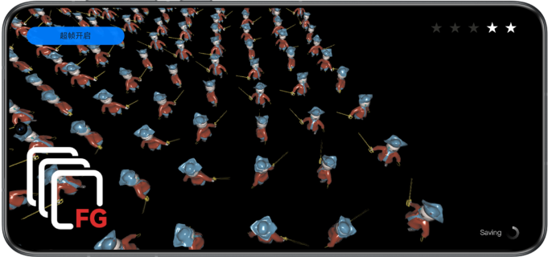

# FrameGeneration -- 超帧

## 介绍

本示例展示了基于Graphics Accelerate Kit提供的Vulkan超帧API在图形绘制场景实现超帧功能。

需要编译依赖FrameGeneration的动态库libframegeneration.so。

## 效果预览

|            **桌面**             |                 **主界面**                 |
|:-----------------------------:|:---------------------------------------:|
|  |  |

使用说明：

1. 在手机的主屏幕，点击”VulkanFG“，启动应用，进入图形绘制场景。
2. 点击左上角，可手动开启或关闭超帧功能。显示“超帧开启”表示超帧功能已开启，显示“超帧关闭”表示超帧功能已关闭。
3. 退出应用时，自动关闭超帧。

## 工程目录

```
└── entry/src/main                          // 代码区
    ├── cpp
    │    ├── types/libentry
    │    │     └── index.d.ts               // native层接口注册文件
    │    ├── napi_init.cpp                  // native api层接口的具体实现函数
    │    ├── CMakeLists.txt                 // native层编译配置
    │    ├── Asset                          // Shader及资源加载类的实现
    │    ├── Begin                          // 程序入口
    │    │    ├── core.cpp                  // 核心入口，管理生命周期
    │    │    ├── hellovk.cpp               // vk渲染流程及超帧调用
    │    │    └── ...
    │    ├── Common                         // 通用类
    │    ├── third_party                    // 三方库
    │    ├── vulkan_utils                   // vk工具类的实现
    ├── ets
    │    ├── entryability 
    │    │     └── EntryAbility.ets         // 程序入口类，可在此设置超帧模式
    │    ├── pages 
    │    │     └── Index.ets                // 主界面
    └── resources
    │    ├── base/media                     // 图片资源
    │    │   └── ...
    │    ├── rawfile                        // 模型、UI资源及Shader二进制文件
    │    │    └── ...                       
```


## 具体实现

本示例展示的功能使用了在FrameGeneration定义的以下API：

* FG_Context_VK* HMS_FG_CreateContext_VK(const FG_ContextDescription_VK* contextDescription);
* FG_ErrorCode HMS_FG_SetAlgorithmMode_VK(FG_Context_VK* context, const FG_AlgorithmModeInfo* predictionModeInfo);
* FG_ErrorCode HMS_FG_SetResolution_VK(FG_Context_VK* context, const FG_ResolutionInfo* resolutionInfo);
* FG_ErrorCode HMS_FG_SetCvvZSemantic_VK(FG_Context_VK* context, FG_CvvZSemantic semantic);
* FG_ErrorCode HMS_FG_SetImageFormat_VK(FG_Context_VK* context, const FG_ImageFormat_VK* format);
* FG_Image_VK* HMS_FG_CreateImage_VK(FG_Context_VK* context, VkImage image, VkImageView view);
* FG_ErrorCode HMS_FG_DestroyImage_VK(FG_Context_VK* context, FG_Image_VK* image);
* FG_ErrorCode HMS_FG_Activate_VK(FG_Context_VK* context);
* FG_ErrorCode HMS_FG_Deactivate_VK(FG_Context_VK* context);
* FG_ErrorCode HMS_FG_Dispatch_VK(FG_Context_VK* context, const FG_DispatchDescription_VK* desc);
* FG_ErrorCode HMS_FG_DestroyContext_VK(FG_Context_VK** context);

在场景初始化阶段调用HMS_FG_CreateContext_VK、HMS_FG_SetAlgorithmMode_VK、HMS_FG_SetResolution_VK、HMS_FG_Activate_VK等接口完成超帧实例创建、属性配置和激活。在激活后，调用HMS_FG_CreateImage_VK接口创建超帧输入输出图像实例。在帧循环阶段调用HMS_FG_Dispatch_VK接口生成预测帧。将预测帧和真实渲染帧交替送显，实现超帧功能。

## 相关权限

不涉及。

## 依赖

不涉及。

## 约束与限制

1. 本示例仅支持标准系统上运行，支持设备：华为手机、平板设备。
2. HarmonyOS系统：HarmonyOS Next Developer Beta2及以上。
3. DevEco Studio版本：DevEco Studio Next Developer Beta2及以上。
4. HarmonyOS SDK版本：HarmonyOS Next Developer Beta2及以上。
5. vulkan支持AI超帧和顶点标记功能，HarmonyOS 6.0及以上。
